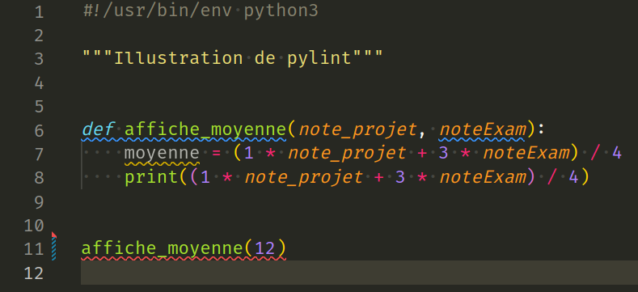

## Énoncé


Cet exercice a pour but de vous familiarisez avec l'outil `pylint` que vous **utiliserez tout au long du semestre** pour vous aider à écrire du code propre et correct.

`pylint` est un outil d'analyse statique (c'est à dire qui n'exécute pas le programme mais le lit seulement) capable d'identifier certaines erreurs et des "fautes de style".

Dans cet exercice vous utilisez `pylint` pour corriger et améliorer la lisibilité du programme `moyenne.py` [disponible ici](moyenne.py) et affiché ci-dessous :

```python
#!/usr/bin/env python3

"""Illustration de pylint"""


def affiche_moyenne(note_projet, noteExam):
    moyenne = (1 * note_projet + 3 * noteExam) / 4
    print((1 * note_projet + 3 * noteExam) / 4)


affiche_moyenne(12)
```

Pour vous familiariser avec `pylint` :

- dans un terminal, lancez `pylint` sur le fichier `moyenne.py`  ci-dessus, c'est à dire exécutez la commande `pylint moyenne.py`, et analysez le résultat en prenant bien soin de comprendre **tout** ce que `pylint` vous indique ;
- si ce n'est pas encore fait, configurez `pylint` dans l'éditeur texte que vous avez choisi d'utiliser pour écrire votre code Python (très probablement `vscode`, et dans ce cas installez l'extension Python puis cochez la case `Pylint Enabled` dans les préférences) ;
- corrigez tous les problèmes indiqués par `pylint`.

Tout au long du semestre, **vous vous assurerez que `pylint` n'indique aucun problème** sur tous les programmes que vous écrirez.
Autrement dit, avec `pylint` proprement configuré dans votre éditeur de texte, vous corrigerez les problèmes au fil de l'eau en même temps que vous écrirez le code.

## Correction
<details markdown="1">
<summary>Cliquez ici pour révéler la correction.</summary>

`pylint` est une application qui prend en entrée le nom du programme Python à analyser, on le lance donc dans un terminal avec la commande `pylint moyenne.py`.
Attention il faut **se trouver dans le dossier** contenant le fichier `moyenne.py`.
Voici le résultat :

```console
> pylint moyenne.py
************* Module moyenne
moyenne.py:6:11: C0326: Exactly one space required around assignment
    moyenne=(1*note_projet + 3*noteExam) / 4
           ^ (bad-whitespace)
moyenne.py:5:0: C0103: Argument name "noteExam" doesn't conform to snake_case naming style (invalid-name)
moyenne.py:5:0: C0116: Missing function or method docstring (missing-function-docstring)
moyenne.py:6:4: W0612: Unused variable 'moyenne' (unused-variable)
moyenne.py:10:4: E1120: No value for argument 'noteExam' in function call (no-value-for-parameter)

------------------------------------
Your code has been rated at -8.00/10
```

Comme on peut le voir, cinq problèmes sont rapportés par `pylint` et notre fichier moyenne a obtenu une note de `-8/10` (c'est pas terrible mais on va corriger tout ça).
On remarque aussi que les cinq problèmes sont de natures différentes : il y a une Erreur (E1120), un Warning (W0612), et quatre problèmes de Convention (C0XXX) d'écriture.

Voici à quoi ressemble l'intégration de `pylint` dans l'éditeur de texte `vscode`.
Les problèmes identifiés par `pylint` sont directement "montrés" dans le code via des souslignages de différentes couleurs en fonction de la nature du problème.
Dans `vscode`, quand on passe la souris sur un souslignage, on obtient le détail du problème tel que rapporté par `pylint` quand on le lance manuellement dans le terminal comme nous l'avons fait précédemment.

Le message clef ici n'est pas l'intégration particulière dans `vscode`, mais le fait que l'intégration de `pylint` dans notre éditeur de texte nous permette d'identifier des problèmes immédiatement après avoir taper chaque nouvelle ligne de code.



Enfin, voici la version finale du programme `moyenne.py` une fois tous les problèmes corrigés :

```python
#!/usr/bin/env python3

"""Illustration de pylint"""


def affiche_moyenne(note_projet, note_exam):
    """affiche la moyenne de BPI à partir des 2 notes."""
    moyenne = (1 * note_projet + 3 * note_exam) / 4
    print(moyenne)


affiche_moyenne(12, 14)
```
</details>
