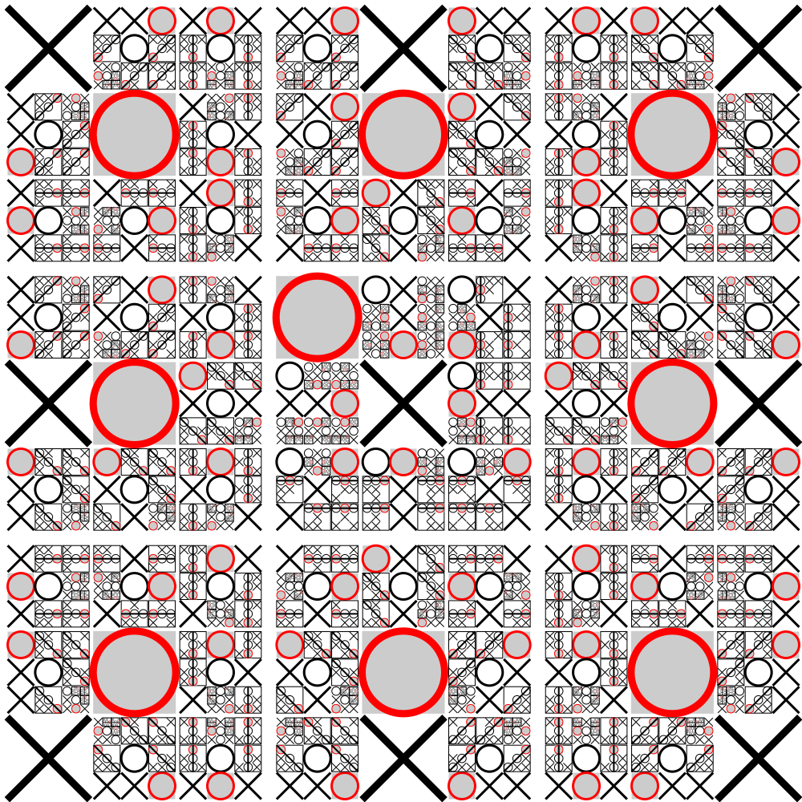

## Énoncé

Dans ce mini projet nous allons programmer un jeu du morpion, appelé tic-tac-toe en anglais.
Comme l'illustre l'image ci-dessous, ce jeu se joue à deux joueurs sur un plateau de 9 cases.
Chaque joueur se voit affecté soit les croix soit les ronds.
On joue à tour de rôle en plaçant un pion dans une case libre et c'est toujours le joueur qui a les croix qui commence.
L'objectif du jeu est d'aligner trois de ses poins sur une ligne, une colonne ou une diagonale.

Ce mini projet comporte trois objectifs pédagogiques principaux :

- aller un peu plus loin dans la découverte des caractères unicode ;
- s'entraîner à rentrer dans le code de quelqu'un d'autre ;
- la réalisation d'une intelligence artificielle, plus ou moins intelligente.


!!! note "ATTENTION"
    Bien qu'une implémentation "sérieuse" utiliserait des boucles, comme nous n'avons pas encore (re-)étudié les boucles `for` et `while`, on se propose de réaliser de ce projet en s'interdisant leur utilisation.
    Néanmoins, comme on le voit dans le code, on s'autorise à utiliser des `list` Python qui elles non plus n'ont pas encore étaient (re-)étudiées.
    Ce choix nous permet d'avoir du code plus simple et donc de nous concentrer sur les objectifs pédagogiques du mini projet.

Le travail à réaliser consiste à :

- compléter le fichier `morpion.py` [disponible ici](morpion.py) et affiché ci-dessous ;
- à implémenter le module `joueur_humain` ;
- à implémenter une première version module `joueur_ordi` bête comme ses pieds ;
- à implémenter une seconde version, la plus intelligente possible, du module `joueur_ordi` capable de battre `joueur_ordi_malin`.

Nous prendrons le temps de bien lire la documentation de chacune des fonctions du fichier `morpion.py` pour bien comprendre comment leur utilisation s'articule ainsi que pour comprendre quel doit être le contenu des modules `joueur_humain` et `joueur_ordi`.

Pour avoir un rendu sympa, bien que notre jeu reste un jeu purement textuel dans le sens où celui-ci n'ouvre aucune fenêtre et s'exécute donc exclusivement dans le terminal, nous aurons certainement besoin de faire des recherches concernant :

- les caractères unicode ;
- leur utilisation en Python ;
- l'affichage de texte en couleur dans un terminal.

Comme mentionné dans le code ci-dessous, le module `joueur_ordi_malin` est fourni.
Une fois le module `joueur_humain` réalisé, nous pourrons jouer contre cette (très grande) "intelligence artificielle".
Le format utilisé est volontairement le format interne de l'interpréteur Python, pour que nous puissions développer notre propre joueur automatique sans "tricher", c'est à dire sans voir le code du joueur malin.
Le module `joueur_ordi_malin`, en fonction de notre version de Python est disponible :

- [ici pour Python 3.6](joueur_ordi_malin_3_6.pyc) ;
- [ici pour Python 3.7](joueur_ordi_malin_3_7.pyc) ;
- [ici pour Python 3.8](joueur_ordi_malin_3_8.pyc) ;
- [ici pour Python 3.10](joueur_ordi_malin_3_10.pyc).

Comme pour un module classique, on placera ce fichier à côté du fichier `morpion.py` pour l'utiliser en prenant soin de **supprimer le numéro de version dans le nom du fichier** pour que celui-ci soit exactement `joueur_ordi_malin.pyc`.


```python
#!/usr/bin/env python3

"""Un jeu de morpion"""


# Les différents types de joueurs sont représentés par des modules.
# Les modules joueur_humain et joueur_ordi doivent être réalisés.
# Le module joueur_ordi_malin est fourni.
# Le module joueur_humain demande simplement à l'utilisateur de jouer.
# Le module joueur_ordi joue automatiquement. Sa stratégie n'est pas spécifiée.
import joueur_humain
import joueur_ordi
import joueur_ordi_malin


def recupere_chaine_a_afficher(symbole):
    """Renvoie la chaîne de caractère à afficher pour le symbole donné.

    Pour le symbole "x", le caractère unicode "MULTIPLICATION X", affiché
    en rouge doit être utilisé.
    Pour le symbole "x", le caractère unicode "WHITE CIRCLE", affiché
    en bleu doit être utilisé.

    précondition : symbole est soit "x" soit "o"
    """
    # TODO
    ...


def affiche_plateau(cases):
    """Affiche le plateau représenté par le tuples cases à 9 éléments.

    L'affichage se fait sur la sortie standard uniquement en utilisant
    des appels à la fonction print.

    précondition : chacune des cases contient soit
      - la chaîne de caractères "x" (case occupée par le joueur 1)
      - la chaîne de caractères "o" (case occupée par le joueur 2)
      - la chaîne de caractères "i" avec i entier correspondant au
        numéro de la case (case libre)
    précondition : cases est un tuple de 9 éléments
    """
    # TODO
    ...


def joue_coup(joueur, joueur_num, cases, symbole):
    """Joue un coup.

    Cette fonction effectue les opérations suivantes tout en affichant
    ce qu'il se passe sur la sortie standard :
      - affiche le plateau représenté par cases
      - utilise le module joueur pour savoir quel coup doit être joué
      - met à jour le plateau de jeu avec ce coup
      - affiche le plateau et le numéro du joueur gagnant si c'est gagné
        puis quitte le programme
      - renvoie le nouveau plateau

    précondition : joueur est un module avec une fonction
                   joue_coup(cases, symbole) qui renvoie le
                   numéro d'une case précédemment inoccupée.
    précondition : joueur_num est soit l'entier 1 soit l'entier 2
    précondition : cases est une list de 9 éléments
    précondition : symbole est soit "x" soit "o"

    """
    # TODO
    ...


def joue_partie():
    """Joue une partie complète de morpion"""

    # Initialisation des deux joueurs en demandant à l'utilisateur
    # Parenthèses nécessaires pour "spliter un string literal"
    message_choix_joueur = (
        "Veuillez choisir le type du joueur {} en tapant\n"
        "  0 pour humain\n"
        "  1 pour un ordinateur\n"
        "  2 pour un ordinateur très malin\n"
        "  entrez votre choix : "
    )

    print(message_choix_joueur.format(1), end="")
    type1 = int(input())
    print(message_choix_joueur.format(2), end="")
    type2 = int(input())
    joueur1 = (
        joueur_humain
        if type1 == 0
        else (joueur_ordi if type1 == 1 else joueur_ordi_malin)
    )
    joueur2 = (
        joueur_humain
        if type2 == 0
        else (joueur_ordi if type2 == 1 else joueur_ordi_malin)
    )
    print()

    # Initialisation et affichage du plateau vide
    # Une case vide est représentée par son numéro,
    # utilisé par le joueur humain pour indiquer
    # quelle case il joue.
    cases = ["0", "1", "2", "3", "4", "5", "6", "7", "8"]

    # Joue 9 coups au maximum
    joue_coup(joueur1, 1, cases, "x")
    joue_coup(joueur2, 2, cases, "o")
    joue_coup(joueur1, 1, cases, "x")
    joue_coup(joueur2, 2, cases, "o")
    joue_coup(joueur1, 1, cases, "x")
    joue_coup(joueur2, 2, cases, "o")
    joue_coup(joueur1, 1, cases, "x")
    joue_coup(joueur2, 2, cases, "o")
    joue_coup(joueur1, 1, cases, "x")

    # Si on arrive là, il y a égalité
    print("Match nul !")


if __name__ == "__main__":
    joue_partie()
```

Pour terminer, essayons de comprendre ce que représente la jolie image ci-dessous ?



## Correction
<details markdown="1">
<summary>Cliquez ici pour révéler la correction.</summary>

Correction de `morpion.py` :

```python
#!/usr/bin/env python3

"""Un jeu de morpion"""

import sys


# Les différents types de joueurs sont représentés par des modules.
# Les modules joueur_humain et joueur_ordi doivent être réalisés.
# Le module joueur_ordi_malin est fourni.
# Le module joueur_humain demande simplement à l'utilisateur de jouer.
# Le module joueur_ordi joue automatiquement. Sa stratégie n'est pas spécifiée.
import joueur_humain
import joueur_ordi
import joueur_ordi_malin

CRED = "\033[31m"
CBLUE = "\033[34m"
CEND = "\033[0m"


def recupere_chaine_a_afficher(symbole):
    """Renvoie la chaîne de caractère à afficher pour le symbole donné.

    Pour le symbole "x", le caractère unicode "MULTIPLICATION X", affiché
    en rouge doit être utilisé.
    Pour le symbole "x", le caractère unicode "WHITE CIRCLE", affiché
    en bleu doit être utilisé.

    précondition : symbole est soit "x" soit "o"
    """
    if symbole == "x":
        return CRED + "\u2715" + CEND
    if symbole == "o":
        return CBLUE + "\u25cb" + CEND
    return symbole


def affiche_plateau(cases):
    """Affiche le plateau représenté par le tuples cases à 9 éléments.

    L'affichage se fait sur la sortie standard uniquement en utilisant
    des appels à la fonction print.

    précondition : chacune des cases contient soit
      - la chaîne de caractères "x" (case occupée par le joueur 1)
      - la chaîne de caractères "o" (case occupée par le joueur 2)
      - la chaîne de caractères "i" avec i entier correspondant au
        numéro de la case (case libre)
    précondition : cases est un tuple de 9 éléments
    """
    print(
        recupere_chaine_a_afficher(cases[0]),
        recupere_chaine_a_afficher(cases[1]),
        recupere_chaine_a_afficher(cases[2]),
        sep="  ",
    )
    print(
        recupere_chaine_a_afficher(cases[3]),
        recupere_chaine_a_afficher(cases[4]),
        recupere_chaine_a_afficher(cases[5]),
        sep="  ",
    )
    print(
        recupere_chaine_a_afficher(cases[6]),
        recupere_chaine_a_afficher(cases[7]),
        recupere_chaine_a_afficher(cases[8]),
        sep="  ",
    )


def joue_coup(joueur, joueur_num, cases, symbole):
    """Joue un coup.

    Cette fonction effectue les opérations suivantes tout en affichant
    ce qu'il se passe sur la sortie standard :
      - affiche le plateau représenté par cases
      - utilise le module joueur pour savoir quel coup doit être joué
      - met à jour le plateau de jeu avec ce coup
      - affiche le plateau et le numéro du joueur gagnant si c'est gagné
        puis quitte le programme
      - renvoie le nouveau plateau

    précondition : joueur est un module avec une fonction
                   joue_coup(cases, symbole) qui renvoie le
                   numéro d'une case précédemment inoccupée.
    précondition : joueur_num est soit l'entier 1 soit l'entier 2
    précondition : cases est une list de 9 éléments
    précondition : symbole est soit "x" soit "o"

    """
    affiche_plateau(cases)
    print(f"C'est au tour du joueur {joueur_num} de jouer sur le plateau ci-dessus")
    case_jouee = joueur.joue_coup(cases, symbole)
    print("Joueur", joueur_num, "a joué la case", case_jouee)
    print()
    cases[case_jouee] = symbole
    if est_gagnant(cases, symbole):
        affiche_plateau(cases)
        print("c'est gagné pour le joueur", joueur_num, "!")
        sys.exit()


def sont_gagnantes(case1, case2, case3, symbole):
    """Indique si les trois cases contiennent symbole."""
    return case1 == symbole and case2 == symbole and case3 == symbole


def est_gagnant(cases, symbole):
    """Indique si le joueur symbole a gagné."""
    if sont_gagnantes(cases[0], cases[1], cases[2], symbole):
        return True
    if sont_gagnantes(cases[3], cases[4], cases[5], symbole):
        return True
    if sont_gagnantes(cases[6], cases[7], cases[8], symbole):
        return True
    if sont_gagnantes(cases[0], cases[3], cases[6], symbole):
        return True
    if sont_gagnantes(cases[1], cases[4], cases[7], symbole):
        return True
    if sont_gagnantes(cases[2], cases[5], cases[8], symbole):
        return True
    if sont_gagnantes(cases[0], cases[4], cases[8], symbole):
        return True
    if sont_gagnantes(cases[2], cases[4], cases[6], symbole):
        return True
    return False


def joue_partie():
    """Joue une partie complète de morpion"""

    # Initialisation des deux joueurs en demandant à l'utilisateur
    # Parenthèses nécessaires pour "spliter un string literal"
    message_choix_joueur = (
        "Veuillez choisir le type du joueur {} en tapant\n"
        "  0 pour humain\n"
        "  1 pour un ordinateur\n"
        "  2 pour un ordinateur très malin\n"
        "  entrez votre choix : "
    )

    print(message_choix_joueur.format(1), end="")
    type1 = int(input())
    print(message_choix_joueur.format(2), end="")
    type2 = int(input())
    joueur1 = (
        joueur_humain
        if type1 == 0
        else (joueur_ordi if type1 == 1 else joueur_ordi_malin)
    )
    joueur2 = (
        joueur_humain
        if type2 == 0
        else (joueur_ordi if type2 == 1 else joueur_ordi_malin)
    )
    print()

    # Initialisation et affichage du plateau vide
    # Une case vide est représentée par son numéro,
    # utilisé par le joueur humain pour indiquer
    # quelle case il joue.
    cases = ["0", "1", "2", "3", "4", "5", "6", "7", "8"]

    # Joue 9 coups au maximum
    joue_coup(joueur1, 1, cases, "x")
    joue_coup(joueur2, 2, cases, "o")
    joue_coup(joueur1, 1, cases, "x")
    joue_coup(joueur2, 2, cases, "o")
    joue_coup(joueur1, 1, cases, "x")
    joue_coup(joueur2, 2, cases, "o")
    joue_coup(joueur1, 1, cases, "x")
    joue_coup(joueur2, 2, cases, "o")
    joue_coup(joueur1, 1, cases, "x")

    # Si on arrive là, il y a égalité
    print("Match nul !")


if __name__ == "__main__":
    joue_partie()
```

Correction de `joueur_humain.py` :

```python
def joue_coup(cases, symbole):
    """Demande à l'utilisateur quoi jouer."""
    case_jouee = int(input("Veuillez choisir la case à jouer, nombre entre 0 et 8 : "))
    return case_jouee


```

Correction de `joueur_ordi.py` :

```python
def joue_coup(cases, symbole):
    """Joue la première case libre."""
    for idx, case in enumerate(cases):
        if case == str(idx):
            return idx
    return None


```

Correction de `joueur_ordi_malin.py` :

```python
def get_wining_threes(case):
    if case == 0:
        yield (0, 1, 2)
        yield (0, 3, 6)
        yield (0, 4, 8)
    elif case == 1:
        yield (0, 1, 2)
        yield (1, 4, 7)
    elif case == 2:
        yield (0, 1, 2)
        yield (2, 4, 6)
        yield (2, 5, 8)
    elif case == 3:
        yield (3, 4, 5)
        yield (0, 3, 6)
    elif case == 4:
        yield (1, 4, 7)
        yield (3, 4, 5)
        yield (0, 4, 8)
        yield (2, 4, 6)
    elif case == 5:
        yield (3, 4, 5)
        yield (2, 5, 8)
    elif case == 6:
        yield (6, 7, 8)
        yield (0, 3, 6)
        yield (6, 4, 2)
    elif case == 7:
        yield (6, 7, 8)
        yield (1, 4, 7)
    elif case == 8:
        yield (6, 7, 8)
        yield (0, 4, 8)
        yield (2, 5, 8)


def get_all_wining_threes():

    # 3 lines
    for line in range(3):
        first = 3 * line
        yield (first, first + 1, first + 2)

    # 3 columns
    for column in range(3):
        first = column
        yield (first, first + 3, first + 6)

    # 2 diagonals
    yield (0, 4, 8)
    yield (2, 4, 6)


def get_wining_play_in_wining_three(wining_three, cases, symbole):
    # Do I already have 2 in a row ?
    count = sum(1 for case in wining_three if cases[case] == symbole)
    # If yes, is the third position free ?
    if count == 2:
        free = next(
            (
                case
                for case in wining_three
                if cases[case] != "x" and cases[case] != "o"
            ),
            None,
        )
        if free:
            return free
    return None


def get_wining_play(cases, symbole):
    for three in get_all_wining_threes():
        play = get_wining_play_in_wining_three(three, cases, symbole)
        if play:
            return play
    return None


def get_empty_cases(cases):
    for case in cases:
        if case != "x" and case != "o":
            yield int(case)


def get_forks(cases, symbole):
    for case in get_empty_cases(cases):
        # suppose I play case
        new_cases = cases[:case] + [symbole] + cases[case + 1 :]
        # check if I now have two wining plays
        nb_wining_plays = 0
        for wining_threes in get_wining_threes(case):
            play = get_wining_play_in_wining_three(wining_threes, new_cases, symbole)
            if play:
                nb_wining_plays += 1
        if nb_wining_plays >= 2:
            yield case


def joue_coup(cases, symbole):

    # Win: if i have two in a row, I place a third
    # to get three in a row.
    free = get_wining_play(cases, symbole)
    if free:
        # print("WIN")
        return free

    # Block: if other has two in a row, block it
    oponent_symbol = "o" if symbole == "x" else "x"
    free = get_wining_play(cases, oponent_symbol)
    if free:
        # print("BLOCK")
        return free

    # Fork: create an opportunity where I have two ways
    # to win (two non-blocked lines of 2)
    free = next(get_forks(cases, symbole), None)
    if free:
        # print("FORK")
        return free

    # Blocking Fork: if there is only one possible fork for the opponent,
    # the player should block it. Otherwise, the player should block all
    # forks in any way that simultaneously allows them to create two in
    # a row. Otherwise, the player should create a two in a row to force
    # the opponent into defending, as long as it doesn't result in them
    # creating a fork. For example, if "X" has two opposite corners and
    # "O" has the center, "O" must not play a corner move in order to win.
    # (Playing a corner move in this scenario creates a fork for "X" to win.)
    oponent_forks = list(get_forks(cases, oponent_symbol))
    if len(oponent_forks) == 1:
        print(oponent_forks[0])
        return oponent_forks[0]

    # Center
    if cases[4] != "x" and cases[4] != "o":
        return 4

    # Opposite corners
    if cases[0] == oponent_symbol and cases[8] != "x" and cases[8] != "o":
        return 8
    if cases[8] == oponent_symbol and cases[0] != "x" and cases[0] != "o":
        return 0
    if cases[2] == oponent_symbol and cases[6] != "x" and cases[6] != "o":
        return 6
    if cases[6] == oponent_symbol and cases[2] != "x" and cases[2] != "o":
        return 2

    # Empty corners
    if cases[0] != "x" and cases[0] != "o":
        return 0
    if cases[2] != "x" and cases[2] != "o":
        return 2
    if cases[6] != "x" and cases[6] != "o":
        return 6
    if cases[8] != "x" and cases[8] != "o":
        return 8

    # Empty midle sides
    if cases[1] != "x" and cases[1] != "o":
        return 1
    if cases[3] != "x" and cases[3] != "o":
        return 3
    if cases[5] != "x" and cases[5] != "o":
        return 5
    if cases[7] != "x" and cases[7] != "o":
        return 7

    assert False


```

Enfin, la jolie image vient de [wikipedia](https://en.wikipedia.org/wiki/Tic-tac-toe#Strategy) et montre la stratégie optimale pour le joueur avec les ronds.
</details>
## Exercices

- [Unix is love](/1-bases/travaux-pratiques/01-premiers-programmes/exercices/01-unixislove/index.html)
- [L'âge du capitaine](/1-bases/travaux-pratiques/01-premiers-programmes/exercices/03-age-du-capitaine/index.html)
- [0+0](/1-bases/travaux-pratiques/01-premiers-programmes/exercices/04-somme/index.html)
- [Par où on rentre ?](/1-bases/travaux-pratiques/01-premiers-programmes/exercices/05-par-ou-on-rentre/index.html)
- [Premier module](/1-bases/travaux-pratiques/01-premiers-programmes/exercices/06-modules/index.html)
- [Tuples](/1-bases/travaux-pratiques/01-premiers-programmes/exercices/07-tuples/index.html)
