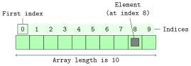

Ce TD a trois objectifs :

  - Définir les notions suivantes :
    + **séquence de taille fixe**
    + **tableau**
    + **séquence de taille variable**
    + **tableau dynamique** aussi appelé **vecteur**
    + **list** sans `e`
    + **liste chaînée**
  - Prendre en main la structure de contrôle `for` en parcourant des list Python
  - Introduire la notion de **complexité de calcul** de façon intuitive

## Préambule : éléments de langage

### Question 1
!!! question " "
    Donner une définition du terme **séquence de taille fixe**.

###  Correction question 1
<details markdown="1">
<summary>Cliquez ici pour révéler la correction.</summary>
Les définitions que nous adoptons en BPI, et plutôt communément admises, sont les suivantes.
Attention néanmoins, en fonction des contextes les gens peuvent utiliser une terminologie différente.
Il faut **toujours savoir** de quoi on parle et **faire attention à la terminologie employée**.

- **type abstrait (abstract data type, ADT en anglais)** : ensemble d'opérations et ensemble de propriétés ;
- **structure de données** : mise en œuvre concrète d'un type abstrait ;
- **séquence de taille fixe** : type abstrait avec 2 opérations : `get(i)` et `set(i, v)` ;
</details>

### Question 2
!!! question " "
    Donner une définition du terme **tableau** ainsi qu'une ligne de code, dans n'importe quel langage, permettant de créer un tableau.

###  Correction question 2
<details markdown="1">
<summary>Cliquez ici pour révéler la correction.</summary>
**tableau** : mise en œuvre du type abstrait séquence de taille fixe à l'aide d'un segment de mémoire contiguë. Pour rappel, les tableaux n'existent pas en Python. Les deux opérations `get(i)` et `set(i)` s'effectuent en temps constant : la ième case se trouve en partant du début du tableau et en ajoutant `i` fois la taille d'une case. Autrement dit, la taille du tableau n'intervient pas quand on cherche à savoir où se trouve la ième case. Voici à quoi ressemble un tableau :


</details>

### Question 3
!!! question " "
    Donner une définition du terme **séquence de taille variable**.

###  Correction question 3
<details markdown="1">
<summary>Cliquez ici pour révéler la correction.</summary>
 **séquence de taille variable** : type abstrait avec les deux opérations disponibles sur les séquences de taille fixe et des opérations d'insertion et de suppression ;
</details>

### Question 4
!!! question " "
    Donner une définition du terme **tableau dynamique** ainsi qu'une ligne de code, dans n'importe quel langage, permettant de créer un tableau dynamique.

###  Correction question 4
<details markdown="1">
<summary>Cliquez ici pour révéler la correction.</summary>
**tableau dynamique** : mise en œuvre du type abstrait séquence de taille variable à l'aide d'un tableau ;
</details>

### Question 5
!!! question " "
    Donner une définition du terme **list** ainsi qu'une ligne de code Python permettant de créer une `list`.

###  Correction question 5
<details markdown="1">
<summary>Cliquez ici pour révéler la correction.</summary>
**list** : tableau dynamique de Python ;
</details>

### Question 6
!!! question " "
    Donner une définition du terme **liste chaînée** et réfléchir à la façon de créer une telle liste.

###  Correction question 6
<details markdown="1">
<summary>Cliquez ici pour révéler la correction.</summary>
**liste chaînée** : mise en œuvre du type abstrait séquence de taille variable avec un chaînage d'éléments comme illustré ici :


Pour rappel, le document présenté en cours synthétisant les types abstraits et les structures de données rencontrés en BPI est [disponible ici](../../adt_sdd.pdf).
</details>


## Exercice 1 : parcours de tableaux

Dans cet exercice nous allons parcourir un tableau.
Comme les tableaux n'existent pas en Python, quand nous disons tableau, cela signifie une `list` Python sur laquelle on effectue uniquement des accès indexés.

### Question 1
!!! question " "
    Écrire une fonction qui renvoie la somme des éléments d'un tableau à l'aide d'une boucle `for`.
    Combien d'additions sont-elles nécessaires ?

###  Correction question 1
<details markdown="1">
<summary>Cliquez ici pour révéler la correction.</summary>

Pour nous forcer à prendre du recul, commençons par regarder une implémentation en `C` :

```c
int somme(int longueur, int tableau[longueur]) {
    int somme = 0;
    for (int i = 0; i < longueur; i++) {
        somme += tableau[i];
    }
    return somme;
}
```

Comme nous l'avons vu en cours, cette solution sera valide, aux détails de syntaxe près, dans la plus grande majorité des langages impératifs.
En Python, voici la solution qui se rapproche le plus de la solution "universelle" ci-dessus.

```python
def somme(tableau):
    """Illustration d'une boucle de base sur une list Python avec range"""
    total = 0
    for i in range(len(tableau)):
        total += tableau[i]
    return total
```

Python étant un langage de haut niveau, il existe un moyen plus naturel pour parcourir une `list` :

```python
def somme(tableau):
    """Illustration d'une boucle de base sur une list Python"""
    total = 0
    for element in tableau:
        total += element
    return total
```

Nous favoriserons l'utilisation de cette dernière solution pour parcourir une `list` Python.

Attention les deux parcours de `list` Python (avec et sans `range`) ci-dessus cachent beaucoup de choses, notamment les concepts d'itérable et d'itérateur que nous étudierons en détail dans le chapitre 3 du cours.

Enfin maintenant que nous avons pris du recul, nous nous autorisons à utiliser la fonction standard `sum` de Python :

```python
sum(tableau)
```

Pas besoin de réinventer la roue grâce à l'utilisation de la fonction `sum`.
De plus, cette dernière implémentation est plus efficace que les deux précédentes car elle [écrite en C](https://github.com/python/cpython/blob/c5cb077ab3c88394b7ac8ed4e746bd31b53e39f1/Python/bltinmodule.c#L2293).

Enfin, concernant le nombre d'additions nécessaires, chacune des trois solutions ci-dessus effectue exactement `n` additions, `n` étant le nombre d'éléments dans le tableau.
Autrement dit, indépendamment de l'efficacité de l'implémentation dûe au langage utilisé, la complexité en calcul est la même pour chacune des trois solutions.
</details>


### Question 2
!!! question " "
    Écrire une fonction qui réalise la somme des éléments pairs d'un tableau à l'aide d'une boucle `for`.
    Combien d'additions sont-elles nécessaires ?

###  Correction question 2
<details markdown="1">
<summary>Cliquez ici pour révéler la correction.</summary>
Voici la façon à priori la plus naturelle de faire :
```python
def somme_pairs(tableau):
    """Somme des éléments pairs uniquement"""
    total = 0
    for element in tableau:
        if element % 2 == 0:
            total += element
    return total
```

À la place de l'opérateur modulo `%` on peut utiliser l'opérateur binaire bit à bit `&` pour savoir si un nombre est pair comme dans la solution ci-dessous :

```python
def somme_pairs(tableau):
    """Somme des éléments pairs uniquement avec un opérateur obscure :)"""
    total = 0
    for element in tableau:
        if element & 1 == 0:
            total += element
    return total
```

L'opérateur `&` effectue un `ET` logique bit à bit entre ses deux opérandes.
Comme on peut tester la parité d'un nombre sur sa représentation binaire simplement en regardant le bit de poids faible, et comme la représentation binaire du nombre 1 est `....0000000001`, l'entier `element & 1` dans le code ci-dessous vaut `0` si `element` est pair et `1` sinon.

Cette seconde version nous emmène à nous interroger sur la lisibilité du code. Quelle est la version la plus lisible ? Cela dépend peut-être de la personne qui relira ?

Concernant le nombre d'additions effectuées, qui est exactement le même pour les deux solutions ci-dessus, la bonne réponse est **"ça dépend !"**
Si tous les éléments du tableau sont pairs, alors il y a `n` additions, avec `n` étant le nombre d'éléments dans le tableau.
Si aucun élément du tableau n'est pair, alors il n'y aura aucune addition d'effectuée.

Enfin, bien que les deux versions ci-dessus effectuent le même nombre d'additions, on pourrait s'interroger sur la différence de performance liée au choix de l'opérateur utilisé pour tester la parité.
Néanmoins, il faut ici **commencer par privilégié la lisibilité**.
Autrement dit, comme la complexité en calcul est la même pour les deux solutions, on s'intéressera au "détail de performance entre `% 2` et `& 1`" si et seulement si on s'aperçoit que ce point particulier du programme a un impact non négligeable quant à la performance de l'ensemble du programme (ce qui est peu probable).
Nous comprendrons quand même quelle peut-être la différence entre ces deux solutions au second semestre dans l'UE "Fondements matériels et logiciels de l'informatique".
</details>


### Question 3
!!! question " "
    Écrire une fonction qui réalise la somme des éléments d'indices pairs d'un tableau à l'aide d'une boucle `for`.
    Combien d'additions sont-elles nécessaires ?

###  Correction question 3
<details markdown="1">
<summary>Cliquez ici pour révéler la correction.</summary>

Commençons par regarder une implémentation en `C` :

```c
int somme_indices_pairs(int longueur, int tableau[longueur]) {
    int somme = 0;
    for (int i = 0; i < longueur; i+=2) {
        somme += tableau[i];
    }
    return somme;
}
```

En Python on ne peut pas utiliser le parcours `for element in tableau` car nous travaillons sur les indices.
Il faut donc utiliser la fonction `range`.

Plutôt que de parcourir tous les indices et faire un test pour trouver ceux qui sont pairs,
on utilise le paramètre optionnel `step` de la fonction `range`.

```python
def somme_indices_pairs(tableau):
    """Illustration du parametre step de range"""
    total = 0
    for i in range(len(tableau), step=2):
        total += tableau[i]
    return total
```

Concernant le nombre d'additions, c'est `n/2` avec `n` étant le nombre d'éléments dans le tableau, et ce quelque soit le contenu de ce dernier.
</details>

### Question 4
!!! question " "
    Écrire une fonction qui réalise le produit scalaire de deux vecteurs (au sens mathématique et non informatique tel que décrit dans le préambule) stockés dans deux tableaux.
    Combien d'additions sont-elles nécessaires ?

###  Correction question 4
<details markdown="1">
<summary>Cliquez ici pour révéler la correction.</summary>
Une première solution à laquelle on peut penser consiste à utiliser la fonction `range`.
Attention, il faut bien s'assurer que la taille du tableau que nous utilisons pour connaître l'indice maximum à utiliser soit inférieur à la taille de l'autre tableau.
On parle de précondition pour faire référence aux contraintes sur les arguments passés à une fonction.

Dans la correction ci-dessous, cette précondition est mentionnée dans la docstring, mais n'est pas vérifiée dans le code.
Pour le moment, on se contente de cette solution sans vérification, qui dans tous les cas génère une erreur (essayez le par vous mêmes) si la précondition n'est pas vérifiée.
```python
def produit_scalaire_v1(vecteur1, vecteur2):
    """Parcours de deux tableaux en parallèle

    pré-condition: len(vecteur1) <= len(vecteur2)
    """
    total = 0
    for i in range(len(vecteur1)):
        total += vecteur1[i] * vecteur2[i]
    return total
```

En Python il existe une autre solution plus élégante basée sur la fonction `zip`, notamment parce qu'elle permet très facilement de travailler avec le plus petit tableau.
Autrement dit, cette solution va sommer autant d'éléments qu'il y en a dans le plus petit tableau.

```python
def produit_scalaire_v2(vecteur1, vecteur2):
    """Parcours de deux tableaux en parallèle

    Ici pas de précondition car `zip` s'arrête au plus petit.
    """
    total = 0
    for e1, e2 in zip(vecteur1, vecteur2):
        total += e1 * e2
    return total
```

Pour bien comprendre cette solution il faut lire attentivement la documentation de la fonction `zip`.
Il est normal que nous ne comprenions pas encore tous les termes utilisés dans cette documentation (à la fin du semestre ce ne sera plus le cas), néanmoins apprendre à ne pas fuir, et donc à lire, de la documentation technique (en anglais) est aussi un des objectifs d'apprentissage de BPI, donc allons-y :-)

```console
The zip object yields n-length tuples, where n is the number of iterables
passed as positional arguments to zip().  The i-th element in every tuple
comes from the i-th iterable argument to zip().  This continues until the
shortest argument is exhausted.
```

**Attention**, les fonctions `produit_scalaire_v1` et `produit_scalaire_v2` ne réponde pas à la même spécification.
En effet, la deuxième version n'a pas de précondition concernant les paramètres.
On s'est autorisé ici cet écart car la spécification n'était pas précise dans l'énoncé.

Concernant le nombre d'additions, celui-ci est égal à la longueur de `vecteur1` dans la première solution, et égal à la plus petite longueur entre `vecteur1` et `vecteur2` dans la seconde solution.
</details>


## Exercice 2 : polygones

On stocke un polygone comme un tableau de `Point`.
Les points sont donc ordonnés.
On souhaite afficher tous les segments composant le polygone.
On dispose pour ce faire d’une fonction `affiche_segment(point1, point2)`.

### Question 1
!!! question " "
    Écrire une fonction qui réalise l'affichage du polygone. Combien d'appels à la fonction `affiche_segment` sont nécessaires ?

###  Correction question 1
<details markdown="1">
<summary>Cliquez ici pour révéler la correction.</summary>
Voici une première solution utilisant la fonction `range`.
On utilise ici l'opérateur modulo `%` pour s'assurer de retomber sur le premier point quand on arrive à la fin du tableau.

```python
def affiche_polygone(polygone):
    """Première solution avec range."""
    for indice in range(len(polygone)):
        point1 = polygone[indice]
        point2 = polygone[(indice + 1) % len(polygone)]
        affiche_segment(point1, point2)
```

Voici une seconde solution utilisant la fonction `enumerate` plutôt que `range` dont la documentation est donnée ci-dessous.
Dans cette solution on utilise encore l'opérateur modulo `%`.

```console
The enumerate object yields pairs containing a count and a value yielded by the iterable argument.
```

```python
def affiche_polygone(polygone):
    """Deuxième solution avec enumerate."""
    for indice, point1 in enumerate(polygone):
        point2 = polygone[(indice + 1) % len(polygone)]
        affiche_segment(point1, point2)
```

Une troisième solution plus "Pythonique", c'est à dire tirant pleinement partie des constructions du langage, consiste à utiliser le fait que l'on peut accéder aux éléments d'une `list` Python en partant de la fin grâce à des indices négatif, sachant que l'indice `[-1]` représente le dernier élément, `[-2]` l'avant dernier, etc.

```python
def affiche_polygone(polygone):
    """Troisième solution, Pythonique."""
    for i in range(len(polygone)):
        affiche_segment(polygone[i - 1], polygone[i])
```

On notera qu'avec cette troisième solution les segments ne sont pas affichés dans le même ordre que dans les deux solutions précédentes.
Là encore on s'autorise cet écart car la spécification n'est pas précise dans l'énoncé.

Concernant le nombre d'appels à la fonction `affiche_segment`, celui-ci est égale au nombre d'éléments dans la `list` `polygone` dans les trois solutions.
</details>


## Exercice 3 : somme de chiffres

### Question 1
!!! question " "
    Écrire une fonction qui réalise la somme de tous les chiffres dans la représentation en base 10 d'un entier. Quel est le nombre de tours de boucle nécessaires ?

###  Correction question 1
<details markdown="1">
<summary>Cliquez ici pour révéler la correction.</summary>
Voici une première solution parcourant les chiffres de l'entier un à un à l'aide d'une boucle `while`.
Un `while` et non pas un `for` est nécessaire ici car le nombre de tours de boucle n'est pas connu au démarrage de la boucle.
Pour parcourir les chiffres un à un de notre nombre, on utilise l'opérateur modulo `%` que nous avons déjà vu, et l'opérateur division entière `//`.
```python
def get_somme_chiffre(nombre):
    """Renvoie la somme des chiffres dans la représentation en base 10 de nombre"""
    total = 0
    while nombre != 0:
        chiffre = nombre % 10 # on récupère le chiffre tout à droite
        nombre = nombre // 10 # on supprime le dernier chiffre
        total += chiffre
    return total
```

Voici une seconde solution, complètement différente, utilisant le fait qu'en Python il est très simple de parcourir les caractères d'une chaîne de caractères à l'aide d'une boucle `for`.
On transforme donc `nombre` en une chaîne de caractères avec la fonction `str` puis on utilise une boucle `for` car cette fois-ci le nombre de tours de boucle est connu au démarrage de la boucle : il y aura autant de tours que de caractères.

On notera également que la fonction `str` est appelée directement dans la boucle `for`.
Cela signifie-t-il que cette fonction est appelée à chaque tour de boucle ? **Non** : elle appelée une seule fois avant le démarrage de l'exécution de la boucle.
```python
def get_somme_chiffre(nombre):
    """Renvoie la somme des chiffres dans la représentation en base 10 de nombre"""
    total = 0
    for car in str(nombre):
        total += int(car)
    return total
```
Pour les deux solutions ci-dessus, le nombre de tours de boucle est égal au nombre de chiffres dans la représentation en base 10 du nombre.

On peut raisonnablement se demander s'il n'y a pas un surcoût mémoire à stocker en plus une représentation textuelle du nombre. En fait il y en a une. Supposons que Python utilise exactement $\log_2(n)$ bits pour stocker un entier $n$ (en fait, c'est plus compliqué que ça, mais bon, en première approximation...). Pour stocker la représentation textuelle du même entier, il utilisera un tableau de $\log_{10}(n)$ caractères. Chaque caractère étant un chiffre, donc faisant partie du jeu Latin1, Python le code sur 1 octet. La représentation textuelle du nombre nécessite donc théoriquement $8\times\log_{10}(n)$ bits. Il y a donc un facteur de $\frac{8\ln(2)}{ln(10)} \approx 2.41$ entre la représentation textuelle et la représentation directe de l'entier, en théorie (en pratique c'est un peu différent car l'interpréteur Python ne stocke pas tout-à-fait les variables de cette manière-là).

En pratique, si jamais vous avez du temps à perdre et que vous voulez tester, allez, c'est cadeau, voici un petit programme qui permet de mettre en évidence ce ratio :
```python
#!/usr/bin/env python3

import matplotlib.pyplot as plt
import sys

x = list(range(0, 800, 5))
entiers, caracteres = [sys.getsizeof(2 ** i) for i in x], \
    [sys.getsizeof(str(2 ** i)) for i in x]


fig, ax = plt.subplots()
ax.plot(x, entiers)
ax.plot(x, caracteres)

print("Rapport moyen :", sum(c / e for c, e in zip(caracteres, entiers)) / len(x))
print("Rapport min :", min(c / e for c, e in zip(caracteres, entiers)))
print("Rapport max :", max(c / e for c, e in zip(caracteres, entiers)))

plt.show()
```
On arrive à un ratio de 2,1 environ. Pas trop loin du ratio théorique, donc.


</details>


## Exercice 4 : multiplication binaire (pour aller plus loin)

On s’intéresse à la réalisation manuelle de la multiplication de deux entiers.
Il s’agit de réimplémenter l’algorithme vu à l'école primaire, mais en base 2.

Dans cette implémentation on s'interdit d'utiliser les opérateurs `%`, `//` et `*`.
On utilisera les opérateurs bit-à-bit `&` et `>>` en lieu et place de `%` et `//`.
Comme nous l'avons vu, l'opérateur `&` applique un _ET LOGIQUE_ bit-à-bit à ses deux opérandes.
L'opérateur `x >> k` décale les bits du nombre `x` de `k` positions vers la droite.
Autrement dit, `x >> k` divise `x` par `2^k`.

On utilisera également l'opérateur `x << k` qui décale les bits du nombre `x` de `k` positions vers la droite.
Autrement dit, `x << k` multipliée `x` par `2^k`.

### Question 1
!!! question " "
    Écrire une fonction `get_bits(nombre)` qui renvoie une `list` contenant tous les bits d'un entier.

###  Correction question 1
<details markdown="1">
<summary>Cliquez ici pour révéler la correction.</summary>
```python
def get_bits(nombre):
    """
    Renvoie une list contenant les bits de nombre.
    Version sans opérateur // et %.
    """
    bits = []
    while nombre != 0:
        bit = nombre & 1
        nombre >>= 1
        bits.append(bit)
    return bits
```
</details>

### Question 2
!!! question " "
    En utilisant la fonction `get_bits`, écrire une fonction qui réalise la multiplication en base 2 comme apprise à l'école primaire, de deux nombres.
    Combien de tours de boucles sont nécessaires ?

###  Correction question 2
<details markdown="1">
<summary>Cliquez ici pour révéler la correction.</summary>
Voici une solution utilisant l'opérateur de décalage à gauche `<<`.
Il peut être utile de faire une multiplication binaire à la main sur papier pour comprendre cette fonction.
```python
def multiplie(nombreA, nombreB):
    """multiplication en base deux de deux nombres "à l'ancienne"""
    product = 0
    bitsA = get_bits(nombreA)
    bitsB = get_bits(nombreB)
    for idxA , bitA in enumerate(bitsA):
        for idxB , bitB in enumerate(bitsB):
            product += (bitA & bitB) << (idxA + idxB)
    return product
```
En regardant le code contenant deux boucles imbriquées, on en déduit qu'il faut `nb_bits(nombre1) * nb_bits(nombre2)` tours de boucle.
</details>

