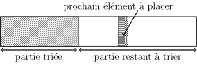

Les objectifs de ce TD sont les suivants :

  - (re) voir deux algorithmes classiques de tri ;
  - s'interroger sur le coût de ces algorithmes en fonction des entrées ;

## Exercice 1 : tri par insertion

On se propose d'implémenter un tri par insertion.
Cet algorithme fonctionne en triant le tableau à partir de son début.
Au départ rien n'est trié et à la fin tout est trié.
Normal, c'est l'objectif et si ce n'était pas le cas, l'algorithme serait incorrect.

Quel est l'état intermédiaire du système ?
En milieu de parcours tout le début du tableau est composé d'éléments ordonnés comme le montre la figure ci dessous.
On parle **d'invariant** de boucle, c'est à dire d'une propriété vraie au début de chaque itération de la boucle.


On prend le premier élément non ordonné et on l'insère à la bonne place dans la partie ordonnée du tableau.
Cette insertion augmente la taille de la partie ordonnée de 1 et il suffit donc de la répéter pour obtenir un tableau complètement trié.

### Question 1
!!! question " "
    Programmer un tri par insertion.

###  Correction question 1
<details markdown="1">
<summary>Cliquez ici pour révéler la correction.</summary>
```python
#!/usr/bin/env python3
"""Tri par insertion"""

from random import randint

# INVARIANT : au début de chaque itération,
#             tableau[0 ... i-1] est trié
#
# 3 choses à prouver :
#    - invariant vrai au début
#    - invariant préservé par une itération
#    - invariant utile en sortie de boucle


def tri_insertion(tableau):
    """Tri par insertion du tableau."""

    # INVARIANT vrai au début car tableau à une seule case
    for i in range(1, len(tableau)):  # 1 <= i <= len(tableau) - 1

        # On mémorise l'élément à placer
        elem_a_placer = tableau[i]

        # On récupère l'indice du dernier élément
        # de la partie triée
        j = i - 1

        # On décale vers la droite 1 à 1 les éléments
        # de la partie triée tant qu'ils sont plus grands
        # que l'élément à placer
        while j >= 0 and tableau[j] > elem_a_placer:
            tableau[j + 1] = tableau[j]
            j = j - 1

        # On met l'élément à placer à sa place
        tableau[j + 1] = elem_a_placer

        # INVARIANT préservé car :
        #   - on a inséré elem_a_placer au bon endroit dans
        #     tableau[0 ... i-1]
        #   - on incrémente i de 1

    # INVARIANT et terminaison
    # Quand on sort de la boucle, l'invariant est vrai
    # car on a montré qu'il était préservé à la fin de
    # chaque iteration.
    # Comme i = len(tableau) quand on est sorti on a :
    #    tableau[0 ... len(tableau) - 1] est trié
    # CQFD.


def teste_tri_insertion():
    """Tri par insertion d'un tableau aléatoire."""
    tableau = [randint(1, 200) for _ in range(10)]
    tri_insertion(tableau)
    print(" ".join(f"{i:3d}" for i in tableau))


teste_tri_insertion()
```
</details>


### Question 2
!!! question " "
    Quelle est à la complexité en temps de l'algorithme ?

###  Correction question 2
<details markdown="1">
<summary>Cliquez ici pour révéler la correction.</summary>
Cet algorithme de tri nous permet d'introduire les notions de meilleur et pire cas en ce qui concerne la complexité en temps d'un programme.
Quelque soit la tableau en entrée de l'algorithme, la boucle externe itère `len(tableau) - 1` fois.

Dans le meilleur cas, le tableau est déjà trié et on ne rentre jamais dans la boucle interne.
Le coût est donc dans ce cas `O(n - 1)` que l'on simplifie en `O(n)` (intuitivement, quand on parle de complexité c'est l'ordre de grandeur qui nous intéresse, et donc on se moque du `- 1`. Nous verrons au second semestre dans le cours d'algo que la definition formelle de `O` nous autorise cette simplification) avec `n` représentant la taille du tableau en entrée.

Dans le pire cas, le tableau est trié mais à l'envers.
La boucle interne est exécutée `1 + 2 + 3 + ... + len(tableau) - 1` fois.
Le coût est donc `O(n * (n+1) / 2) = O(n^2)`, toujours avec `n` représentant la taille du tableau en entrée.
</details>


## Exercice 2 : tri par sélection

Un second algorithme simple de tri est le tri par sélection.
Comme dans le tri par insertion, le tableau est toujours divisé entre une partie triée et une partie non triée.

Comme l'illustre la figure ci-dessous, au lieu de prendre le premier élément non trié et de l'insérer au bon endroit on sélectionne parmi les éléments non triés celui qui prendra sa place définitive à la fin de la partie triée.
Les éléments de la partie triée ne sont donc jamais déplacés.



### Question 1
!!! question " "
    Programmer un tri par sélection.

###  Correction question 1
<details markdown="1">
<summary>Cliquez ici pour révéler la correction.</summary>
```python
#!/usr/bin/env python3
"""Tri par selection"""

from random import randint

# INVARIANT : au début de chaque itération,
#             tableau[0 ... i-1] est trié
#
# 3 choses à prouver :
#    - invariant vrai au début
#    - invariant préservé par une itération
#    - invariant utile en sortie de boucle


def tri_selection(tableau):
    """Tri par selection du tableau"""

    # INVARIANT vrai au début car tableau vide
    for i in range(0, len(tableau) - 1):  # 0 <= i <= len(tableau) - 2

        # On cherche l'élément minimum dans la partie
        # non triée.
        indice_min = i
        valeur_min = tableau[i]
        for j in range(i + 1, len(tableau)):  # i+1 <= j <= len(tableau) - 1
            if tableau[j] < valeur_min:
                valeur_min = tableau[j]
                indice_min = j

        # On inverse l'élément minimum avec
        # l'élément à la case i si besoin
        if indice_min != i:
            tableau[indice_min] = tableau[i]
            tableau[i] = valeur_min

        # INVARIANT préservé car :
        #   - on a inséré à la fin de tableau[0 ... i-1]
        #     le minimum des éléments restants, qui est
        #     plus grand que tableau[i-1]
        #   - on incrémente i de 1

    # INVARIANT et terminaison
    # Quand on sort de la boucle, l'invariant est vrai.
    # Comme i = len(tableau) - 1, on a :
    #    tableau[0 ... len(tableau) - 1 - 1] est trié
    # Par ailleurs, tableau[len(tableau) - 1] est forcément
    # le plus grand élément comme on a cherché le minimum
    # restant à chaque fois.
    # Donc tableau[0 ... len(tableau) - 1] est trié.
    # CQFD.


def teste_tri_selection():
    """Tri par selection d'un tableau aléatoire"""
    tableau = [randint(1, 200) for _ in range(10)]
    tri_selection(tableau)
    print(" ".join(f"{i:3d}" for i in tableau))


teste_tri_selection()
```
</details>

### Question 2
!!! question " "
    Quelle est à la complexité en temps de l'algorithme ?

###  Correction question 2
<details markdown="1">
<summary>Cliquez ici pour révéler la correction.</summary>
Quelque soit le tableau en entrée la boucle interne est exécutée `n-1 + n-2 + ... + 1` fois avec `n` représentant la taille du tableau en entrée.
Le coût est donc `O(n * (n+1) / 2) = O(n^2)`.
</details>


## Exercice 3 : fusion de tableaux triés

### Question 1
!!! question " "
    Écrire un algorithme qui fusionne deux tableaux triés en un seul également trié.

###  Correction question 1
<details markdown="1">
<summary>Cliquez ici pour révéler la correction.</summary>
```python
#!/usr/bin/env python3
"""Fusion de tableaux triés"""

from random import randint


def fusion_tableaux(tab1, tab2):
    """Version language agnostique"""

    # Indices indiquant ou l'on se trouve dans chacun des deux tableaux
    indice_tab_1 = 0
    indice_tab_2 = 0

    # Résultat de la fusion. On utilise une liste contenant initialement
    # autant de None qu'il y aura d'élément dans le résultat de la fusion.
    tab_fusion = [None] * (len(tab1) + len(tab2))

    # Tant qu'il reste des éléments dans les deux tableaux
    indice_tab_fusion = 0
    while indice_tab_1 < len(tab1) and indice_tab_2 < len(tab2):
        valeur_tab_1 = tab1[indice_tab_1]
        valeur_tab_2 = tab2[indice_tab_2]

        # Si le plus petit est dans tab1 on le copie dans
        # fusion et on avance indice_tab_1 de 1
        if valeur_tab_1 <= valeur_tab_2:
            tab_fusion[indice_tab_fusion] = valeur_tab_1
            indice_tab_1 += 1
        # sinon le plus petit est dans tab2, on le copie dans
        # fusion et on avance indice_tab_2 de 2
        else:
            tab_fusion[indice_tab_fusion] = valeur_tab_2
            indice_tab_2 += 1
        indice_tab_fusion += 1

    # Quand on sort de la boucle, un des deux tableaux
    # est entièrement recopié dans tab_fusion. Il faut recopier
    # la fin de l'autre tableau dans tab_fusion.

    # Ici on utilise l'expression if pour voir que celle-ci existe.
    # On pourrait de manière équivalente utiliser une instruction if.
    # Le choix entre les deux se fait en général en fonction de la
    # simplicité ou non du travail en effectuer dans chacune des deux
    # branches du if. Ici nous affectons seulement une valeur, donc
    # l'utilisation de l'expression if se justifie.
    tab, indice = (
        (tab2, indice_tab_2) if indice_tab_1 == len(tab1) else (tab1, indice_tab_1)
    )
    for i in range(indice, len(tab)):
        tab_fusion[indice_tab_fusion] = tab[i]
        indice_tab_fusion += 1

    return tab_fusion


def teste_fusion():
    """Test simple fusionnant deux tableaux aléatoires"""
    tab1 = sorted([randint(1, 100) for _ in range(10)])
    tab2 = sorted([randint(1, 100) for _ in range(15)])
    print(tab1, tab2, "--->", fusion_tableaux(tab1, tab2), sep="\n")


teste_fusion()
```
</details>


### Question 2
!!! question " "
    Quelle est la complexité en temps de l'algorithme ?

###  Correction question 2
<details markdown="1">
<summary>Cliquez ici pour révéler la correction.</summary>
La complexité est `O(n1 + n2)` avec `n1` et `n2` la longueur de `tab1` et `tab2`.

En effet, quelque soit l'entrée de l'algorithme, les deux tableaux doivent être entièrement recopiés dans le tableau fusionné.
</details>


## Exercice 4 : un peu de stabilité (pour aller plus loin)

Un algorithme de tri est **stable** si deux éléments ayant la même valeur dans le tableau se retrouvent dans le même ordre dans le tableau après le tri.
Il faut donc avoir une notion d'ordre en plus de celle définie pour trier le tableau pour parler de stabilité.
En général dans le contexte des tableaux, la position initiale des éléments, c'est-à-dire les indices du tableau auxquels ils se trouvent, est utilisée pour définir cet ordre supplémentaire.

### Question 1
!!! question " "
    L'algorithme de tri par insertion est-il stable ? Pourquoi ?

###  Correction question 1
<details markdown="1">
<summary>Cliquez ici pour révéler la correction.</summary>
Oui.
Comme l'algorithme place les éléments en suivant l'ordre initial, celui-ci est préservé pour les éléments de même valeur.
</details>

### Question 2
!!! question " "
    L'algorithme de tri par sélection est-il stable ? Pourquoi ?

###  Correction question 2
<details markdown="1">
<summary>Cliquez ici pour révéler la correction.</summary>
Non. Un contre exemple suffit : `[4, 4, 1]`
Après la première itération on a `[1, 4, 4]` avec les deux `4` inversés car le premier `4` a été échangé avec le `1`.
</details>


## Exercice 5 : peut-on faire mieux ? (pour aller encore plus loin)

### Question 1
!!! question " "
    Quel est l'algorithme de tri utilisé par la méthode `list.sort()` et la fonction `sorted()` de l'implémentation standard Python ?
    Comparez son coût aux algorithmes étudiés dans ce TD.

###  Correction question 1
<details markdown="1">
<summary>Cliquez ici pour révéler la correction.</summary>
[Timsort](https://fr.wikipedia.org/wiki/Timsort) parce qu'il est en `O(n)` dans le meilleur cas, et en `O(nlogn)` au pire.
C'est un algorithme hybride utilisant le tri par insertion et le [tri par fusion](https://fr.wikipedia.org/wiki/Tri_fusion) (qui utilise une fonction de fusion de tableau similaire à notre fonction `fusion_tableau` ci-dessus)
</details>

