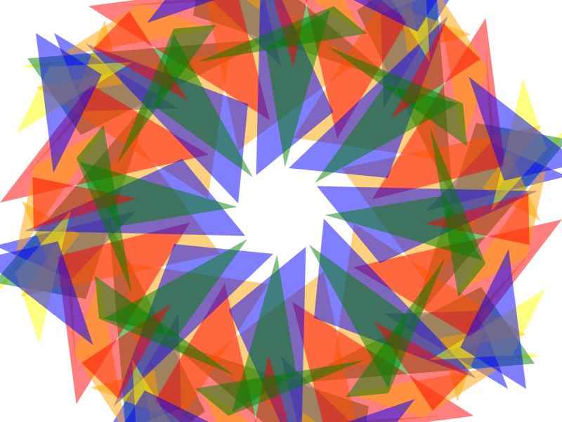

## Énoncé

On se propose dans ce TP de travailler sur un générateur d'images `SVG`.
On souhaite générer des images kaléidoscopiques comme celle ci-dessous.



On vous fournit le fichier principal du programme [`kaleidoscope.py`](kaleidoscope.py) et on vous demande d'écrire deux modules : `dessin.py` et `triangle.py`

Prenez le temps pour bien comprendre le programme principal fourni.
En particulier, on vous demande de bien identifier les fonctions qui devront être implémentées dans les différents modules.
Pour chacune des fonctions, veillez à bien comprendre les paramètres ainsi qu'à identifier ce qu'elle retourne.

Pour dessiner un triangle au format `SVG`, on se référera à la documentation en ligne : [http://www.w3schools.com/graphics/svg_polygon.asp](http://www.w3schools.com/graphics/svg_polygon.asp).
Rajoutez donc une fonction pour générer des polygones à votre module `svg.py` :

```python
def genere_polygone(points):
    """
    Retourne la chaîne de caractères correspondant à un élément SVG
    représentant un polygone. `points` est un tableaux de points.
    """
    # TODO
    ...
```

Vous aurez également besoin de dessiner des triangles transparents.
Pour cela, vous rajouterez la fonction suivante à votre module `svg.py`.
Vous vous renseignerez auprès de votre moteur de recherche préféré pour trouver comment faire de la transparence en `SVG`.

```python
def genere_balise_debut_groupe_transp(niveau_opacite):
    """
    Retourne la chaîne de caractères correspondant à une balise ouvrant un
    groupe d'éléments qui, dans son ensemble, sera partiellement transparent.
    Les éléments qui composent le groupe se masquent les uns les autres dans
    l'ordre d'apparition (ils ne sont pas transparents entre eux).
    `niveau_opacite` doit être un nombre entre 0 et 1. Ce groupe doit être
    refermé de la même manière que les groupes définissant un style.
    """
    # TODO
    ...
```

Pour effectuer la rotation d'angle `α` d’un point de coordonnées `(x, y)` autour d'un centre de rotation de coordonnées `(xc, yc)`, plusieurs approches sont possibles. Si cette partie ne vous inspire pas, vous pouvez toujours utiliser la formule suivante :

`x′ = (x - xc) × cos(α) - (y - yc) × sin(α) + xc`

`y′ = (x - xc) × sin(α) + (y - yc) × cos(α) + yc`

## Correction
<details markdown="1">
<summary>Cliquez ici pour révéler la correction.</summary>
Voici le code d'une correction possible.

Fonction dans le module `svg.py` pour générer un polygone :

```python
def genere_polygone(points):
    """
    Retourne la chaîne de caractères correspondant à un élément SVG
    représentant un polygone. `points` est un tableaux de points.
    """
    coordonnees_points = ""
    for point in points:
        coordonnees_points += f"{point.x}, {point.y} "
    return f'<polygon points="{coordonnees_points}" />'
```

Fonction dans le module `svg.py` pour générer le début d'un groupe transparent :

```python
def genere_balise_debut_groupe_transp(niveau_opacite):
    """
    Retourne la chaîne de caractères correspondant à une balise ouvrant un
    groupe d'éléments qui, dans son ensemble, sera partiellement transparent.
    Les éléments qui composent le groupe se masquent les uns les autres dans
    l'ordre d'apparition (ils ne sont pas transparents entre eux).
    `niveau_opacite` doit être un nombre entre 0 et 1. Ce groupe doit être
    refermé de la même manière que les groupes définissant un style.
    """
    return f'<g opacity="{niveau_opacite}">'
```

Fichier `triangle.py` :
```python
"""
Module pour manipuler des triangles.

Le module fournit un namedtuple Triangle ainsi
qu'une fonction triangle_aleatoire.
"""
from random import randint
from collections import namedtuple
from math import cos, sin
from svg import Point

Triangle = namedtuple("Triangle", "p1 p2 p3")


def tourne_point(point, centre, angle):
    """Tourne le point donné"""
    x_tourne = (
        (point.x - centre.x) * cos(angle) - (point.y - centre.y) * sin(angle) + centre.x
    )
    y_tourne = (
        (point.x - centre.x) * sin(angle) + (point.y - centre.y) * cos(angle) + centre.y
    )
    return Point(x_tourne, y_tourne)


def tourne_triangle_autour(triangle, centre, angle):
    """Tourne le triangle donné"""
    p1_tourne = tourne_point(triangle.p1, centre, angle)
    p2_tourne = tourne_point(triangle.p2, centre, angle)
    p3_tourne = tourne_point(triangle.p3, centre, angle)
    return Triangle(p1_tourne, p2_tourne, p3_tourne)


def point_aleatoire(intervalle_x, intervalle_y):
    """Renvoie un nouveau point aléatoire dans les intervalles donnés"""
    return Point(
        randint(intervalle_x[0], intervalle_x[1]),
        randint(intervalle_y[0], intervalle_y[1]),
    )


def triangle_aleatoire(intervalle_x, intervalle_y):
    """Renvoie un nouveau triangle aléatoire dans le rectangle specifie par les intervalles.

    Prend deux intervalles (chacun un couple de coordonnees) pour chaque dimension.
    """
    return Triangle(
        point_aleatoire(intervalle_x, intervalle_y),
        point_aleatoire(intervalle_x, intervalle_y),
        point_aleatoire(intervalle_x, intervalle_y),
    )


```

Fichier `dessin.py` :
```python
"""Quelques fonctions utiles pour générer du SVG.

    - affiche_triangle
    - couleur_aleatoire
"""
from random import choice
import svg


def affiche_triangle(triangle, couleur):
    """Affiche le triangle donné, de la couleur donnée sur la sortie standard.

    Affichage avec une opacité de 0,5 (semi-transparent)
    """
    # Remarque : pour que les triangles soient transparents les uns
    # par rapport aux autres, chacun doit être dans son propre groupe
    # transparent.
    print(svg.genere_balise_debut_groupe_transp(0.5))
    print(svg.genere_balise_debut_groupe("none", couleur, 0))
    print(svg.genere_polygone((triangle.p1, triangle.p2, triangle.p3)))
    print(svg.genere_balise_fin_groupe())
    print(svg.genere_balise_fin_groupe())


def couleur_aleatoire():
    """Renvoie une couleur svg aleatoire."""
    return choice(["red", "green", "blue", "orange", "yellow"])


```
</details>

## Exercices

- [Boucles for](/2-iterations/travaux-pratiques/05-convertisseur/exercices/01-boucles-for/index.html)
- [Le hasard fait bien les choses](/2-iterations/travaux-pratiques/06-images-pgm/exercices/01-le-hasard-fait-bien-les-choses/index.html)
- [Ligne de commandes et arguments](/2-iterations/travaux-pratiques/07-kaleidoscope/exercices/01-parametres-main/index.html)
