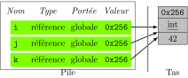
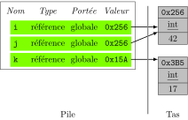
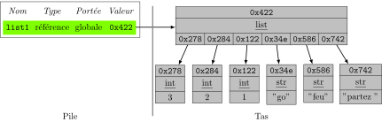
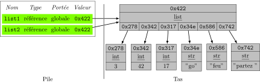
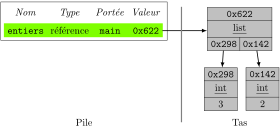
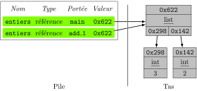
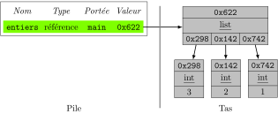
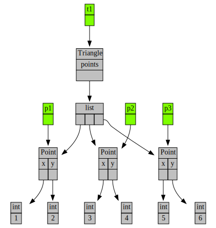
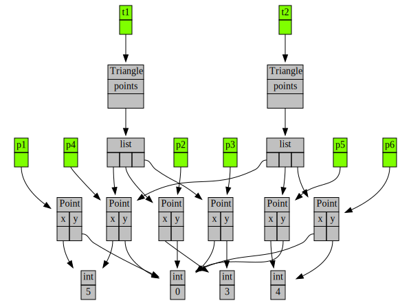

L'objectif de ce TD est d'enfoncer le clou à propos des concepts de classe, d'instance et de référence introduit dans le dernier CM.

## Préambule : éléments de langage

### Question 1
!!! question " "
    Donner une définition du terme **classe**.

### Question 2
!!! question " "
    Donner une définition du terme **instance**.

### Question 3
!!! question " "
    Donner une définition du terme **référence**.

### Question 4
!!! question " "
    Donner une définition du terme **variable** ainsi qu'une ligne de code, dans n'importe quel langage, permettant de créer une variable de type entier.


### Correction globale
<details markdown="1">
<summary>Cliquez ici pour révéler la correction.</summary>

- *Classe* : définition d'un nouveau type composé d'un ensemble d'attributs. Contient aussi des opérations sur le type en question, appelées méthodes, mais en BPI ça ne nous intéresse pas car on ne fait pas de programmation objet, on verra ça en 2A dans le cours POO. Bon, ça nous intéresse quand même un peu, parce que quand on fait `nombres.append("23")` c'est bien la **méthode** `append` de la classe `list` que nous appelons alors que quand nous faisons `sum(nombres)` nous appelons la **fonction** `sum`.
- *Instance* : zone mémoire contenant un ensemble d'attributs tels que définis par la classe à laquelle l'instance est attachée. Cette classe définit le type de l'instance.
- *Référence* : zone mémoire qui est simplement un lien vers une instance.
- *Variable* : nom symbolique utilisé pour désigner une zone mémoire de la machine. En Python, **les variables, les paramètres et les attributs sont toujours des références**.

Une introduction aux concepts de classe, instance, référence et variable est également disponible en vidéo :

<iframe src="https://videos.univ-grenoble-alpes.fr/video/12937-ensimag-bpi-td9-correction-preambule/?is_iframe=true" width="640" height="360" style="padding: 0; margin: 0; border:0" allowfullscreen ></iframe>
</details>


## Exercice 1 : en Python, toutes les variables sont des références !

Et nous allons le prouver !

### Question 1
!!! question " "
    Nous savons maintenant que les variables Python sont toujours des **références** vers des **instances**.
    Comme nous l'avons fait dans le premier cours ([diapositive 21 ici](../../../1-bases/1-bases.pdf)) et les premiers TD, exécutons pas à pas le programme suivant en modifiant sur papier un tableau contenant les variables accessibles à chaque étape du programme ainsi que les instances référencées par ces variables.
    Ce tableau indiquera pour chaque variable : son nom, son type, sa portée et sa valeur.
    La valeur sera donc dessinée par une flèche vers l'instance associée.

    Autrement dit, les schémas que nous allons faire dans ce TD allient les tableaux de variables vus en début d'année avec les schémas d'instances tels que dessinés par le module traceur que nous utiliserons en TP.

```python
#!/usr/bin/env python3

"""Un petit programme pour nous, un grand programme pour l'interpréteur"""

i = 42
j = i
k = 41
k += 1
```


###  Correction question 1
<details markdown="1">
<summary>Cliquez ici pour révéler la correction.</summary>
Voici les quatre schémas corrects représentant l'état du programme :

après exécution de la ligne 5 :<br> 

après exécution de la ligne 6 :<br> 

après exécution de la ligne 7 :<br> 

après exécution de la ligne 8 :<br> 

Les points essentiels à retenir de cette question sont les suivants :

- à partir de maintenant, nous allons insister sur les dessins des instances qui se trouvent dans une partie de la mémoire appelée le **tas** car ils aident vraiment à comprendre nos programmes ;
- nous afficherons les variables en vert ;
- nous afficherons les instances en gris avec leur type et leur contenu ;
- nous représenterons les références par des flèches.
- comme toutes les variables sont des références, leur valeur est donc simplement une adresse vers une instance dans le tas ;
- il existe bien une classe `int` fournie par l'interpréteur ;
- sur le deuxième schéma (et sur le dernier), on voit que `j` (et `k`) désigne(nt) la même instance `int 42` que `i` ; `i` et `j` (et `k` à la fin) sont des références comme toutes les variables en Python.
</details>

### Question 2
!!! question " "
    Que se passe-t-il si l'on rajoute une ligne `k = 17` ?

###  Correction question 2
<details markdown="1">
<summary>Cliquez ici pour révéler la correction.</summary>
Après `k = 17`, voici l'état de la mémoire : <br> 

Les points essentiels à retenir de cette question sont les suivants :

- comme les variables en Python sont toujours des références, quand on modifie `k` avec `k = 17` **on ne change pas** `i` et `j` mais on affecte une nouvelle valeur à la référence `k` pour que celle-ci pointe vers une nouvelle instance de `int` contenant la valeur `17`.
- comme les entiers sont immuables, il n'y a aucun problème à ce que l'entier `42` soit "partagé" par les variables référençant cet entier et l'interpréteur fait ce choix de partage pour des questions d'optimisation.

</details>

### Question 3
!!! question " "
    Dessiner l'état du programme ci-dessous, c'est à dire le tableau des variables et les instances en mémoire, après exécution de:

    - la première ligne ;
    - des deux premières lignes ;
    - des quatre lignes.

```python
#!/usr/bin/env python3

"""Un petit programme pour nous, un grand programme pour l'interpréteur"""

list1 = [3, 2, 1, "go", "feu", "partez"]
list2 = list1
list2[1] = 42
list2[2] = 17
```

###  Correction question 3
<details markdown="1">
<summary>Cliquez ici pour révéler la correction.</summary>
Voici les trois schémas corrects représentant l'état du programme :

après exécution de la ligne 5 : <br> 

après exécution de la ligne 6 : <br> 

après exécution de la ligne 8 : <br> 

Les points essentiels à retenir de cette question sont les suivants :

- il existe bien une classe `list` fournie par l'interpréteur ;
- les `list` Python contiennent des références ;
- les instances de la classe `list` sont mutables, attention donc si l'on a plusieurs références sur une même instance de `list`, lorsque l'on modifie cette instance via une référence, on "modifie" donc implicitement toutes les références ;
- ici il y a deux opérations de mutation sur la liste, à savoir la modification de la référence `[1]` et la modification de la référence `[2]`.

Correction vidéo pour l'ensemble de l'exercice. Attention cette correction ne représente que les instances dans le tas (à l'aide du traceur) et pas le tableau des variables.

<iframe src="https://videos.univ-grenoble-alpes.fr/video/12942-ensimag-bpi-td9-correction-exercice-1/?is_iframe=true" width="640" height="360" style="padding: 0; margin: 0; border:0" allowfullscreen ></iframe>
</details>


## Exercice 2 : et donc les paramètres sont aussi des références !

Nous avons vu que les paramètres des fonctions sont des variables **locales** aux fonctions.
Comme toutes les variables Python sont des références, les paramètres le sont aussi et c'est ce que nous allons voir dans cet exercice.

### Question 1
!!! question " "
    Dessiner l'état du programme ci-dessous, c'est à dire le tableau des variables et les instances en mémoire :

    - après exécution de la ligne 12 ;
    - à l'entrée de la fonction `add_1`, c'est à dire juste avant l'exécution de la ligne 7;
    - après exécution de la ligne 7 ;
    - après exécution de la ligne 13.

```python
#!/usr/bin/env python3

"""Que se passe-t-il quand on passe des arguments à une fonction ?"""

def add_1(entier):
    """Une fonction qui ajoute 1, super !!"""
    entier += 1
    return entier

def main():
    """Point d'entrée du programme."""
    entier = 6
    entier = add_1(entier)
    print(f"{entier = }")

if __name__ == "__main__":
    main()
```


###  Correction question 1
<details markdown="1">
<summary>Cliquez ici pour révéler la correction.</summary>
Voici les quatre schémas corrects représentant l'état du programme :

après exécution de la ligne 12 : <br> 

avant exécution de la ligne 7 : <br> 

après exécution de la ligne 7 : <br> 

après exécution de la ligne 13 <br> 

Les points essentiels à retenir de cette question sont les suivants :

- les paramètres et les valeurs de retour des fonctions **sont des références** ;
- quand on affecte une nouvelle valeur à un paramètre à l'intérieur d'une fonction (avec `param = ...`), on fait pointer le paramètre qui est une variable locale à la fonction vers une autre instance ;
- à la ligne 13, la variable `entier` de la fonction `main` est modifiée : sa nouvelle valeur est la référence renvoyée par la fonction `add_1`, donc une flèche vers l'entier `7` ;
- si une instance n'est plus référencée par personne, alors le ramasse miette de l'interpréteur peut decider de la supprimer pour libérer la mémoire qu'elle occupe.
- (pythonisterie : les `f-string` c'est cool, voir la [documentation ici](https://docs.python.org/3.10/reference/lexical_analysis.html#formatted-string-literals) et/ou essayer le code en TP pour comprendre ce que fait `f"{entier = }"`)
</details>

### Question 2
!!! question " "
    Dessiner l'état du programme ci-dessous, c'est à dire le tableau des variables et les instances en mémoire :

    - après exécution de la ligne 11 ;
    - à l'entrée de la fonction `add_1`, c'est à dire juste avant l'exécution de la ligne 7;
    - après exécution de la ligne 7 mais avant de sortir de la fonction `add_1`;
    - après exécution de la ligne 12.

```python
#!/usr/bin/env python3

"""Que se passe-t-il quand on passe des arguments à une fonction ?"""

def add_1(entiers):
    """Une fonction qui ajoute 1, super !!"""
    entiers.append(1)

def main():
    """Point d'entrée du programme."""
    entiers = [3, 2]
    add_1(entiers)
    print(f"{entiers = }")

if __name__ == "__main__":
    main()
```

###  Correction question 2
<details markdown="1">
<summary>Cliquez ici pour révéler la correction.</summary>
Voici les quatre schémas corrects représentant l'état du programme :

après exécution de la ligne 11 : <br> 

avant exécution de la ligne 7 : <br> 

après exécution de la ligne 7 mais avant de sortir de la fonction `add_1` : <br> 

après exécution de la ligne 12 <br> 

Les points essentiels à retenir de cette question sont les suivants :

- les paramètres et les valeurs de retour des fonctions **sont des références** ;
- quand on modifie une **instance mutable** à l'intérieur d'une fonction, les modifications sont visibles à l'extérieur de la fonction si on possède une référence vers l'instance qui a été modifiée. C'est le cas sur le tableau dynamique `entiers` ici.
</details>


## Exercice 3 : première classe

Nous allons maintenant voir comment définir nos propres classes.
On considère le programme suivant :

```python
#!/usr/bin/env python3

"""Programme manipulant des points via deux entiers"""

def manipule_points():
    """Quelques opérations sur des points"""

    x1, y1 = 3, 5
    x2, y2 = 4, 4
    milieu_x, milieu_y = (x1 + x2) / 2, (y1 + y2) / 2
    print("le milieu est (", milieu_x, milieu_y, ")")
    print("on projette sur la droite y=5")
    milieu_y = 5
    print("nous sommes maintenant en (", milieu_x, milieu_y, ")")

if __name__ == "__main__":
    manipule_points()
```

### Question 1
!!! question " "
    Pourquoi ne pas réécrire ce programme en utilisant des `namedtuple` ?

###  Correction question 1
<details markdown="1">
<summary>Cliquez ici pour révéler la correction.</summary>
Parce que les `namedtuple` sont immuables.
On ne peut donc pas faire la projection sur la droite `y=5` car elle consiste en une affectation de l'ordonnée du milieu.
</details>

### Question 2
!!! question " "
    Écrire une classe `Point` composée de deux attributs `x` et `y` et fournissant :

    - un constructeur prenant une abscisse et une ordonnée en paramètres ;
    - un opérateur de conversion en chaine de caractères `__str__`.

### Question 3
!!! question " "
    Réécrire le code à l'aide de la classe `Point`


###  Correction question 3
<details markdown="1">
<summary>Cliquez ici pour révéler la correction.</summary>

Voici la classe `Point` et la nouvelle version de la fonction `manipule_points()` utilisant cette classe.

```python
#!/usr/bin/env python3

"""Programme manipulant des points via une classe"""


class Point:
    """Un point dans le plan"""

    def __init__(self, abscisse, ordonnee):
        self.x = abscisse
        self.y = ordonnee

    def __str__(self):
        return "(" + str(self.x) + "," + str(self.y) + ")"

def manipule_points():
    """Quelques opérations sur des points"""

    p1 = Point(3, 5)
    p2 = Point(4, 4)
    milieu = Point((p1.x + p2.x) / 2, (p1.y + p2.y) / 2)
    print("le milieu est", milieu)
    print("on projette sur la droite y=5")
    milieu.y = 5
    print("nous sommes maintenant en", milieu)


if __name__ == "__main__":
    manipule_points()
```

Les points essentiels à retenir de cette question sont les suivants :

- la méthode spéciale `__init__()` d'une classe est appelée automatiquement par l'interpréteur quand on crée une instance de cette classe ;
- la méthode spéciale `__str__()` d'une classe est appelée automatiquement par l'interpréteur quand on fait `str(inst)` et que `inst` est une référence vers une instance de la classe ;
- les instances de nos propres classes sont mutables ;
- la fonction `print` appelle `__str__()` pour nous sur tous ses paramètres qui ne sont pas des références vers des instances de type `str`.

</details>

### Question 4
!!! question " "
    Dessiner l'état du programme ci-dessous après exécution de la ligne `milieu.y = 5`.
    Comme nous nous intéressons ici non pas à l'évolution des variables et des instances au cours du temps, mais simplement à comprendre ce qu'il se passe à un instant donné, nous ne dessinerons pas le tableau des variables mais directement les variables et instances en mémoire comme les dessinerait le module `traceur`.

###  Correction question 4
<details markdown="1">
<summary>Cliquez ici pour révéler la correction.</summary>
Voici le dessin correct représentant l'état du programme :


Les points essentiels à retenir de cette question sont les suivants :

- il y a bien trois points, c'est à dire des instances de la classe `Point`, correspondant aux trois appels `Point(..., ...)` ;
- les attributs de nos propres classes **sont des références** ;
- l'entier `5` est partagé entre deux points ;
- l'abscisse de milieu est un `float`.

Correction vidéo pour l'ensemble de l'exercice :

<iframe src="https://videos.univ-grenoble-alpes.fr/video/12947-ensimag-bpi-td9-correction-exercice-2/?is_iframe=true" width="640" height="360" style="padding: 0; margin: 0; border:0" allowfullscreen ></iframe>
</details>


## Exercice 4 : deuxième classe

### Question 1
!!! question " "
    Proposer une classe `Triangle` utilisant un tableau contenant trois références vers des instances de la classe `Point`.
    Penser à définir l'opérateur `__str__`.

###  Correction question 1
<details markdown="1">
<summary>Cliquez ici pour révéler la correction.</summary>
```python
#!/usr/bin/env python3

"""Programme manipulant des points via une classe"""

from points_classe import Point


class Triangle:
    """Un triangle est composé de trois points"""

    def __init__(self, p1, p2, p3):
        self.points = [p1, p2, p3]

    def __str__(self):
        return str(self.points[0]) + str(self.points[1]) \
            + str(self.points[2])

def test_triangle():
    """Teste la classe triangle"""

    p1 = Point(1, 2)
    p2 = Point(3,4)
    p3 = Point(5,6)
    t1 = Triangle(p1, p2, p3)


if __name__ == "__main__":
    test_triangle()
```
</details>

### Question 2
!!! question " "
    Dessiner l'état du programme ci-dessous, après exécution des quatre lignes.
    Comme nous nous intéressons ici non pas à l'évolution des variables et des instances au cours du temps, mais simplement à comprendre ce qu'il se passe à un instant donné, nous ne dessinerons pas le tableau des variables mais directement les variables et instances en mémoire comme les dessinerait le module `traceur`.

```python
p1 = Point(1,2)
p2 = Point(3,4)
p3 = Point(5,6)
t1 = Triangle(p1, p2, p3)
```

###  Correction question 2
<details markdown="1">
<summary>Cliquez ici pour révéler la correction.</summary>
Voici le dessin correct représentant l'état du programme :



Les points essentiels à retenir de cette question sont les suivants :

- `p1` et `t1.points[0]` sont deux références vers la même instance ;
- `p2` et `t1.points[1]` sont deux références vers la même instance ;
- `p3` et `t1.points[2]` sont deux références vers la même instance ;
- il y a une instance de `list`, créée quand on fait `[...]`.

</details>


### Question 3
!!! question " "
    Dessiner l'état du programme ci-dessous juste après le dernier appel à la fonction `print` du programme ci-dessous.
    Comme nous nous intéressons ici non pas à l'évolution des variables et des instances au cours du temps, mais simplement à comprendre ce qu'il se passe à un instant donné, nous ne dessinerons pas le tableau des variables mais directement les variables et instances en mémoire comme les dessinerait le module `traceur`.

```python
#!/usr/bin/env python3

"""Programme à analyser"""

from points_classe import Point
from triangles_classe import Triangle

def fonction_a_analyser():
    """Que fait cette fonction ?"""

    p1 = Point(0 ,0)
    p2 = Point(3, 0)
    p3 = Point(0, 3)
    p4 = Point(0 ,0)
    p5 = Point(4, 0)
    p6 = Point(0, 4)
    t1 = Triangle(p1, p2, p3)
    t2 = Triangle(p4, p5, p6)
    print(t1, t2)
    t1.points[0].x = 5
    print(t1, t2)
    t1.points[0] = p4
    print(t1, t2)
    t1.points[0].x = 5
    print(t1, t2)


if __name__ == "__main__":
    fonction_a_analyser()
```

###  Correction question 3
<details markdown="1">
<summary>Cliquez ici pour révéler la correction.</summary>
Voici le dessin correct représentant l'état du programme :



Les points essentiels à retenir de cette question sont les suivants :

- la méthode `__str__` est appelée automatiquement par l'interpréteur sut `t1` et `t2` quand on fait `print(t1, t2)` ;
- une instance de `list` est créée à chaque `[...]`, donc deux instances sont créées ici ;
- les `list` Python contiennent des références et donc `t1` et `t2` "partagent" un point qui est une instance ⚠️**mutable**⚠. Donc quand on change l'instance de `Point` partagée, on change les deux triangles.

Correction vidéo pour l'ensemble de l'exercice :

<iframe src="https://videos.univ-grenoble-alpes.fr/video/12959-ensimag-bpi-td9-correction-exercice-3/?is_iframe=true" width="640" height="360" style="padding: 0; margin: 0; border:0" allowfullscreen ></iframe>
</details>


## Exercice 5 : égaux ou identiques ? (pour aller plus loin)

### Question 1
!!! question " "
    Qu'affiche le programme ci-dessous ?

```python
#!/usr/bin/env python3

"""Un petit programme mystère"""

i = 41
j = 42
k = i + 1
print(i is j)
print(i == j)
print(i is k)
print(i == k)
print(j is k)
print(j == k)
print()

a = 1234 * 5678
b = 5678 * 1234
c = b
print(a is b)
print(a == b)
print(a is c)
print(a == c)
print(b is c)
print(b == c)
print()

print(-9 is -9)
print()

r = "41"
s = "42"
t = "4" + str(2)
print(r is s)
print(r == s)
print(r is t)
print(r == t)
print(s is t)
print(s == t)

```

###  Correction question 1
<details markdown="1">
<summary>Cliquez ici pour révéler la correction.</summary>
Il faut commencer par copier le code ci-dessus dans un fichier Python et l'exécuter.

On peut également regarder ce qu'il se passe en mémoire :


Voici ce que l'on peut retenir de cet exercice :

- `x is y` teste si les deux références `x` et `y` pointent vers la même instance ;
- `x == y` teste si les deux instances référencées par `x` et `y` sont égales, c'est à dire si leur contenu sont égaux, par exemple pour des entiers si ils ont la même valeur. Plus précisément,  `x == y` est défini par `x.__eq__(y)` [voir ici](https://docs.python.org/3/reference/datamodel.html#object.__eq__)
- pour les instances immuables, comment fait l'interpréteur pour décider si il doit chercher une instance existante ayant la même valeur ou en créer un nouveau, ben c'est une bonne question :-) ? Tout ce qu'on peut dire ici c'est que notre entier favori `42` est partagé, alors que `7006652` ne l'est pas.

</details>

### Question 2
!!! question " "
    Qu'affiche le programme ci-dessous ?

```python
#!/usr/bin/env python3

"""Un autre programme mystère"""

from points_classe import Point

p1 = Point(42, 42)
p2 = Point(42, 42)
print(p1 == p2)
print(p1 is p2)
```

###  Correction question 2
<details markdown="1">
<summary>Cliquez ici pour révéler la correction.</summary>
Le programme affiche deux fois `False`.
Nous avons deux instances différentes de la classe `Point`, donc il est normal que le teste avec `is` renvoie `False`.

Concernant le teste avec `==` sur des instances de nos propres classes, par défaut celui-ci est équivalent à `is`. C'est pourquoi il renvoie `False` également.
Pour avoir un test d'égalité qui compare la valeur de deux `Point`, c'est à dire les valeurs des abscisses et celles des ordonnées, il faut implémenter la méthode spéciale `__eq__` dans notre classe `Point` [voir ici](https://docs.python.org/3/reference/datamodel.html#object.__eq__).
</details>


