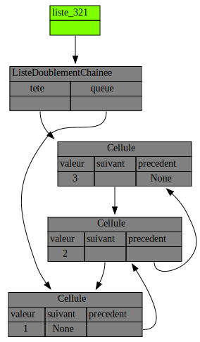

L'objectif de ce TD est de créer une liste doublement chaînée et de réfléchir à l'implémentation et à la complexité temporelle de différentes opérations sur ce type de listes chaînées.

## Exercice 1 : listes doublement chaînées

On travaille donc aujourd'hui sur les listes doublement chaînées.
Dans une liste doublement chaînée, chaque cellule contient deux références : une vers la cellule **suivante** et une vers la cellule **précédente**.

L'image ci dessous est la liste doublement chaînée `3 --> 2 --> 1` dessinée par le module `traceur` à l'aide de l'option `deeply=False` pour simplifier le dessin.
Cette option permet de ne pas dessiner les instances "primitives" (entiers, flottants, chaînes de caractères et `None`) comme des objets à part entière mais de les imbriquer dans les instances les contenant.
Ceci **n'est pas la réalité** de ce qu'il se passe dans l'interpréteur.
Si vous n'êtes pas encore à l'aise avec les dessins conformes à la réalité que nous avons vus jusqu'à présent, **il est déconseillé d'utiliser** l'option `deeply=False`.



Comme l'illustre l'image ci-dessus, le type `ListeDoublementChainee` est le même que le type `ListeSimplementChainee` manipulé jusque là, c'est à dire avec une référence vers la tête de liste et une autre vers la queue.

Le type `Cellule` devient par contre le suivant :

```python
class Cellule:
    """Une cellule d'une liste doublement chaînée.

    Contient une référence vers une valeur, une référence
    vers la cellule suivante et une référence vers la cellule
    précédente.
    """

    def __init__(self, valeur, precedent, suivant):
        self.valeur = valeur
        self.suivant = suivant
        self.precedent = precedent

    def __str__(self):
        """Pour pouvoir afficher des cellules facilement."""
        return str(self.valeur)
```

### Question 1
!!! question " "
    Écrire  les  fonctions  d'ajout  d’éléments, de prototypes

    `ajoute_en_tete(liste_chainee, valeur)` et `ajoute_en_queue(liste_chainee, valeur)`

    Dans ce TD, ces fonctions seront les deux seules créant des cellules.
    Quelle est la complexité temporelle de chacune de ces deux fonctions ?

###  Correction question 1
<details markdown="1">
<summary>Cliquez ici pour révéler la correction.</summary>
Voici le code de la fonction pour ajouter en tête :
```python
def ajoute_en_tete(liste_chainee, valeur):
    """Ajoute un élément en tête de liste chaînée en temps constant."""

    # Dans tous les cas, la tête doit être une nouvelle cellule.
    liste_chainee.tete = Cellule(valeur, precedent=None, suivant=liste_chainee.tete)

    # Si la liste chaînée n'était pas vide, donc qu'il
    # y avait une queue, il faut mettre à jour l'attribut
    # précédent de l'ancienne tête pour qu'il référence
    # la nouvelle tête.
    if liste_chainee.queue:
        liste_chainee.tete.suivant.precedent = liste_chainee.tete

    # Sinon il faut mettre à jour la queue de la liste chaînée.
    else:
        liste_chainee.queue = liste_chainee.tete
```

Voici le code de la fonction pour ajouter en queue :
```python
def ajoute_en_queue(liste_chainee, valeur):
    """Ajoute un élément en queue de liste chaînée en temps constant."""

    # Dans tous les cas, la queue doit être une nouvelle cellule.
    liste_chainee.queue = Cellule(valeur, suivant=None, precedent=liste_chainee.queue)

    # Si la liste chaînée n'était pas vide, donc qu'il
    # y avait une tête, il faut mettre à jour l'attribut
    # suivant de l'ancienne queue pour qu'il référence
    # la nouvelle queue.
    if liste_chainee.tete:
        liste_chainee.queue.precedent.suivant = liste_chainee.queue

    # Sinon il faut mettre à jour la tête de la liste chaînée
    else:
        liste_chainee.tete = liste_chainee.queue
```

Comme l'indique la docstring, les deux fonctions ont un coût constant, c'est à dire indépendant de la taille de la liste chaînée.
En effet, il n'y a aucune boucle dans ces deux fonctions mais un nombre d'opérations constant quelle que soit la liste chaînée.
</details>

### Question 2
!!! question " "
    Programmer un générateur renvoyant un itérateur sur toutes les cellules de la liste de la tête à la queue.
    Il devra être résistant aux modifications sur la cellule courante.

###  Correction question 2
<details markdown="1">
<summary>Cliquez ici pour révéler la correction.</summary>
Voici le code du générateur :
```python
def recupere_cellules(liste_chainee):
    """Renvoie un itérateur sur toutes les cellules.

    Résistant aux changements sur la cellule courante grâce à la
    sauvegarde du suivant avant le yield.
    """
    cellule_courante = liste_chainee.tete
    while cellule_courante:
        cellule_suivante = cellule_courante.suivant
        yield cellule_courante
        cellule_courante = cellule_suivante
```
</details>

### Question 3
!!! question " "
    Programmer un générateur renvoyant un itérateur sur toutes les cellules de la liste de la queue à la tête.
    Il devra être résistant aux modifications sur la cellule courante.
    Serait-ce aussi simple avec une liste simplement chaînée ?

###  Correction question 3
<details markdown="1">
<summary>Cliquez ici pour révéler la correction.</summary>
Voici le code du générateur :
```python
def recupere_cellules_inversees(liste_chainee):
    """Renvoie un itérateur sur toutes les cellules en ordre inverse.

    Avec une liste doublement chaînée c'est assez simple car nous avons
    accès au précédent de chaque cellule. Dans une liste simplement chaînée,
    il faut nécessairement mémoriser toutes les cellules du début jusqu'à la
    fin, puis parcourir à l'envers.

    Résistant aux changements sur la cellule courante grâce à la
    sauvegarde du précédent avant le yield.
    """
    cellule_courante = liste_chainee.queue
    while cellule_courante:
        cellule_precedente = cellule_courante.precedent
        yield cellule_courante
        cellule_courante = cellule_precedente
```

Correction vidéo des questions 1, 2 et 3 :

<iframe src="https://videos.univ-grenoble-alpes.fr/video/14177-ensimag-bpi-td13-correction-questions-12-et-3/?is_iframe=true" width="640" height="360" style="padding: 0; margin: 0; border:0" allowfullscreen ></iframe>
</details>

### Question 4
!!! question " "
    En utilisant `filter`, `next`, et le générateur sur les cellules, programmer une fonction renvoyant la première cellule contenant la valeur donnée ou `None` si la valeur n'est pas présente dans la liste.

    Le prototype de cette fonction est `recherche(liste_chainee, valeur)`.

    La documentation de `next` et de `filter` est donnée ci-dessous.

```console
filter(function or None, iterable) --> filter object
Return an iterator yielding those items of iterable for which function(item)
is true. If function is None, return the items that are true.

next(iterator[, default])
Return the next item from the iterator. If default is given and the iterator
is exhausted, it is returned instead of raising StopIteration.
```

###  Correction question 4
<details markdown="1">
<summary>Cliquez ici pour révéler la correction.</summary>
Voici le code de la fonction `recherche` :
```python
def recherche(liste_chainee, valeur):
    """Renvoie la première cellule contenant la valeur donnée, None si pas trouvée."""

    def teste_valeur(cellule):
        """Cette fonction interne va être utiliser par `filter`."""

        # La variable valeur n'existe pas dans la fonction teste_valeur.
        # Dans ce cas, l'interpréteur va chercher une variable avec ce nom
        # dans la fonction englobante, c'est à dire la fonction `recherche`
        # ici.
        return cellule.valeur == valeur

    # On récupère un itérateur sur toutes les cellules ayant la valeur que l'on
    # cherche grâce à la fonction standard `filter`.
    # Ici il faut bien garder en tête qu'avec des itérateurs nous travaillons de
    # façon "paresseuse" (lazy en anglais), c'est à dire que la liste chaînée
    # n'est pas parcourue tant qu'on ne fait pas d'appels aux fonctions des
    # itérateurs permettant de récupérer le prochain élément.
    iterateur_cellules_filtrees = filter(teste_valeur, recupere_cellules(liste_chainee))

    # On renvoie le premier élément de cet itérateur on None si il est vide
    return next(iterateur_cellules_filtrees, None)
```
</details>

### Question 5
!!! question " "
    Programmer une fonction :
    `enleve_cellule(liste_chainee, cellule)`
    enlevant la cellule donnée, qui **fait** partie de la liste.
    Quelle est sa complexité temporelle ?

###  Correction question 5
<details markdown="1">
<summary>Cliquez ici pour révéler la correction.</summary>
Voici le code de la fonction `enleve_cellule` :
```python
def enleve_cellule(liste_chainee, cellule):
    """Enlève la cellule donnée en temps constant."""

    # Si la cellule enlevée n'est pas la tête, il faut
    # mettre à jour le champ suivant de la cellule
    # précédente.
    if cellule.precedent:
        cellule.precedent.suivant = cellule.suivant

    # Sinon il faut mettre à jour la tête de la liste chaînée.
    else:
        liste_chainee.tete = cellule.suivant

    # Si la cellule enlevée n'est pas la queue, il faut
    # mettre à jour le champ précédent de la cellule
    # suivante.
    if cellule.suivant:
        cellule.suivant.precedent = cellule.precedent

    # Sinon il faut mettre à jour la queue de la liste chaînée.
    else:
        liste_chainee.queue = cellule.precedent
```

Correction vidéo des questions 4 et 5 :

<iframe src="https://videos.univ-grenoble-alpes.fr/video/14178-ensimag-bpi-td13-correction-questions-4-et-5/?is_iframe=true" width="640" height="360" style="padding: 0; margin: 0; border:0" allowfullscreen ></iframe>
</details>

### Question 6
!!! question " "
    En supposant que notre liste soit de longueur ≥ 2 et contienne des entiers, proposer une fonction
    renvoyant un des couples d'entiers les plus proches de la liste, de prototype : `recupere_entiers_proches(liste_chainee)`
    Si le cœur nous en dit, on pourra utiliser `itertools.combinations` dont la documentation est donnée ci-dessous.
    Quelle est la complexité temporelle de la fonction `recupere_entiers_proches`?

```console
combinations(iterable, r) --> combinations object
Return successive r-length combinations of elements in the iterable.
combinations(range(4), 3) --> (0,1,2), (0,1,3), (0,2,3), (1,2,3)
```

###  Correction question 6
<details markdown="1">
<summary>Cliquez ici pour révéler la correction.</summary>
Voici le code de la fonction `recupere_entiers_proches` utilisant `itertools.combinations` et une fonction annexe `recupere_valeurs` :
```python
def recupere_valeurs(liste_chainee):
    """Renvoie un itérateur sur toutes les valeurs."""
    for cellule in recupere_cellules(liste_chainee):
        yield cellule.valeur
```
```python
def recupere_entiers_proches(liste_chainee):
    """Renvoie les deux valeurs (entiers) les plus proches.

    La complexité avec itertools.combinations = A^k_n / k! = n! / k!(n-k)! notée C^k_n
    avant, et maintenant (n,k) mais verticalement, appelé coefficient binomial.
    Ici on a k = 2 donc complexité = n! / 2*(n-2)! = n * (n-1) / 2
    """

    # On crée un itérateur sur toutes les valeurs de la liste chaînée.
    iterateur_valeurs = recupere_valeurs(liste_chainee)

    # On crée un itérateur sur toutes les combinaisons de 2 valeurs.
    iterateur_couples = itertools.combinations(iterateur_valeurs, 2)

    # Ici on utilise une "expression génératrice" qui crée un itérateur
    # comme une fonction génératrice.
    # Néanmoins, comme on le voit ici, pas besoin de créer de fonction avec yield
    # on utilise simplement des parenthèses avec à l'intérieur une structure de la forme:
    # (X for Y in Z)
    # Toutes les valeurs prises par X seront "yieldées" par l'itérateur créé.
    #
    # Ici l'itérateur créé contient des tuples à deux éléments :
    #   - le premier est un entier représentant la distance entre les deux valeurs stockées
    #     dans le deuxième élément
    #   - un tuple à deux éléments représentant deux valeurs
    iterateur_distance_elements = (
        (abs(e1 - e2), (e1, e2)) for e1, e2 in iterateur_couples
    )

    # Pour comprendre la ligne ci-dessous, il faut savoir que par défaut,
    # les tuples python sont ordonnés selon leur premier élément et que donc
    # si on demande à la fonction min le minimum parmi un itérateur de tuples,
    # celle-ci nous renvoie le tuple avec la plus petite première valeur,
    # en l'occurrence le plus petit abs(e1 - e2).
    min_distance_elements = min(iterateur_distance_elements)

    # Le couple le plus proche est simplement le deuxième élément du
    # tuple min trouvé ci-dessus.
    return min_distance_elements[1]
```

Voici une autre version n'utilisant pas `itertools.combinations` mais deux fonctions annexes `recupere_cellules_apres` et `recupere_paires_valeurs` :
```python
def recupere_cellules_apres(cellule):
    """Renvoie un  itérateur sur les cellules après la cellule donnée."""
    cellule_courante = cellule
    while cellule_courante:
        yield cellule_courante
        cellule_courante = cellule_courante.suivant
```
```python
def recupere_paires_valeurs(liste_chainee):
    """Renvoie un  itérateur sur toutes les paires de valeurs."""
    for premiere in recupere_cellules(liste_chainee):
        for deuxieme in recupere_cellules_apres(premiere.suivant):
            yield premiere.valeur, deuxieme.valeur
```
```python
def recupere_entiers_proches_bis(liste_chainee):
    """Renvoie les deux valeurs les plus proches.

    Utilise le fait qu'une distance n'est jamais < 0.
    """

    def distance(paire):
        return abs(paire[0] - paire[1])

    paires = recupere_paires_valeurs(liste_chainee)
    paire_min = next(paires)
    dist_min = distance(paire_min)
    if dist_min == 0:
        return paire_min
    for paire_cour in paires:
        dist_cour = distance(paire_cour)
        if dist_cour == 0:
            return paire_cour
        if dist_cour < dist_min:
            paire_min, dist_min = paire_cour, dist_cour
    return paire_min
```

La complexité temporelle des deux implémentations ci-dessus est la même.
Celle-ci est égale au nombre de combinaisons de taille 2 dans la liste chaînée.
Sachant que le nombre de combinaisons de taille `k` parmi `n` éléments est $\frac{n!}{k!(n-k)!}$ on obtient une complexité de $\frac{n!}{2!(n-2)!} = \frac{n * (n - 1)}{2}$ avec `n` qui est le nombre de cellules dans la liste chaînée.

Dans la version qui n'utilise pas `itertools` on retrouve cette complexité en regardant le code de la fonction `recupere_paires_valeurs` avec ses deux boucles `for` imbriquées.

Correction vidéo de la question 6 :

<iframe src="https://videos.univ-grenoble-alpes.fr/video/14179-ensimag-bpi-td13-correction-question-6/?is_iframe=true" width="640" height="360" style="padding: 0; margin: 0; border:0" allowfullscreen ></iframe>
</details>

### Question 7
!!! question " "
    Écrire une fonction `supprime_doublons(liste_chainee)`, éliminant tous les doublons de la liste.

###  Correction question 7
<details markdown="1">
<summary>Cliquez ici pour révéler la correction.</summary>
Voici le code de la fonction `supprime_doublons` :
```python
def supprime_doublons(liste_chainee):
    """Supprime les éléments en double.

    On utilise un `set` pour savoir si une valeur est en
    double ou non et deux des fonctions déjà implémentées
    pour factoriser le plus possible notre code.
    """
    valeurs_vues = set()  # comme un `dict` mais ne stocke que les clefs
    for cellule in recupere_cellules(liste_chainee):
        if cellule.valeur in valeurs_vues:
            enleve_cellule(liste_chainee, cellule)
        else:
            valeurs_vues.add(cellule.valeur)
```
Correction vidéo de la question 7 :

<iframe src="https://videos.univ-grenoble-alpes.fr/video/14180-ensimag-bpi-td13-correction-question-7/?is_iframe=true" width="640" height="360" style="padding: 0; margin: 0; border:0" allowfullscreen ></iframe>
</details>

## Exercice 2 : j'entrelace (pour aller plus loin)

### Question 1
!!! question " "
    Écrire  une  fonction `entrelace(liste_chainee_1, liste_chainee_2)` qui  entrelace  les  deux  listes chaînées dans `liste_chainee_1`.
    Par  exemple,  entrelace `0 --> 2 --> 4 --> 6 --> 8 --> 10 --> 12`  et  `1 --> 3 --> 5 --> 7 --> 9`  donne `0 --> 1 --> 2 --> 3 --> 4 --> 5 --> 6 --> 7 --> 8 --> 9 --> 10 --> 12`.
    On supposera qu’aucune liste n’est vide.
    En sortie, `liste_chainee_2` doit être vide.

###  Correction question 1
<details markdown="1">
<summary>Cliquez ici pour révéler la correction.</summary>
Voici le code de la fonction `entrelace` :
```python
def entrelace(liste_chainee_1, liste_chainee_2):
    """Entrelace les éléments des deux listes et vide `liste_chainee_2`.

    Après l'entrelacement, cette fonction ajoute tout le reste
    de la plus longue des deux listes chaînées à la fin.
    Cette fonction ne crée pas de nouvelle cellule.

    Pré-condition:
      - les deux listes chaînées sont non vides
    """

    # On commence par prendre un élément sur deux dans chaque liste chaînée.
    iter1, iter2 = recupere_cellules(liste_chainee_1), recupere_cellules(
        liste_chainee_2
    )
    for cellule1, cellule2 in zip(iter1, iter2):
        cellule1.precedent = cellule2.precedent
        cellule2.precedent = cellule1
        cellule2.suivant = cellule1.suivant  ## [***]
        cellule1.suivant = cellule2

    # Ici cellule2 est garantie d'exister car les deux listes chaînées
    # sont non vides et donc on est passé au moins une fois dans la boucle.
    # On le dit à pylint qui ne peut pas le savoir pour qu'il supprime ses
    # warnings :
    # pylint: disable=undefined-loop-variable

    # On va maintenant raccrocher la fin de la liste la plus longue.
    # cellule2 est la dernière cellule de liste_chainee_2 qui a été traitée, et
    # cellule2.suivant est ce qui suivait à l'origine la dernière cellule de
    # liste_chainee traitée (voir [***]). Donc, if cellule2.suivant <=>
    # if "liste_chainee_1 était plus longue que liste_chainee_2"
    if cellule2.suivant:
        # il faut raccrocher la dernière cellule de liste_chainee_2 grâce au précèdent
        # de la première cellule non traitée de liste_chainee_1
        cellule2.suivant.precedent = cellule2
    else:
        # il faut re-accrocher la fin de liste_chainee_2
        cellule2.suivant = next(iter2, None)
        # et ne pas oublier de changer la queue de liste_chainee_1
        liste_chainee_1.queue = liste_chainee_2.queue

    # On vide la deuxième liste chaînée.
    liste_chainee_2.tete, liste_chainee_2.queue = None, None
```

La complexité temporelle de cette fonction est égale à la longueur de la plus petite des deux listes.
En effet, la boucle d'entrelacement qui itère sur le résultat de `zip` s'arrête dès que l'un deux itérateurs a été complètement consommé.
Et grâce au chaînage des éléments, le "raccrochage" qui a lieu après la boucle d'entrelacement se fait en temps constant (la preuve dans le code qui ne contient aucune boucle).
</details>

