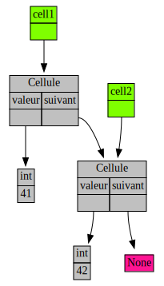
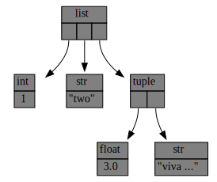
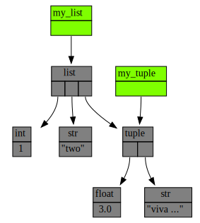

## Objectifs

Afin de déboguer un programme, il est nécessaire de pouvoir introspecter l'état de celui-ci.
L'état du programme est par définition le contenu de sa mémoire, c'est à dire les instances ainsi que les liens entre celles-ci.
Jusqu'ici, pour pouvoir afficher des morceaux de cet état, nous avons simplement ajouté des appels à la fonction `print` dans le programme ou alors utilisé le débogueur `Pdb`.

Dans cet exercice, nous allons utiliser un petit outil maison de débogue : `traceur.py` [disponible ici](traceur.py).
Comme son nom l'indique, cet outil est lui-même un module python.

**ATTENTION** pour que le `traceur` fonctionne il faut installer `graphviz` sur votre machine (que nous avons déjà utilisé dans le mini-projet "Mots suivants").

## Tracer une fonction

Le `traceur` permet de tracer graphiquement tous les appels à une fonction.
Pour s'en servir, il suffit :

- d'ajouter `from traceur import trace` au début de votre code ;
- d'ajouter une ligne `@trace` avant chaque déclaration de fonction que vous voulez tracer (techniquement, on parle d'annotation de fonction dans le jargon Python) ;
- d'exécuter votre programme dans `terminology` (terminal capable d'afficher des images).

Le `traceur` va alors afficher deux images pour chaque appel à chaque fonction tracée :

- une image avec les arguments de la fonctions (ce sont des variables, et donc des références) ainsi que toutes les instances accessibles depuis ces arguments ;
- une image avec l'instance retournée par la fonction ainsi que toutes les instances accessibles depuis cette instance.

**Si vous ne disposez pas** de `terminology`, il est toujours possible d'utiliser le `traceur`.
Pour cela, il suffit de donner la valeur `False` à l'argument `visualize` dans l'annotation de fonction : `@trace(visualize=False)`.
Dans ce cas, le `traceur` va générer dans le répertoire courant les images correspondant aux appels des fonctions tracées.
Deux images sont générées telles que décrites ci-dessus.
Le nom des images générées est affiché sur la sortie standard.

Dans cet exercice, il est demandé dans premier temps de dessiner à la main sur papier toutes les instances accessibles depuis les arguments de l'appel de fonction `ajoute_valeurs_cellules(cell41, cell42)` dans le programme [disponible ici](test_traceur.py) et affiché ci-dessous :
```python
#!/usr/bin/env python3

"""Un petit programme pour tester le module traceur.py"""

from traceur import trace

class Cellule:
    """Une cellule d'une liste chaînée"""

    def __init__(self, valeur, suivant):
        self.valeur = valeur
        self.suivant = suivant

    def __str__(self):
        return "cellule_" + str(self.valeur)

@trace()
def ajoute_valeurs_cellules(cell1, cell2):
    """Renvoie la valeur de la cellule + valeur du suivant"""
    return cell1.valeur + cell2.valeur

def main():
    """Test simple du module de traçage"""
    cell42 = Cellule(42, None)
    cell41 = Cellule(41, cell42)

    somme = ajoute_valeurs_cellules(cell41, cell42)
    print("Somme des deux cellules =", somme)

if __name__ == "__main__":
    main()
```

Ensuite, il est demandé d'installer le module `traceur` sur votre machine (exercice [Installation d'un module](../../../../1-bases/travaux-pratiques/02-module-svg-and-co/exercices/04-installation-d-un-module/)) et d'exécuter `test_traceur.py` pour vérifier votre dessin ainsi que pour vous assurer d'avoir un module `traceur` opérationnel qui sera essentiel pour la suite des travaux pratiques. Si vous ne disposez pas de `terminology` il vous faudra modifier les annotations de fonctions dans `test_traceur.py` comme indiqué ci-dessus.

## Correction
<details markdown="1">
<summary>Cliquez ici pour révéler la correction.</summary>

Le résultat du `traceur` est le suivant :



Sur ce schéma, les couleurs ont la sémantique suivante :

- vert : les arguments donnés à la fonction avec leur nom. Ces derniers sont des variables locales à la fonction, donc des références vers des instances ;
- gris : les instances avec leur type et leur contenu ;
- rose : l'instance `None`.

Nous retrouvons sur ce schéma les deux arguments `cell1` et `cell2` donnés à  la fonction `ajoute_valeurs_cellules`.
`cell1` est une référence vers une cellule dont :

- la `valeur` est une référence vers l'entier `41` ;
- le `suivant` est une référence vers une autre cellule, qui se trouve être la même que celle référencée par `cell2`.

`cell2` est une référence vers une cellule dont :

- la `valeur` est une référence vers l'entier `42` ;
- le `suivant` est une référence vers `None`.

</details>

## Tracer les variables et les instances qui nous intéressent

Il est également possible d'utiliser le `traceur` pour afficher l'instance de notre choix ainsi que toutes les instances accessible depuis celle-ci.
Pour cela il faut utiliser la fonction `display_instance` du module `traceur`.

Il est maintenant demandé de lire la documentation de cette fonction dans votre interpréteur interactif à l'aide de la fonction `help` puis de jouer avec.

## Correction
<details markdown="1">
<summary>Cliquez ici pour révéler la correction.</summary>
Voici un petit exemple d'utilisation de la fonction `display_instance` :

```python
#!/usr/bin/env python3

"""Play with traceur.display_instance."""

import traceur

my_tuple = (3.0, "viva ...")
my_list = [1, "two", my_tuple]
traceur.display_instance(my_list, image_name="my_nice_instance", visualize=False)
```

Ce programme n'affiche pas d'image (`visualize=False`) et spécifie le nom du fichier image qui sera créé (`image_name="my_nice_instance"` sachant que l'extension `.svg` est ajoutée automatiquement par le `traceur`) dont voici le contenu :


</details>

Enfin, il est possible d'utiliser le `traceur` pour afficher un ensemble de variables, donc un ensemble de références, ainsi que toutes les instances accessibles depuis ces variables.
Pour cela il faut utiliser la fonction `display_vars` du module `traceur`.

Il est maintenant demandé de lire la documentation de cette fonction dans votre interpréteur interactif à l'aide de la fonction `help` puis de jouer avec.

## Correction
<details markdown="1">
<summary>Cliquez ici pour révéler la correction.</summary>

Voici un petit exemple d'utilisation de la fonction `display_vars` :

```python
#!/usr/bin/env python3

"""Play with traceur.display_instance."""

import traceur

my_tuple = (3.0, "viva ...")
my_list = [1, "two", my_tuple]
traceur_var_my_tuple = traceur.Variable("my_tuple", my_tuple)
traceur_var_my_list = traceur.Variable("my_list", my_list)
traceur.display_vars(traceur_var_my_tuple,
                     traceur_var_my_list,
                     image_name="my_nice_vars",
                     visualize=False)
```

Ce programme n'affiche pas d'image (`visualize=False`) et spécifie le nom du fichier image qui sera créé (`image_name="my_nice_vars"` sachant que l'extension `.svg` est ajoutée automatiquement par le `traceur`) dont voici le contenu :



Les variables, qui sont des références, sont affichées en vert.
Le traceur **ne peut pas retrouver** le nom d'une variable à partir d'une référence quelconque.
C'est pourquoi ces derniers doivent être spécifiés explicitement via la création d'instances de la classe `traceur.Variable` (c'est le premier paramètre du constructeur).
</details>
