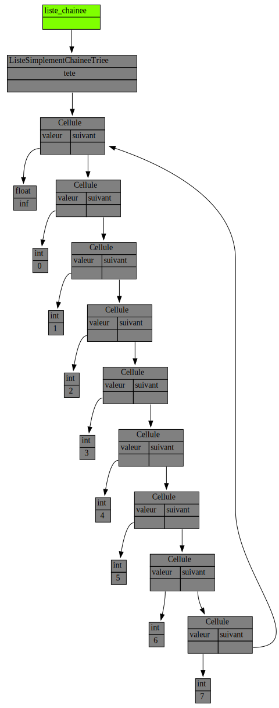

## Énoncé

On s'intéresse dans ce mini-projet aux listes simplement chaînées circulaires, triées, et avec sentinelle.

La tête de liste est une cellule contenant une valeur particulière permettant d'identifier la cellule comme étant la sentinelle.
La valeur de la cellule sentinelle peut être librement choisie pour vous arranger.

Comme la liste est circulaire, la cellule suivant la dernière est la sentinelle.
Cette circularité nous permet donc de garantir que toute cellule a toujours une cellule suivante.
De plus la sentinelle permet de garantir que toute cellule a toujours une cellule précédente.

Grâce à ces propriétés sur notre liste chaînée, certaines opérations comme la suppression sont simplifiées.

Dans ce TP, lorsque ne nous ajouterons une valeur dans la liste, celle si sera insérée au "bon endroit" afin de toujours avoir un chaînage de cellules qui sont triées selon leur valeur, **par ordre croissant**.

L'image ci-dessous illustre la représentation de la liste `0 --> 1 --> 2 --> 3 --> 4 --> 5 --> 6 --> 7`



On vous demande de compléter le code du fichier `circulaire.py` affiché ci-dessous et [disponible ici](circulaire.py) :

```python
#!/usr/bin/env python3

"""Listes simplement chaînées, triées, circulaires et avec sentinelle."""

import traceur


class Cellule:
    """Une cellule possède une valeur et un suivant."""

    def __init__(self, valeur, suivant=None):
        # TODO
        ...


class ListeSimplementChaineeTriee:
    """Listes simplement chaînées, triées, circulaires et avec sentinelle."""

    def __init__(self, valeur_sentinelle, nombres=None):
        """Construit la liste avec le range de nombres donné.

        `valeur_sentinelle` precise la valeur de la cellule sentinelle.
        pre-condition: le range de nombres donné est trié si il est
                       différent de None.
        Si le range est différent de None, on créera directement les cellules
        ici dans le constructeur. Autrement dit, on n'utilisera pas la fonction
        ajoute.
        """
        # TODO
        ...

    def __str__(self):
        """Renvoie la chaîne de caractères "val1 --> val2 --> val3 ..." """
        # TODO
        ...


def ajoute(liste_chainee, valeur):
    """Ajoute la valeur donnée à la bonne place dans la liste chaînée.

    pre-condition : `valeur` n'est pas la valeur de la sentinelle.
    """
    # TODO
    ...


def supprime(liste_chainee, valeur):
    """Supprime la première cellule de la liste chaînée avec la valeur donnée.

    pre-condition : `valeur` n'est pas la valeur de la sentinelle.
    """
    # TODO
    ...


def decoupe(liste_chainee):
    """Découpe la liste chaînée en deux, une cellule sur 2.

    Par exemple (1,2,3,4,5) produit (1,3,5) et (2,4).
    Renvoie les deux nouvelles listes.
    Aucune nouvelle cellule n'est créée hormis les sentinelles
    des deux nouvelles listes.
    En sortie `liste_chainee` est vide.
    """
    # TODO
    ...


def test():
    """Tests simples des différentes fonctions (à compléter)"""

    # On crée une liste simplement chaînée triée circulaire et l'on affiche
    liste_chainee = ListeSimplementChaineeTriee(float("inf"), range(1, 6))
    print("liste_chainee :", liste_chainee)

    # On ajoute et on supprime puis on affiche
    ajoute(liste_chainee, 0)
    ajoute(liste_chainee, 7)
    ajoute(liste_chainee, 6)
    ajoute(liste_chainee, 5)
    supprime(liste_chainee, 5)
    ajoute(liste_chainee, 8)
    supprime(liste_chainee, 8)
    print("liste_chainee :", liste_chainee)

    # On trace notre liste
    liste_chainee_variable = traceur.Variable("liste_chainee", liste_chainee)
    traceur.display_vars(
        liste_chainee_variable, visualize=False, image_name="liste_chainee_0_a_7"
    )

    # On découpe notre liste
    resultat_decoupe = decoupe(liste_chainee)
    pairs, impairs = resultat_decoupe  # ce qu'on fait ici s'appelle du unpacking

    # On trace le résultat de la découpe
    resultat_decoupe_variable = traceur.Variable("res_decoupe", resultat_decoupe)
    traceur.display_vars(
        resultat_decoupe_variable, visualize=False, image_name="resultat_decoupe"
    )

    # On affiche
    print("pairs   :", pairs)
    print("impairs :", impairs)
    print("liste_chainee :", liste_chainee)

    # On refait quelques suppressions et ajouts pour le plaisir
    # puis on affiche
    supprime(pairs, 4)
    supprime(pairs, 0)
    supprime(pairs, 2)
    supprime(pairs, 6)
    ajoute(impairs, 6)
    ajoute(impairs, 0)
    print("impairs après ajout de 6 et 0 :", impairs)
    print("pairs après suppression de tous les éléments :", pairs)


if __name__ == "__main__":
    test()
```

## Correction
<details markdown="1">
<summary>Cliquez ici pour révéler la correction.</summary>
Voici le code de correction.
Dans cette solution nous utilisons une fonction `recupere_cellules` qui renvoie une `list`, donc un tableau dynamique, pour factoriser le parcours de la liste chaînée.
Cette factorisation du code est une très bonne chose.

Néanmoins, si cela vous semble étrange de passer par une `list`, donc un tableau dynamique, alors que l'on travaille sur une liste chaînée, **vous avez entièrement raison**.
En pratique dans du code python professionnel, la fonction `recupere_cellules` serait une fonction génératrice dont nous allons parler dans le prochain TD.

```python
#!/usr/bin/env python3

"""Listes simplement chaînées, triées, circulaires et avec sentinelle."""

import traceur


class Cellule:
    """Une cellule possède une valeur et un suivant."""

    def __init__(self, valeur, suivant=None):
        self.valeur = valeur
        self.suivant = suivant


class ListeSimplementChaineeTriee:
    """Listes simplement chaînées, triées, circulaires et avec sentinelle."""

    def __init__(self, valeur_sentinelle, nombres=None):
        """Construit la liste avec le range de nombres donné.

        `valeur_sentinelle` precise la valeur de la cellule sentinelle.
        pre-condition: le range de nombres donné est trié si il est
                       différent de None.
        Si le range est différent de None, on créera directement les cellules
        ici dans le constructeur. Autrement dit, on n'utilisera pas la fonction
        ajoute.
        """
        self.tete = Cellule(valeur_sentinelle)
        self.tete.suivant = self.tete
        derniere_cellule = self.tete
        if nombres is not None:
            for element in nombres:
                derniere_cellule.suivant = Cellule(element, self.tete)
                derniere_cellule = derniere_cellule.suivant

    def __str__(self):
        """Renvoie la chaîne de caractères "val1 --> val2 --> val3 ..." """
        return " --> ".join(str(c.valeur) for c in recupere_cellules(self))


def recupere_cellules(liste_chainee, inclure_sentinelle=False):
    """Renvoie une list Python contenant toutes les cellules de la liste_chainee.

    `inclure_sentinelle` est un booleen permettant de preciser si la sentinelle
    est incluse ou non dans les cellules renvoyées.
    """
    cellules = []
    if inclure_sentinelle:
        cellules.append(liste_chainee.tete)
    cellule_courante = liste_chainee.tete.suivant
    while cellule_courante != liste_chainee.tete:
        cellules.append(cellule_courante)
        cellule_courante = cellule_courante.suivant
    return cellules


def ajoute(liste_chainee, valeur):
    """Ajoute la valeur donnée à la bonne place dans la liste chaînée.

    pre-condition : `valeur` n'est pas la valeur de la sentinelle.
    """
    for cellule in recupere_cellules(liste_chainee, inclure_sentinelle=True):
        if cellule.suivant.valeur > valeur:
            cellule.suivant = Cellule(valeur, cellule.suivant)
            return


def supprime(liste_chainee, valeur):
    """Supprime la première cellule de la liste chaînée avec la valeur donnée.

    pre-condition : `valeur` n'est pas la valeur de la sentinelle.
    """
    for cellule in recupere_cellules(liste_chainee, inclure_sentinelle=True):
        if cellule.suivant.valeur == valeur:
            cellule.suivant = cellule.suivant.suivant
            return


def decoupe(liste_chainee):
    """Découpe la liste chaînée en deux, une cellule sur 2.

    Par exemple (1,2,3,4,5) produit (1,3,5) et (2,4).
    Renvoie les deux nouvelles listes.
    Aucune nouvelle cellule n'est créée hormis les sentinelles
    des deux nouvelles listes.
    En sortie `liste_chainee` est vide.
    """

    # On crée les deux nouvelles listes, vide iniatelement
    listes = [ListeSimplementChaineeTriee(liste_chainee.tete.valeur) for _ in range(2)]

    # On rajoute les cellules à tour de rôle dans chacune des deux
    # nouvelles listes.
    cellules_courantes = [l.tete for l in listes]
    liste_courante = 0
    for cellule in recupere_cellules(liste_chainee, inclure_sentinelle=False):
        cellules_courantes[liste_courante].suivant = cellule
        cellules_courantes[liste_courante] = cellule
        liste_courante = 1 - liste_courante

    # On "circularise" les deux listes créées
    for indice, liste in enumerate(listes):
        cellules_courantes[indice].suivant = liste.tete

    # On vide la liste qui a été découpée
    liste_chainee.tete.suivant = liste_chainee.tete

    return listes


def test():
    """Tests simples des différentes fonctions (à compléter)"""

    # On crée une liste simplement chaînée triée circulaire et l'on affiche
    liste_chainee = ListeSimplementChaineeTriee(float("inf"), range(1, 6))
    print("liste_chainee :", liste_chainee)

    # On ajoute et on supprime puis on affiche
    ajoute(liste_chainee, 0)
    ajoute(liste_chainee, 7)
    ajoute(liste_chainee, 6)
    ajoute(liste_chainee, 5)
    supprime(liste_chainee, 5)
    ajoute(liste_chainee, 8)
    supprime(liste_chainee, 8)
    print("liste_chainee :", liste_chainee)

    # On trace notre liste
    liste_chainee_variable = traceur.Variable("liste_chainee", liste_chainee)
    traceur.display_vars(
        liste_chainee_variable, visualize=False, image_name="liste_chainee_0_a_7"
    )

    # On découpe notre liste
    resultat_decoupe = decoupe(liste_chainee)
    pairs, impairs = resultat_decoupe  # ce qu'on fait ici s'appelle du unpacking

    # On trace le résultat de la découpe
    resultat_decoupe_variable = traceur.Variable("res_decoupe", resultat_decoupe)
    traceur.display_vars(
        resultat_decoupe_variable, visualize=False, image_name="resultat_decoupe"
    )

    # On affiche
    print("pairs   :", pairs)
    print("impairs :", impairs)
    print("liste_chainee :", liste_chainee)

    # On refait quelques suppressions et ajouts pour le plaisir
    # puis on affiche
    supprime(pairs, 4)
    supprime(pairs, 0)
    supprime(pairs, 2)
    supprime(pairs, 6)
    ajoute(impairs, 6)
    ajoute(impairs, 0)
    print("impairs après ajout de 6 et 0 :", impairs)
    print("pairs après suppression de tous les éléments :", pairs)


if __name__ == "__main__":
    test()
```

 Une des opérations à implémenter est un découpage construisant deux nouvelles listes en alternant les éléments d’une liste de départ.
 Voici le résultat attendu sur la liste 0 à 7 ci dessus :

 
</details>
## Exercices

- [Première classe](/3-references/travaux-pratiques/15-listes-sc/exercices/01-premiere-classe/index.html)
- [Débogage visuel](/3-references/travaux-pratiques/15-listes-sc/exercices/02-debogage-visuel/index.html)
