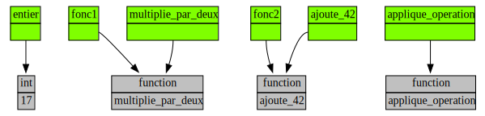

## Énoncé

Dans cet exercice nous allons voir qu'il est possible de manipuler des fonctions de la même manière que l'on manipule des instances de classes. Autrement dit, il est possible d'avoir des références vers des fonctions, et de passer des fonctions en paramètres d'une fonction.

Comme *une image vaut mille mots*, interrogeons-nous sur le code ci-dessous en nous posant les questions suivantes :

- est-il correct, c'est-à-dire exécutable et ne donnant lieu à aucune erreur ?
- qu'affiche-t-il ?
- quel est l'état du programme une fois que les variables `entier`, `fonc1` et `fonc2` ont été définies ?

```python
#!/usr/bin/env python3
"""Un exemple de références vers des fonctions"""


def multiplie_par_deux(un_nombre):
    """Renvoie un_nombre multiplié par deux"""
    return un_nombre * 2


def ajoute_42(un_nombre):
    """Renvoie un_nombre + 42"""
    return un_nombre + 42


def applique_operation(un_nombre, operation):
    return operation(un_nombre)


def main():
    """Test de nos fonctions"""
    entier = 17
    fonc1 = multiplie_par_deux
    fonc2 = ajoute_42
    print(multiplie_par_deux(entier))
    print(fonc1(entier))
    print(applique_operation(entier, multiplie_par_deux))
    print(applique_operation(entier, fonc2))
    print(applique_operation(entier, fonc1(entier)))


if __name__ == "__main__":
    main()
```

## Correction
<details markdown="1">
<summary>Cliquez ici pour révéler la correction.</summary>

La sortie du programme est la suivante :
```console
34
34
34
59
Traceback (most recent call last):
  File "./fonction.py", line 59, in <module>
    main()
  File "./fonction.py", line 56, in main
    print(applique_operation(entier, fonc1(entier)))
  File "./fonction.py", line 17, in applique_operation
    return operation(un_nombre)
TypeError: 'int' object is not callable
```

Il n'est donc pas entièrement correct comme l'indique le message d'erreur.
Le deuxième argument de la fonction `applique_operation` doit être une fonction, or dans le troisième appel à cette fonction on lui passe un entier.

Voici l'état de la mémoire une fois que toutes nos variables sont définies.



Et voici le code de correction de `fonction.py` :

```python
#!/usr/bin/env python3
"""Un exemple de références vers des fonctions"""
import traceur


def multiplie_par_deux(un_nombre):
    """Renvoie un_nombre multiplié par deux"""
    return un_nombre * 2


def ajoute_42(un_nombre):
    """Renvoie un_nombre + 42"""
    return un_nombre + 42


def applique_operation(un_nombre, operation):
    """Renvoie le résultat de l'opération donnée sur le nombre donné"""
    return operation(un_nombre)


def main():
    """Test de nos fonctions"""
    entier = 17
    # fonc1 et fonc2 sont des références vers une fonction
    fonc1 = multiplie_par_deux
    fonc2 = ajoute_42
    variables = [
        traceur.Variable("entier", entier),
        traceur.Variable("fonc1", fonc1),
        traceur.Variable("fonc2", fonc2),
        traceur.Variable("multiplie_par_deux", multiplie_par_deux),
        traceur.Variable("ajoute_42", ajoute_42),
        traceur.Variable("applique_operation", applique_operation),
    ]
    traceur.display_vars(*variables)
    # On appelle multiplie_par_deux comme d'habitude.
    # C'est à dire en utilisant son nom.
    # Ce-dernier n'est en fait qu'une référence vers
    # la fonction elle-même.
    print(multiplie_par_deux(entier))
    # fonc1 est une référence vers une fonction
    # au même titre que multiplie_par_deux.
    # On peut donc l'appeler.
    print(fonc1(entier))
    # On passe une référence vers une fonction
    # en paramètre à la fonction applique_operation
    print(applique_operation(entier, multiplie_par_deux))
    # On passe une référence vers une fonction
    # en paramètre à la fonction applique_operation
    print(applique_operation(entier, fonc2))
    # On passe une référence vers une fonction
    # en paramètre un entier à la place d'une fonction
    # à la fonction applique_operation --> ERREUR
    print(applique_operation(entier, fonc1(entier)))


if __name__ == "__main__":
    main()
```
</details>
