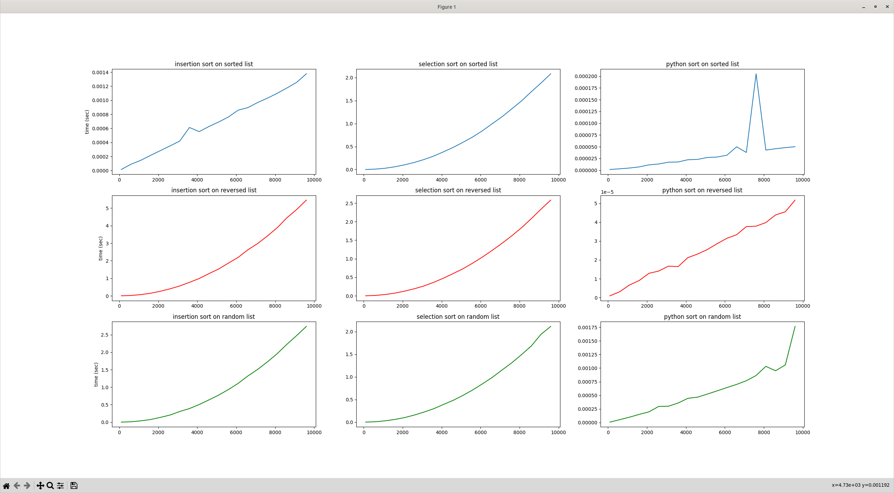

## Énoncé

Dans ce mini projet nous allons mesurer et analyser la performance des deux algorithmes que nous avons vus dans le [TD "Algorithmes de tri".](../../../../../2-iterations/travaux-diriges/06-algorithmes-de-tri)

Le travail demandé consiste à étudier la performance de ces deux algorithmes ainsi que celle de la méthode `sort` du type `list` de Python.

Pour commencer, on implémentera les deux algorithmes de tri d'un tableau au travers de deux fonctions : `tri_insertion` et `tri_selection`.

Ensuite, nous développerons le code permettant de mesurer le temps qu'il faut à chacune de ces fonctions pour trier un tableau d'une taille donnée.
Nous nous référerons à l'exercice *le temps qui passe* du chapitre précédent [accessible ici](/2-iterations/travaux-pratiques/04-perf-sdd/exercices/01-mesure-du-temps) pour la mesure du temps.

Enfin, nous analyserons les performances de chacune des deux fonctions ainsi que celles de la méthode `sort` du type `list` de Python en essayant de mettre en regard les résultats observés avec ce que nous pensions.
Pour cela, il est **demandé** d'afficher les résultats sous forme graphique à l'aide de la bibliothèque [matplotlib](https://matplotlib.org/) très largement utilisée dans la communauté Python pour dessiner des graphes.

## Correction
<details markdown="1">
<summary>Cliquez ici pour révéler la correction.</summary>
Voici une correction possible :

```python
#!/usr/bin/env python3
"""Mesurons le temps qu'il faut pour trier."""

import time
import random
import tri_insertion
import tri_selection
import matplotlib.pyplot as plt

INPUT_SIZES = range(100, 10_000, 500)


def time_insertion_sort(to_sort):
    """Return time to sort to_sort with insertion"""
    start = time.time()
    tri_insertion.tri_insertion(to_sort)
    end = time.time()
    return end - start


def time_selection_sort(to_sort):
    """Return time to sort to_sort with selection"""
    start = time.time()
    tri_selection.tri_selection(to_sort)
    end = time.time()
    return end - start


def time_python_sort(to_sort):
    """Return time to sort to_sort with Python list.sort"""
    start = time.time()
    to_sort.sort()
    end = time.time()
    return end - start


def bench_sort_perf():
    """Bench sort algorithms"""

    perfs_on_sorted_list = {"insertion": {}, "selection": {}, "python": {}}
    perfs_on_reversed_list = {"insertion": {}, "selection": {}, "python": {}}
    perfs_on_random_list = {"insertion": {}, "selection": {}, "python": {}}

    for size in INPUT_SIZES:
        sorted_list = list(range(size))
        reversed_list = list(range(size, 0, -1))
        random_list = list(range(size))
        random.shuffle(random_list)
        for to_sort, perfs_res in (
            (sorted_list, perfs_on_sorted_list),
            (reversed_list, perfs_on_reversed_list),
            (random_list, perfs_on_random_list),
        ):
            to_sort_copy1 = list(to_sort)
            to_sort_copy2 = list(to_sort)
            to_sort_copy3 = list(to_sort)
            perfs_res["insertion"][size] = time_insertion_sort(to_sort_copy1)
            perfs_res["selection"][size] = time_selection_sort(to_sort_copy2)
            perfs_res["python"][size] = time_python_sort(to_sort_copy3)

    return perfs_on_sorted_list, perfs_on_reversed_list, perfs_on_random_list


def bench_and_plot():
    """Bench and plots sorting algorithms performances"""

    (
        perfs_on_sorted_list,
        perfs_on_reversed_list,
        perfs_on_random_list,
    ) = bench_sort_perf()

    # Create 3 subplots side by side
    _, axs = plt.subplots(nrows=3, ncols=3)

    # First line is sorted list
    axs[0][0].plot(
        list(perfs_on_sorted_list["insertion"].keys()),
        list(perfs_on_sorted_list["insertion"].values()),
        label="insertion sort",
    )
    axs[0][0].set_title("insertion sort on sorted list")
    axs[0][0].set(ylabel="time (sec)")
    axs[0][1].plot(
        list(perfs_on_sorted_list["selection"].keys()),
        list(perfs_on_sorted_list["selection"].values()),
        label="selection sort",
    )
    axs[0][1].set_title("selection sort on sorted list")
    axs[0][2].plot(
        list(perfs_on_sorted_list["python"].keys()),
        list(perfs_on_sorted_list["python"].values()),
        label="python sort",
    )
    axs[0][2].set_title("python sort on sorted list")

    # Second line is reversed list
    axs[1][0].plot(
        list(perfs_on_reversed_list["insertion"].keys()),
        list(perfs_on_reversed_list["insertion"].values()),
        label="insertion sort",
        color="red",
    )
    axs[1][0].set_title("insertion sort on reversed list")
    axs[1][0].set(ylabel="time (sec)")
    axs[1][1].plot(
        list(perfs_on_reversed_list["selection"].keys()),
        list(perfs_on_reversed_list["selection"].values()),
        label="selection sort",
        color="red",
    )
    axs[1][1].set_title("selection sort on reversed list")
    axs[1][2].plot(
        list(perfs_on_reversed_list["python"].keys()),
        list(perfs_on_reversed_list["python"].values()),
        label="python sort",
        color="red",
    )
    axs[1][2].set_title("python sort on reversed list")

    # Third line is random list
    axs[2][0].plot(
        list(perfs_on_random_list["insertion"].keys()),
        list(perfs_on_random_list["insertion"].values()),
        label="insertion sort",
        color="green",
    )
    axs[2][0].set_title("insertion sort on random list")
    axs[2][0].set(ylabel="time (sec)")
    axs[2][1].plot(
        list(perfs_on_random_list["selection"].keys()),
        list(perfs_on_random_list["selection"].values()),
        label="selection sort",
        color="green",
    )
    axs[2][1].set_title("selection sort on random list")
    axs[2][2].plot(
        list(perfs_on_random_list["python"].keys()),
        list(perfs_on_random_list["python"].values()),
        label="python sort",
        color="green",
    )
    axs[2][2].set_title("python sort on random list")

    # Open the plot window, in full screen mode
    mng = plt.get_current_fig_manager()
    mng.resize(*mng.window.maxsize())
    plt.show()


bench_and_plot()
```

Et ce que ça donne sur ma (Manuel) machine :



Sur ces graphes, on voit clairement que :

- le tri par insertion est linéaire sur une `list` déjà triée et quadratique sinon ;
- le tri par selection est quadratique dans tous les cas ;
- le tri de Python est linéaire pour une `list` déjà triée et pour une `list` triée à l'envers.

</details>

## Exercices

- [Tableaux](/2-iterations/travaux-pratiques/09-sous-suite/exercices/01-tableaux/index.html)
- [Boucles for](/2-iterations/travaux-pratiques/05-convertisseur/exercices/01-boucles-for/index.html)
- [Le hasard fait bien les choses](/2-iterations/travaux-pratiques/06-images-pgm/exercices/01-le-hasard-fait-bien-les-choses/index.html)
- [Le temps qui passe ...](/2-iterations/travaux-pratiques/optionnels/04-perf-sdd/exercices/01-mesure-du-temps/index.html)
