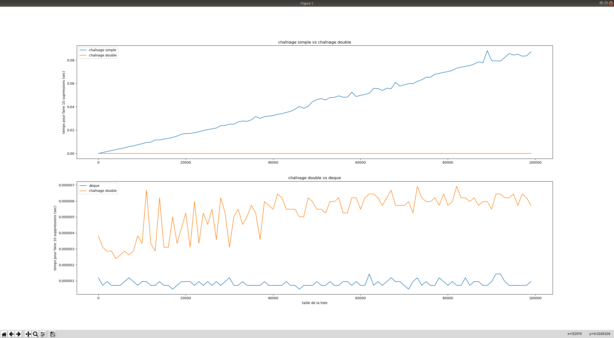

## Énoncé

Dans ce mini projet nous allons mesurer et analyser la performance de différentes implémentations d'une fonction de suppression dans une liste chaînée.
Le sujet est volontairement peu spécifié afin que nous puissions prendre des initiatives.

Pour commencer, on implémentera les trois fonctions suivantes avec les fonctions et classes annexes nécessaires.
On peut bien sûr réutiliser du code déjà développé dans les mini projets précédents.

- suppression d'un élément en queue d'une liste simplement chaînée ;

- suppression d'un élément en queue d'une liste doublement chaînée ;

- suppression en queue d'une `deque` disponible dans le module standard `collections` dont la documentation est [disponible ici](https://docs.python.org/3.6/library/collections.html#collections.deque) ainsi que dans l'interpréteur interactif grâce à la commande `help`.

Ensuite, nous développerons le code permettant de mesurer le temps qu'il faut à chacune de ces fonctions pour faire un nombre donné de suppressions.
Nous nous référerons à l'exercice *le temps qui passe* du chapitre précédent [accessible ici](/2-iterations/travaux-pratiques/04-perf-sdd/exercices/01-mesure-du-temps) pour la mesure du temps.

Enfin, nous analyserons les performances de chacune des trois implémentations en essayant de mettre en regard les résultats observés avec ce que nous pensions.
Pour cela, il est **demandé** d'afficher les résultats sous forme graphique à l'aide de la bibliothèque [matplotlib](https://matplotlib.org/) très largement utilisée dans la communauté Python pour dessiner des graphes.

## Correction
<details markdown="1">
<summary>Cliquez ici pour révéler la correction.</summary>
Voici une façon de faire :
```python
#!/usr/bin/env python3

"""Analyse de performance entre liste simplement, doublement chaînée et dequeue."""

import collections
from time import time as my_time
import matplotlib.pyplot as plt

NB_SUP_TO_TIME = 10
INPUT_SIZES = range(NB_SUP_TO_TIME, 100_000, 1_000)


class Cellule:
    """Une cellule d'une liste simplement chaînée.

    Possède une référence vers la valeur, une
    référence vers la cellule suivante et une
    vers la cellule précédente.
    """

    def __init__(self, valeur, suivant, precedent):
        self.valeur = valeur
        self.suivant = suivant
        self.precedent = precedent


class ListeSimplementChainee:
    """Une liste simplement chaînée."""

    def __init__(self, valeurs):
        self.tete = None
        self.queue = None
        self.taille = 0

        for val in valeurs:
            ajoute_en_queue_simplement(self, val)

    def __str__(self):
        """Renvoie val1 --> val2 --> val3 ..."""
        return " --> ".join(str(c.valeur) for c in recupere_cellules(self))


def ajoute_en_queue_simplement(liste_chainee, valeur):
    """Ajoute une cellule en queue de la liste simplement chaînée."""

    # Possible en temps constant grace au pointeur de queue.
    liste_chainee.taille += 1
    nouvelle_cellule = Cellule(valeur, suivant=None, precedent=None)
    if liste_chainee.queue:
        liste_chainee.queue.suivant = nouvelle_cellule
    else:
        liste_chainee.tete = nouvelle_cellule

    liste_chainee.queue = nouvelle_cellule
    return liste_chainee


def supprime_en_queue_simplement(liste_chainee):
    """Supprime la queue de la liste simplement chaînée."""

    # Si la liste est vide
    if not liste_chainee.tete:
        return

    # Si la liste possède un seul élément
    if liste_chainee.tete == liste_chainee.queue:
        liste_chainee.tete = None
        liste_chainee.queue = None
        return

    # Sinon il faut parcouri la liste pour
    # trouver l'avant dernier
    second_to_last = None
    for queue in recupere_cellules(liste_chainee):
        if queue == liste_chainee.queue:
            break
        second_to_last = queue

    # On casse le lien entre l'avant dernier et le dernier
    # puis on dit que la nouvelle queue est l'avant dernier
    second_to_last.suivant = None
    liste_chainee.queue = second_to_last


def recupere_cellules(liste_chainee):
    """Générateur sur toutes les cellules de `liste_chainee`."""
    cellule_courante = liste_chainee.tete
    while cellule_courante:
        yield cellule_courante
        cellule_courante = cellule_courante.suivant


class ListeDoublementChainee:
    """Une liste doublement chaînée."""

    def __init__(self, valeurs):
        self.tete = None
        self.queue = None
        self.taille = 0

        for val in valeurs:
            ajoute_en_queue_doublement(self, val)

    def __str__(self):
        """Renvoie val1 --> val2 --> val3 ..."""
        return " --> ".join([str(c.valeur) for c in recupere_cellules(self)])


def ajoute_en_queue_doublement(liste_chainee, valeur):
    """Ajoute une cellule en queue de la liste doublement chaînée."""

    # Possible en temps constant grace au pointeur de queue.
    liste_chainee.taille += 1
    nouvelle_cellule = Cellule(valeur, suivant=None, precedent=liste_chainee.queue)
    if liste_chainee.queue:
        liste_chainee.queue.suivant = nouvelle_cellule
    else:
        liste_chainee.tete = nouvelle_cellule

    liste_chainee.queue = nouvelle_cellule


def supprime_en_queue_doublement(liste_chainee):
    """Supprime la queue de la liste doublement chaînée."""

    # Si la liste est vide
    if not liste_chainee.tete:
        return

    # Si la liste possède un seul élément
    if liste_chainee.tete == liste_chainee.queue:
        liste_chainee.tete = None
        liste_chainee.queue = None
        return

    # Sinon
    liste_chainee.queue.precedent.suivant = None
    liste_chainee.queue = liste_chainee.queue.precedent


def bench_liste_chainee_maison(constructeur, fonction_supression):
    """Fait les expériences (benchs en anglais) pour une liste chainée maison."""
    perfs = {}
    for size in INPUT_SIZES:
        liste_chainee = constructeur(range(size))
        start_time = my_time()
        for _ in range(NB_SUP_TO_TIME):
            fonction_supression(liste_chainee)
        end_time = my_time()
        perfs[size] = end_time - start_time
    return perfs


def bench_deque():
    """Fait les expériences (benchs en anglais) pour une dequeue."""
    perfs = {}
    for size in INPUT_SIZES:
        deq = collections.deque()
        for val in range(size):
            deq.append(val)
        start_time = my_time()
        for _ in range(NB_SUP_TO_TIME):
            deq.pop()
        end_time = my_time()
        perfs[size] = end_time - start_time
    return perfs


def bench_and_plot():
    """Fait les expériences (benchs en anglais) et affiche le résultat avec matplotlib."""

    # Get performance results
    perfs_simplement = bench_liste_chainee_maison(
        ListeSimplementChainee, supprime_en_queue_simplement
    )
    perfs_doublement = bench_liste_chainee_maison(
        ListeDoublementChainee, supprime_en_queue_doublement
    )
    perfs_deque = bench_deque()

    # Plot them using matplotlib

    # Create subplots of size 2 (two plots vertically stacked)
    _, axs = plt.subplots(2)

    # Plot 1 is simple vs double
    axs[0].plot(
        list(perfs_simplement.keys()),
        list(perfs_simplement.values()),
        label="chaînage simple",
    )
    axs[0].plot(
        list(perfs_doublement.keys()),
        list(perfs_doublement.values()),
        label="chaînage double",
    )
    axs[0].set_title("chaînage simple vs chaînage double")
    axs[0].legend(loc="upper left")
    axs[0].set(ylabel=f"temps pour faire {NB_SUP_TO_TIME} supressions (sec)")

    # Plot 2 is double vs dequeue
    axs[1].plot(list(perfs_deque.keys()), list(perfs_deque.values()), label="deque")
    axs[1].plot(
        list(perfs_doublement.keys()),
        list(perfs_doublement.values()),
        label="chaînage double",
    )
    axs[1].set_title("chaînage double vs deque")
    axs[1].legend(loc="upper left")
    axs[1].set(
        xlabel="taille de la liste",
        ylabel=f"temps pour faire {NB_SUP_TO_TIME} suppressions (sec)",
    )

    # Open the plot window, in full screen mode
    mng = plt.get_current_fig_manager()
    mng.resize(*mng.window.maxsize())
    plt.show()


if __name__ == "__main__":
    bench_and_plot()
```

Voici le résultat du code ci-dessus sur ma (Manu) machine.



Le graphe montre clairement les points suivants :

- le coût de la suppression avec chaînage simple est une fonction linéaire du nombre de la taille de la liste ;

- `collections.deque` est meilleur que notre propre chaînage double. Normal c'est du C optimisé aux petits oignons ;

- il y a quand même un peu de bruit dans ces expériences faites rapidement ;

</details>
## Exercices

- [Première classe](/3-references/travaux-pratiques/15-listes-sc/exercices/01-premiere-classe/index.html)
- [Référence vers une fonction](/3-references/travaux-pratiques/17-op-listes-sc-yield/exercices/01-reference-vers-fonction/index.html)
