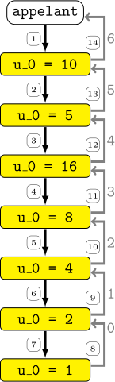
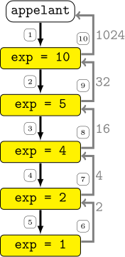
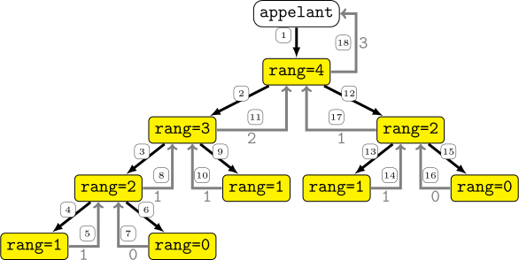

L'objectif de ce TD est d'écrire nos premières fonctions récursives et de **bien comprendre le flot de contrôle** lors de l'exécution du programme.

## Préambule :

Dans ce TD nous allons dessiner des arbres d'appels.
À titre d'exemple, voici un programme python ainsi que l'arbre d'appels associé à son exécution.
Assurez-vous d'avoir bien compris cet arbre d'appels et demandez-vous ce qu'il se passe si on remplace `4` par `-1` dans le premier appel à la fonction `affiche_n_fois_hello`.

```python
def affiche_n_fois_hello(n):
    """Affiche n fois hello sur la sortie standard."""
    # Condition d'arrêt
    if n == 0:
        return

    # Corps de la fonction
    print("hello")

    # Appel(s) recursif(s)
    affiche_n_fois_hello(n-1)

if __name__ == "__main__":
    affiche_n_fois_hello(4)
```


## Exercice 1 : conjecture de Syracuse

On se propose de ré-implémenter le calcul du nombre d’étapes pour que la suite de Syracuse atteigne 1.
Pour rappel la suite de Syracuse est définie à partir d'un entier $u_0$ quelconque par :

  - si $u_i$ est pair alors $u_{i+1} = u_i/2$
  - sinon $u_{i+1} = 3 \times u_i + 1$

### Question 1
!!! question " "
    Implémenter la fonction `calcule_nb_etapes_avant_1` en utilisant la récursivité.

###  Correction question 1
<details markdown="1">
<summary>Cliquez ici pour révéler la correction.</summary>

Pour commencer, commençons par regarder une vidéo d'introduction aux fonctions récursives réalisée pendant la saison COVID 2020/2021.

<iframe src="https://videos.univ-grenoble-alpes.fr/video/14505-ensimag-bpi-introduction-a-la-recursivite/209a8a1034bf48399759f1b0dec42f3a851fda12a16153cb7d4209cccdb2b7dd/?is_iframe=true" width="640" height="360" style="padding: 0; margin: 0; border:0" allowfullscreen ></iframe>

```python
#!/usr/bin/env python3

"""Implémentation récursive de Syracuse"""

def calcule_nb_etapes_avant_1(u_0):
    """Renvoie le nombre d'étapes pour arriver à 1 à partir de u_0"""

    # Arrêt de la récursion avec le cas de base u_0 = 1
    if u_0 == 1:
        return 0

    # Si u_0 est pair
    if u_0 % 2 == 0:
        return 1 + calcule_nb_etapes_avant_1(u_0 // 2)

    # Sinon u_0 est impair
    return 1 + calcule_nb_etapes_avant_1(u_0 * 3 + 1)

def test():
    """On teste TOUJOURS nos fonctions"""
    print(calcule_nb_etapes_avant_1(10))

if __name__ == "__main__":
    test()
```
</details>

### Question 2
!!! question " "
    Exécuter pas-à-pas l'appel de fonction `calcule_nb_etapes_avant_1(10)`.
    Il faut donc dessiner un arbre d'appel et numéroter les arêtes de cet arbre pour indiquer l'ordre d'exécution.
    Les nœuds de l'arbre sont les exécutions des appels à la fonction, et les arêtes représentent les appels et les retours de fonction.

###  Correction question 2
<details markdown="1">
<summary>Cliquez ici pour révéler la correction.</summary>


Correction vidéo de l'exercice :

<iframe src="https://videos.univ-grenoble-alpes.fr/video/14512-ensimag-bpi-td14-correction-exercice-1/?is_iframe=true" width="640" height="360" style="padding: 0; margin: 0; border:0" allowfullscreen ></iframe>
</details>


## Exercice 2 : exponentiation rapide

On souhaite calculer  $x^y$ où `x` est un `float` ou un `int` et `y` un `int` strictement plus grand que zéro.

### Question 1
!!! question " "
    En remarquant que pour `y` pair on a $x^y = (x^{y/2})^2$, proposer une fonction récursive calculant très rapidement $x^y$.

###  Correction question 1
<details markdown="1">
<summary>Cliquez ici pour révéler la correction.</summary>
```python
#!/usr/bin/env python3

"""Exponentiation rapide récursive."""

def exponentiation(nombre, exp):
    """Renvoie nombre ** exposant."""
    if exp == 1:
        return nombre
    if exp % 2: # <=> exp % 2 != 0
        return nombre * exponentiation(nombre, exp - 1)
    racine = exponentiation(nombre, exp // 2)
    return racine * racine

if __name__ == "__main__":
    print(exponentiation(2, 10))
```
</details>

### Question 2
!!! question " "
    Exécuter pas à pas l'appel de fonction `exponentiation(2, 10)`.
    Il faut donc dessiner un arbre d'appel et numéroter les arêtes de cet arbre pour indiquer l'ordre d'exécution.
    Les nœuds de l'arbre sont les exécutions des appels à la fonction, et les arêtes représentent les appels et les retours de fonction.

###  Correction question 2
<details markdown="1">
<summary>Cliquez ici pour révéler la correction.</summary>


Correction vidéo de l'exercice :

<iframe src="https://videos.univ-grenoble-alpes.fr/video/14593-ensimag-bpi-td14-correction-exercice-2/?is_iframe=true" width="640" height="360" style="padding: 0; margin: 0; border:0" allowfullscreen ></iframe>
</details>


## Exercice 3 : suite de Fibonacci

On considère le programme suivant :

```python
def fibonacci(rang):
    """Renvoie le terme de rang donné de la suite de Fibonacci."""
    print("rang", rang)
    if rang <= 1:
        return rang
    return fibonacci(rang - 1) + fibonacci(rang - 2)

if __name__ == "__main__":
    print(fibonacci(4))
```

### Question 1
!!! question " "
    Qu'affiche ce programme sur la sortie standard ?

###  Correction question 1
<details markdown="1">
<summary>Cliquez ici pour révéler la correction.</summary>
Le plus simple pour savoir ce que va afficher le programme est de dessiné l'arbre d'appels avec l'ordre d'exécution :



Une fois l'arbre construit, on peut facilement dire ce que le programme va afficher en suivant l'ordre des appels :
```console
rang 4
rang 3
rang 2
rang 1
rang 0
rang 1
rang 2
rang 1
rang 0
3
```
</details>

### Question 2
!!! question " "
    Intuitivement, quelle est la complexité de la fonction `fibonacci` ?


###  Correction question 2
<details markdown="1">
<summary>Cliquez ici pour révéler la correction.</summary>
En regardant l'arbre on image que c'est presque `O(2^rang)` car tous les niveaux de l'arbre vont être "remplis" sauf le dernier.

Correction vidéo de l'exercice :

<iframe src="https://videos.univ-grenoble-alpes.fr/video/14594-ensimag-bpi-td14-correction-de-lexo-3/e832d72b0904e4d30eb44ae1794fb0b72e973386f7b7ce2eb8e1f24c0ba1abd2/?is_iframe=true" width="640" height="360" style="padding: 0; margin: 0; border:0" allowfullscreen ></iframe>
</details>


## Exercice 4 : dichotomie récursive

### Question 1
!!! question " "
    Implémenter une recherche dichotomique récursive dans un tableau trié.
    La fonction implémentée renvoie `True` si l'élément cherché est présent dans le tableau et `False` sinon.

###  Correction question 1
<details markdown="1">
<summary>Cliquez ici pour révéler la correction.</summary>
Il y a de très nombreuses façons de répondre à cette question.
Le code ci-dessous en montre trois :

- une solution avec `tranches` (`slices` en anglais) ;
- une solution sans `tranches` ;
- une solution avec le module standard `bisect`.

L'objectif de l'exercice est de discuter des performances.

Créer des tranches coûte `(O(taille de la tranche))`.
Pourquoi ? Parce qu'une nouvelle `list` est créée, et qu'il faut donc recopier tous les éléments.
Ici au pire cas les tranches successives sont de taille `n/2 , n/4 ... 0`, d’où un coût total linéaire en `n` (en temps comme en espace).
On perd alors tout l’intérêt d’une dichotomie.

```python
#!/usr/bin/env python3

"""Dichotomie recursive."""

import bisect
import random
import time

def cherche_1(tab, elem):
    """Recherche dichotomique récursives avec tranches."""
    if not tab: #tableau vide
        return False
    milieu = len(tab) // 2
    if tab[milieu] == elem:
        return True
    if tab[milieu] > elem:
        return cherche_1(tab[:milieu], elem)
    return cherche_1(tab[milieu + 1:], elem)

def cherche_2(tab, elem, left_idx, right_idx):
    """Recherche dichotomique récursive sans tranches."""
    if not right_idx > left_idx: #tableau vide
        return False
    milieu = left_idx + (right_idx - left_idx) // 2
    if tab[milieu] == elem:
        return True
    if tab[milieu] > elem:
        return cherche_2(tab, elem, left_idx, milieu - 1)
    return cherche_2(tab, elem, milieu + 1, right_idx)

def cherche_3(tab, elem):
    """Recherche dichotomique avec le module standard `bisect`."""
    index = bisect.bisect_left(tab, elem)
    if index < len(tab) and elem == tab[index]:
        return True
    return False

def teste():
    """Teste les différentes implémentations"""
    random.seed(422)
    tab = [random.randint(1, TAILLE) for _ in range(TAILLE)]
    tab.sort()
    elem = random.randint(1, TAILLE)

    # Exclude time if python process is scheduled out by the OS
    start = time.process_time_ns()
    print(elem, "in tab =", cherche_1(tab, elem))
    end = time.process_time_ns()
    print("it took", (end - start) * 1E-9, "seconds to cherche_1 to find that")

    # Exclude time if python process is scheduled out by the OS
    start = time.process_time_ns()
    print(elem, "in tab =", cherche_2(tab, elem, 0, len(tab) - 1))
    end = time.process_time_ns()
    print("it took", (end - start) * 1E-9, "seconds to cherche_2 to find that")

    # Exclude time if python process is scheduled out by the OS
    start = time.process_time_ns()
    print(elem, "in tab =", cherche_3(tab, elem))
    end = time.process_time_ns()
    print("it took", (end - start) * 1E-9, "seconds to cherche_3 to find that")

if __name__ == "__main__":
    TAILLE = 1_000_000
    teste()
```

Le code ci-dessus donne les performances suivantes sur ma (Manu) machine :

```console
833392 in tab = True
it took 0.025718231 seconds to cherche_1 to find that
833392 in tab = True
it took 4.3428000000000005e-05 seconds to cherche_2 to find that
833392 in tab = True
it took 8.776e-06 seconds to cherche_3 to find that
```

On voit bien sur ces résultats que les tranches coûtent cher mais aussi que c'est mieux d'utiliser le module `bisect`.
C'est attendu : avec l'implémentation de `cpython` que nous utilisons c'est du [C optimisé aux petits oignons, et pas du récursif !](https://github.com/python/cpython/blob/master/Lib/bisect.py)
</details>


## Exercice 5 : Fibonacci qui va vite (pour aller plus loin)

### Question 1
!!! question " "
    Implémenter une autre version de la fonction `fibonacci` bien plus efficace que celle de l'exercice  3.

###  Correction question 1
<details markdown="1">
<summary>Cliquez ici pour révéler la correction.</summary>
Deux solutions sont possibles pour avoir du `O(rang)` :

- une solution itérative ;
- une solution récursive avec mémoisation.

Les voici :

```python
#!/usr/bin/env python3

"""Exercice sur Fibonacci"""

import time

def fibonacci_recursive(rang):
    """Renvoie le terme de rang donné de la suite de Fibonacci."""
    if rang <= 1:
        return rang
    return fibonacci_recursive(rang - 1) + fibonacci_recursive(rang - 2)

def fibonacci_recursive_memoization(rang, memoire):
    """Renvoie le terme de rang donné de la suite de Fibonacci."""
    if rang <= 1:
        return rang
    valeur = memoire.get(rang, None)
    if valeur:
        return valeur
    rang_moins_1 = fibonacci_recursive_memoization(rang - 1, memoire)
    rang_moins_2 = fibonacci_recursive_memoization(rang - 2, memoire)
    valeur = rang_moins_1 + rang_moins_2
    memoire[rang] = valeur
    return valeur

def fibonacci_iterative(rang):
    """Renvoie le terme de rang donné de la suite de Fibonacci."""
    prev_prev, prev = 0, 1
    for _ in range(rang):
        prev_prev, prev = prev, prev_prev + prev
    return prev_prev

def teste():
    """Teste nos différentes implémentations de fibonacci"""

    # Exclude time if python process is scheduled out by the OS
    start = time.process_time_ns()
    print("fibonacci(35)", fibonacci_recursive(35))
    end = time.process_time_ns()
    print("it took", (end - start) * 1E-9, "seconds to find that recursively and naively")

    # Exclude time if python process is scheduled out by the OS
    start = time.process_time_ns()
    print("fibonacci(35)", fibonacci_recursive_memoization(35, {}))
    end = time.process_time_ns()
    print("it took", (end - start) * 1E-9, "seconds to find that recursively with memoization")

    # Exclude time if python process is scheduled out by the OS
    start = time.process_time_ns()
    print("fibonacci(35)", fibonacci_iterative(35))
    end = time.process_time_ns()
    print("it took", (end - start) * 1E-9, "seconds to find that iteratively")

if __name__ == "__main__":
    teste()
```

Le code ci-dessus donne les performances suivantes sur ma (Manu) machine :

```console
fibonacci(35) 9227465
it took 1.999708151 seconds to find that recursively and naively
fibonacci(35) 9227465
it took 4.1591e-05 seconds to find that recursively with memoization
fibonacci(35) 9227465
it took 2.6163e-05 seconds to find that iteratively
```

Donc il semblerait que le facteur constant de la solution itérative soit deux fois plus petit que celui de la version récursive avec mémoisation.
C'est certainement lié au coût des appels de fonction.
</details>

