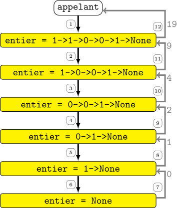
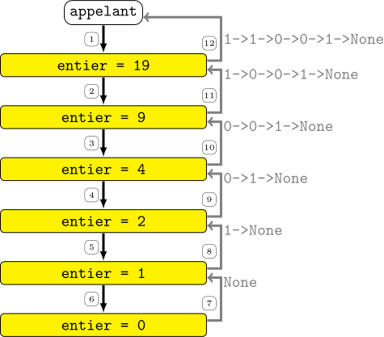

L'objectif de ce TD est de continuer à se familiariser avec l'écriture de fonctions récursives.
Pour ce faire, on se propose ici de stocker des entiers naturels comme une liste chaînée de bits.
On utilise le type `Cellule` suivant :

```python

class Cellule:
    """Cellule d'une liste chaînée de bits."""

    def __init__(self, bit, suivant=None):
```

Contrairement aux listes chaînées vues précédemment, il n'y a pas ici de classe `ListeChainee`.
On considère directement la liste chaînée des cellules à partir d’une première cellule donnée.
On stocke les bits en partant du bit de poids faible.
L’entier `13`, `1101` en binaire sera donc codé par une liste chaînée de 4 cellules :

- une première cellule contenant le bit `1` ;
- une seconde cellule contenant le bit `0` ;
- une troisième cellule contenant le bit `1` ;
- une dernière cellule contenant le bit `1`.

Les listes chaînées devront être sous forme canonique, c’est-à-dire sans 0 inutile en queue.
Chaque entier aura donc un codage unique, et 0 sera codé par `None`.

Dans ce TD, toutes les fonctions demandées **doivent être récursives**.

## Exercice 1 : représentation

### Question 1
!!! question " "
    Dessiner la liste codant 8 et la liste codant 19.

###  Correction question 1
<details markdown="1">
<summary>Cliquez ici pour révéler la correction.</summary>
8 = 1000b = `0 -> 0 -> 0 -> 1 -> None`

19 = 10011b = `1 -> 1 -> 0 -> 0 -> 1 -> None`

Normalement, nous avons assez dessiné de listes chaînées sous la forme d'instances Python en arrivant ici.
Donc pas forcément la peine de dessiner les instances mais on peut le faire quand même hein si ça nous semble encore nécessaire :)
</details>

### Question 2
!!! question " "
    Implémenter une fonction `calcule_valeur(entier_liste_chainee)` renvoyant la valeur de l'entier codé par la liste chaînée de bits `entier_liste_chainee`.

###  Correction question 2
<details markdown="1">
<summary>Cliquez ici pour révéler la correction.</summary>
```python
def calcule_valeur(entier_liste_chainee):
    """Renvoie la valeur de l'entier codé par la liste chaînée de bits donnée."""
    if entier_liste_chainee is None:
        return 0
    return 2 * calcule_valeur(entier_liste_chainee.suivant) + entier_liste_chainee.bit
```

Pour bien comprendre, voici l'arbre d'appels de `calcule_valeur(dixneuf)` avec `dixneuf` étant une référence sur la liste chaînée `1 -> 1 -> 0 -> 0 -> 1 -> None` :



Correction vidéo :

<iframe src="https://videos.univ-grenoble-alpes.fr/video/14813-ensimag-bpi-td15-correction-exercice-1-question-2/?is_iframe=true" width="640" height="360" style="padding: 0; margin: 0; border:0" allowfullscreen ></iframe>
</details>

### Question 3
!!! question " "
    Implémenter une fonction `construit_liste_chaînée(entier)` prenant un entier naturel >= 0 et renvoyant la liste chaînée de bits qui le code.

###  Correction question 3
<details markdown="1">
<summary>Cliquez ici pour révéler la correction.</summary>
```python
def construit_liste_chainee(entier):
    """Renvoie la liste chaînée de bits qui code entier (qui doit être >= 0)."""
    if entier == 0:
        return None
    return Cellule(entier & 1, construit_liste_chainee(entier >> 1))
```

Pour bien comprendre, voici l'arbre d'appels de `construit_liste_chainee(19)` :



Correction vidéo :

<iframe src="https://videos.univ-grenoble-alpes.fr/video/14814-ensimag-bpi-td15-correction-exercice-1-question-3/?is_iframe=true" width="640" height="360" style="padding: 0; margin: 0; border:0" allowfullscreen ></iframe>
</details>

### Question 4
!!! question " "
    Implémenter la méthode de stringification `__str__` pour la classe `Cellule`.
    Celle-ci devra retourner une chaîne de caractères contenant les bits dans le sens classique de lecture, c'est à dire  *du poids fort au poids faible*.
    Quelle est la complexité de cette méthode ?

###  Correction question 4
<details markdown="1">
<summary>Cliquez ici pour révéler la correction.</summary>
```python
    def __str__(self):
        """Stringification quadratique en le nombre de cellules == le nombre de bits.

        Quadratique car "a + b" est en O(len(a) + len(b)) car le type str est immutable.
        Donc sur la liste 19 = 1 → 1 → 0 → 0 → 1 on va faire
           (((("1") + "0") + "0") + "1") + "1"
        Voir le dessin dans la correction.

        Voir également la version ci-dessous pour du linéaire.
        """

        # Cas de base numéro 1
        # Le seul cas ou self peut être None est
        # lors d'un appel direct à la méthode __str__
        # comme ça :
        #      zero = construit_liste_chainee(0)
        #      print(Cellule.__str__(zero))
        if self is None:
            return "None (= zéro)"

        # Cas de base numéro 2
        # liste chaînée à une seule Cellule
        if self.suivant is None:
            return str(self.bit)

        # Appel récursif
        return self.suivant.__str__() + str(self.bit)

    def str__lineaire_rec(self):
        """Stringification linéaire en le nombre de cellules == le nombre de bits.

        Plutôt que d'utiliser l'opérateur "+" qui coûte cher, on fait du
        list.append.
        """

        # Cas de base numéro 1
        # Le seul cas ou self peut être None est
        # lors d'un appel direct à la méthode __str__
        # comme ça :
        #      zero = construit_liste_chainee(0)
        #      print(Cellule.__str__(zero))
        if self is None:
            return "None (= zéro)"

        def get_bits(cell):
            """Fonction auxiliaire qui construit un tableau dynamique de bits."""

            # Cas de base numéro 1
            # liste chaînée à une seule Cellule
            # Ici `cell` ne peut jamais être None,
            # parce qu'on vérifie juste au dessus
            # que self n'est pas None et qu'on
            # s'arrête sur une liste chaînée à
            # un seul élément.
            if cell.suivant is None:
                return [cell.bit]

            # Appels récursifs
            bits = get_bits(cell.suivant)

            # On rajoute le bit courant à la fin
            # du tableau dynamique pour avoir les
            # bits dans le bon sens, c'est à dire
            # du poids fort vers le poids faible.
            # Rappel : append coûte O(1)
            bits.append(cell.bit)
            return bits

        # Ici on utilise une "generator expression".
        # C'est un moyen plus simple que les fonctions génératrices
        # pour créer des itérateurs.
        # Comme on peut le voir, la syntaxe de ces "generator expressions"
        # est similaire à celle des "list comprehension", à la différence
        # près qu'elle utilise des "crochets" et non pas des "parenthèse".
        # D'un point de vue pratique, la différence est FONDAMENTALE, car
        # ici les éléments de l'itérateur renvoyé ne sont jamais tous
        # stocké en mémoire en même temps. Ici cela n'apporte pas grand
        # chose sachant que les bits sont déjà stockés dans un tableau dynamique.
        # Autrement dit, ça évite "juste" d'avoir un deuxième tableau dynamique
        # avec des chaînes de caractères à l'intérieur à la place des entiers.
        bits = get_bits(self)
        bits_it = (str(bit) for bit in bits)

        # On utilise join qui contrairement à faire
        # une série de "+" a un coup linéaire en la
        # taille de l'itérable qui lui ai donné en
        # paramètre
        return "".join(bits_it)

    def str__lineaire_iter(self):
        """Stringification linéaire en le nombre de cellules == le nombre de bits.

        Plutôt que d'utiliser l'opérateur "+" qui coûte cher, on fait du
        list.append puis du reversed (et pas du insert(0) sinon gare au quadratique
        qui reviendrait au galop).
        """

        # Cas de base numéro 1
        # Le seul cas ou self peut être None est
        # lors d'un appel direct à la méthode __str__
        # comme ça :
        #      zero = construit_liste_chainee(0)
        #      print(Cellule.__str__(zero))
        if self is None:
            return "None (= zéro)"

        def get_bits(bits, cell):
            """Fonction auxiliaire qui construit un tableau dynamique de bits."""

            # On rajoute le bit courant dans le
            # tableau dynamique
            bits.append(cell.bit)

            # Cas de base numéro 1
            # liste chaînée à une seule Cellule
            # Ici `cell` ne peut jamais être None,
            # parce qu'on vérifie juste au dessus
            # que self n'est pas None et qu'on
            # s'arrête sur une liste chaînée à
            # un seul élément.
            if cell.suivant is None:
                return

            # Appel récursif
            get_bits(bits, cell.suivant)

        # On récupère tous les bits
        bits = []
        get_bits(bits, self)

        # Ici on utilise une "generator expression",
        # cf commentaire dans str__lineaire_rec ci-dessus.
        # Comme les bits renvoyés par la fonction auxiliaire
        # get_bits sont dans le mauvais ordre, on utilise la
        # fonction standard reversed qui nous renvoie un iterator
        # permettant de parcourir à l'envers les éléments de la
        # séquence donnée en paramètre.
        bits_it = (str(b) for b in reversed(bits))

        # Enfin on utilise join, cf commentaire dans
        # str__lineaire_rec ci-dessus.
        return "".join(bits_it)
```

Pour bien comprendre, voici l'arbre d'appels de `dixneuf.__str__()` :


<!-- Correction vidéo : -->

<!-- <iframe src="https://videos.univ-grenoble-alpes.fr/video/14815-ensimag-bpi-td15-correction-exercice-1-question-4/?is_iframe=true" width="640" height="360" style="padding: 0; margin: 0; border:0" allowfullscreen ></iframe> -->

Voici l'arbre d'appels de `get_bits(dixneuf)` appelé par `dixneuf.str__lineaire__rec()` :


Concernant les performances des trois implémentation de `__str__`, voici les résultats sur ma (Manu) machine avec une liste assez grande :

```console
big_int = 11111111111111111111111111111111111111111111111111111111111111111111111111111111111111111111111111111111111111111111111111111111111111111111111111111111111111111111111111111111111111111111111111111111111111111111111111111111111111111111111111111111111111111111111111111111111111111111111111111111111111111111111111111111111111111111111111111111111111111111111111111111111111111111111111111111111111111111111111111111111111111111111111111111111111111111111111111111111111111111111111111111111111111111111111111111 = 13407807929942597099574024998205846127479365820592393377723561443721764030073546976801874298166903427690031858186486050853753882811946569946433649006084095
it took 0.00016284400000000001 seconds to __str__
it took 0.000279089 seconds to str__lineaire_rec
it took 0.000217115 seconds to str__lineaire_iter
```

La version quadratique est plus rapide que les versions linéaires :-(
Est-ce le cas sur vos machines également ?
**Une boîte de chocolats sera offerte au premier groupe de TD qui enverra un email à [manuel.selva@grenoble-inp.fr](mailto:manuel.selva@grenoble-inp.fr) avec la justification argumentée, si possible avec des exemples de code, de ce comportement étrange.**

Mais **attention**, le quadratique peut revenir au galop, et gare à lui ! Morale de l'histoire : **toujours préférer `join` à `+` pour concaténer des grandes chaînes de caractères.
</details>


## Exercice 2 : opérations d'ajout

### Question 1
!!! question " "
    Implémenter une fonction `ajoute_1(entier_liste_chainee)` renvoyant une nouvelle liste chaînée codant 1 de plus que l'entier codé par la liste chaînée donnée en entrée.

    NOTE : on s'autorise à partager des suffixes entre les différents entiers car on suppose que ces derniers ne sont jamais modifiés une fois créés.
    Autrement dit, cette fonction **ne modifie pas`entier_liste_chainee`**.

###  Correction question 1
<details markdown="1">
<summary>Cliquez ici pour révéler la correction.</summary>

```python
def ajoute_1(entier_liste_chainee):
    """Renvoie une nouvelle liste chaînée codant 1 de plus que l'entier donnée en entrée."""

    # 0 + 1 = 1
    if entier_liste_chainee is None:
        return representation.Cellule(1)

    # Si on a un 0 en tête de liste, il suffit de remplacer
    # par un 1.
    # Remarque : ici on fait du partage de suffixe avec
    # l’argument entier. Cela fonctionne du moment
    # qu’on ne s’autorise jamais à modifier les listes
    # représentant des entiers une fois construites.
    if entier_liste_chainee.bit == 0:
        return representation.Cellule(1, entier_liste_chainee.suivant)

    # Si on a un 1 en tête de liste, il faut le remplacer
    # par un zéro et propager la retenue vers la droite
    return representation.Cellule(0, ajoute_1(entier_liste_chainee.suivant))
```
</details>

### Question 2
!!! question " "
    Implémenter une fonction `ajoute(entier1_liste_chainee, entier2_liste_chainee)` renvoyant une nouvelle liste chaînée, ou alors l'une des deux listes chaînées passées en paramètres si l'une d'entre elle représente l'entier zéro, codant la somme des entiers codés par les deux listes chaînées passées en paramètres.

    NOTE : on s'autorise à partager des suffixes entre les différents entiers car on suppose que ces derniers ne sont jamais modifiés une fois créés.
    Autrement dit, cette fonction ne **ne modifie ni `entier1_liste_chainee` ni `entier2_liste_chainee`**.


###  Correction question 2
<details markdown="1">
<summary>Cliquez ici pour révéler la correction.</summary>

```python

def ajoute(entier1_liste_chainee, entier2_liste_chainee):
    """Renvoie une nouvelle liste chaînée codant la somme des entiers donnés.

    On pourrait faire également une version prenant une retenue en
    argument. Cette solution est laissée comme exercice.
    """

    # Si l'un des deux vaut zéro, c'est fastoche
    if entier1_liste_chainee is None:
        return entier2_liste_chainee
    if entier2_liste_chainee is None:
        return entier1_liste_chainee

    # Calcule du nouveau bit
    addition_bits = entier1_liste_chainee.bit + entier2_liste_chainee.bit
    bit = addition_bits % 2

    # Appel recursive sur les autres bits
    bits_forts = ajoute(entier1_liste_chainee.suivant, entier2_liste_chainee.suivant)

    # Ajoute 1 à la somme des autres bits si besoin
    if addition_bits == 2:
        bits_forts = ajoute_1(bits_forts)

    return representation.Cellule(bit, bits_forts)
```
</details>


## Exercice 3 : soustraction (pour aller plus loin)

### Question 1
!!! question " "
    Implémenter une fonction `soustrait(entier1_liste_chainee, entier2_liste_chainee)` renvoyant une nouvelle liste chaînée, ou alors `entier1_liste_chainee` si `entier2_liste_chainee` représente l'entier zéro, codant la différence des entiers codés par les deux listes chaînées passées en paramètres.

    NOTE : on s'autorise à partager des suffixes entre les différents entiers car on suppose que ces derniers ne sont jamais modifiés une fois créés.
    Autrement dit, cette fonction ne **ne modifie ni `entier1_liste_chainee` ni `entier2_liste_chainee`**.

    Cette fonction ne peut pas renvoyer d’entier négatif et doit donc lever une exception si l’entier codé par `entier1_liste_chainee` est strictement inférieur à l’entier codé par `entier2_liste_chainee`.

    Attention à la canonicité !

###  Correction question 1
<details markdown="1">
<summary>Cliquez ici pour révéler la correction.</summary>
```python
def soustrait(entier1_liste_chainee, entier2_liste_chainee):
    """Renvoie une nouvelle liste codant entier1_liste_chainee - entier2_liste_chainee.

    Lève une exception si entier1_liste_chainee > entier2_liste_chainee.
    """

    # On lance une exception si le résultat est un nombre négatif
    if representation.calcule_valeur(
        entier2_liste_chainee
    ) > representation.calcule_valeur(entier1_liste_chainee):
        raise ValueError("entier2 > entier1")

    # Si entier2_liste_chainee est zéro, c'est fastoche
    if entier2_liste_chainee is None:
        return entier1_liste_chainee

    # Calcul du nouveau bit
    bit = entier1_liste_chainee.bit - entier2_liste_chainee.bit

    # Appel récursif sur les bits suivants propageant la retenue avec ajoute_1 si besoin
    if bit == -1:
        diff_of_next_bits = soustrait(
            entier1_liste_chainee.suivant, ajout.ajoute_1(entier2_liste_chainee.suivant)
        )
        bit = 1
    else:
        diff_of_next_bits = soustrait(
            entier1_liste_chainee.suivant, entier2_liste_chainee.suivant
        )
        if bit == 0 and not diff_of_next_bits:
            return None  ## pour la canonicité

    return representation.Cellule(bit, diff_of_next_bits)
```
</details>

