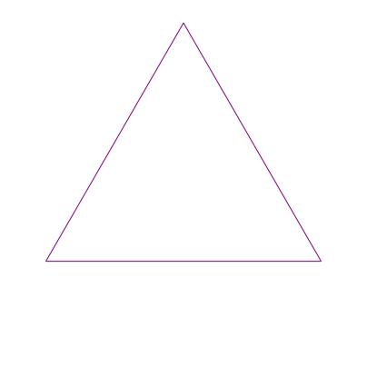
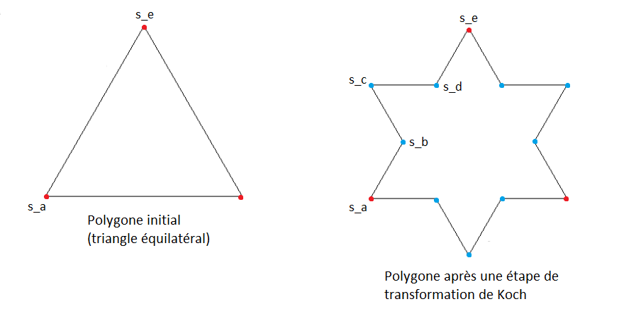

L'épreuve dure **1h30**.

Elle se déroule en **mode examen**, pour lequel l'accès au web **est bloqué**, excepté les sites suivants :

- le site de BPI [(https://bpi-etu.pages.ensimag.fr/)](https://bpi-etu.pages.ensimag.fr/) sur lequel vous vous trouvez actuellement. Vous y trouverez le contenu habituel (CMs, sujets et corrigés de TD/TP avec vidéos volontairement non disponibles) ;
- le site officiel de la documentation python [(https://docs.python.org/3.8/)](https://docs.python.org/3.8/) ;
- un site de traduction pour les élèves pour qui le français n'est pas la langue maternelle [(https://www.deepl.com/fr/translator)](https://www.deepl.com/fr/translator).

Cet examen se compose de deux exercices **indépendants**.

Le deuxième exercice est volontairement long.
Votre objectif premier ne doit pas être de tout faire absolument, mais d'écrire du code fonctionnel et propre pour les fonctions que vous aurez le temps d'implémenter.

**Vous devez travailler directement sur les fichiers python fournis et présents dans le dossier `exam` se trouvant sur le bureau de votre session d'examen.**

**Vous devez sauvegarder votre travail, toutes les 15 minutes environ, en cliquant sur `ENVOYER` se trouvant également sur le bureau.**

**Enfin, à la fin de l'examen il faut cliquer sur `ENVOYER/TERMINER`, toujours sur le bureau, et ne surtout pas éteindre la machine à la main en appuyant sur le bouton de mise/arrêt sous tension.**

Le barème est donné à titre indicatif.

Enfin, le module `traceur.py` **vous est fourni** à côté des fichiers à compléter pour vous aider à déboguer visuellement si cela vous aide.

## Exercice 1 : Range Maison (6 points)

### Description du problème

Premier entretien d'embauche de ma vie, le représentant technique présent me demande "vous qui êtes un expert en algorithmique et en python, comment implémenteriez-vous le concept de `range` fourni en standard, s'il ne l'était pas ?"

Comme j'ai du recul après mes trois années de formation à l'Ensimag, je demande des précisions quant à la spécification du problème.
Voici la tâche précise qui m'est finalement confiée.

#### Représentation d'un `rangemaison`

Je suis libre de représenter un range maison comme bon me semble (structure de données de mon choix) **sauf bien entendu** en utilisant le type standard renvoyé par la fonction `range`.
Autrement dit, je n'ai pas le droit d'utiliser la fonction `range` (qui techniquement n'est pas une fonction mais un constructeur).

#### Opérations sur un `rangemaison`

Les trois opérations principales sur un `rangemaison`, que je dois implémenter, sont les suivantes :

- création à partir des paramètres `start`, `stop` et `step`. Ces trois paramètres peuvent être négatifs.
- récupération du `ième` élément, sachant que le premier élément du `rangemaison` est l'élément `0` ;
- récupération d'un itérateur sur tous les éléments.

### Travail à réaliser

Il vous est demandé de compléter le squelette du **module** `rangemaison.py` qui se trouve dans le dossier `exam` se trouvant lui même sur le bureau de votre session d'examen.
Ce module doit également être un programme exécutable qui appelle la fonction `test_rangemaison`.
Le squelette de ce module est également donné ci-dessous.
Le travail à réaliser est symbolisé par `#TODO` suivi de `...` dans le code.

Il est aussi demandé de **justifier vos choix**, notamment en terme de complexité temporelle et spatiale.
Ces justifications sont à donner dans les commentaires des fonctions que vous modifierez donc.

### Correction


## Exercice 2 : C'est l'hiver, il neige, il faut chaîner (14 points)

### Description du problème

On s'intéresse ici à la génération et au tracé de flocons de Koch, de manière à générer des images ressemblant à celles de l'animation ci-dessous :



On part d'un ensemble de sommets formant un polygone.
Le polygone initial est, ici, un triangle équilatéral.
Une _étape de Koch_ consiste alors à appliquer une _transformation de Koch_ à chaque arête de ce polygone.
Cette transformation consiste à découper l'arête en trois parties égales, et à remplacer la partie centrale par la pointe d'un triangle équilatéral, comme illustré par la figure ci-dessous, qui représente le polygone à l'étape 0 (à gauche) et à l'étape 1 (à droite).



Sur cette figure, une transformation de koch est appliquée à chacune des arêtes du triangle équilatéral initial.
En particulier, l'application de la transformation de Koch à l'arête délimitée par les sommets `s_a` et `s_e` engendre la création des sommets intermédiaires `s_b`, `s_c` et `s_d`.

L'objectif de l'exercice est d'écrire un programme qui génère une image `SVG` représentant un flocon de Koch après un certain nombre d'étapes donné en paramètre.

#### Description des structures de données

Un sommet du polygone sera représenté par une instance de la classe `Sommet` que nous allons implémenter.

Le polygone lui-même sera représenté par l'ensemble des sommets du polygone **sous la forme d'un chaînage circulaire de `Sommet`**.
**Nous n'utiliserons pas** de classe `Polygone` pour représenter le polygone, celui-ci sera simplement **représenté par le `Sommet` en tête de chaînage**.
Il vous est donc **interdit** d'utiliser les tableaux dynamiques de python, mal nommés `list`.

Dans ce chaînage, les points seront ordonnés dans le sens du dessin ci-dessus. Par exemple, le sommet `s_a` sera suivi dans le chaînage de `s_b`, lui-même suivi par `s_c`, et ainsi de suite.

### Travail à réaliser

Le point de départ de cet exercice se trouve dans le fichier `koch.py` disponible dans le dossier `exam` sur le bureau de votre session d'examen.
Cette section présente l'ensemble des fonctionnalités à implémenter dans ce fichier.

#### 1 Chaînage

##### 1.1 Constructeurs

Implémentez le constructeur de la classe `Sommet`.
Une ébauche, que vous devez donc compléter, est donnée dans le fichier `koch.py`.

Pour pouvoir utiliser le module `svg` fourni quand viendra le moment du dessin, un `Sommet` **devra obligatoirement** contenir :

- un attribut appelé `x` représentant l'abscisse du sommet dans le plan ;
- un attribut appelé `y` représentant l'ordonnée du sommet dans le plan.

Un `polygone` sera représenté par **une liste chaînée circulaire de `Sommet`**.
Implémentez ensuite la fonction suivante :

```python
def cree_polygone_initial()
```

Cette fonction retourne le polygone représentant le triangle équilatéral initial, c'est à dire comme indiqué plus haut, **le sommet en tête de chaînage**.
On considère qu'à l'étape 0, le polygone ne contient que les `Sommet` du triangle équilatéral initial, qui sont déjà instanciés dans le squelette de code fourni (`s_a`, `s_b` et `s_c` dans le squelette de code de la fonction `creer_polygone_initial()`).

##### 1.2 Insertion dans le chaînage

Implémentez la fonction suivante :

```python
def insere_apres(prec, sommet)
```

Cette fonction insère le `Sommet` `sommet` à la suite du `Sommet` `prec`.

##### 1.3 Itérateur sur les arêtes

Implémentez la fonction génératrice suivante que vous utiliserez dans les questions suivantes quand cela vous semble pertinent :

```python
def recupere_couples_sommets(polygone, distance=1)
```

Cette fonction génératrice retourne un itérateur permettant de _"faire le tour"_ du polygone arête par arête, c'est-à-dire permettant d'itérer sur les couples de sommets contenus dans `polygone`.

Par exemple, si `polygone` contient les sommets `s_a`, `s_b`, `s_c` (dans cet ordre), alors cet itérateur permettra d'itérer sur le couple `(s_a, s_b)`, puis `(s_b, s_c)` et enfin `(s_c, s_a)`.

Le paramètre optionnel `distance` représente l'écart dans le chaînage entre les sommets des couples retournés par l'itérateur.
Il sera ignoré pour cette question (on considère qu'il vaut toujours 1, ce qui signifie que les sommets des couples retournés par l'itérateur sont voisins dans le chaÎnage), et sera traité plus tard.

#### 2 Création du flocon

##### 2.1 Une fonction auxiliaire bien utile

Implémentez la fonction suivante :

```python
def applique_transformation(s_a, s_e)
```

Cette fonction applique une transformation de Koch sur l'arête délimitée par les sommets `s_a` et `s_e`. Elle doit donc :

- créer les sommets intermédiaires `s_b`, `s_c`, `s_d` : pour ce faire, on utilisera la fonction `calcule_coordonnees()`, qui retourne les coordonnées des points à créer (se référer à la `docstring` de la fonction dans le fichier `koch.py` pour plus d'informations) ;
- les chaîner ensemble et avec les sommets `s_a` et `s_e`, de manière à obtenir
  le chaînage `s_a` -> `s_b` -> `s_c` -> `s_d` -> `s_e`.

##### 2.2 Solution récursive

Pour concevoir votre solution récursive, commencez par implémenter la fonction récursive suivante :

```python
def applique_transformations_rec(s_a, s_e, profondeur)
```

Cette fonction applique `profondeur` transformations de Koch récursivement, en partant du segment `[s_a; s_e]`.

Implémentez ensuite la fonction suivante :

```python
def cree_flocon_koch_v1(polygone, nb_etapes)
```

Cette fonction appelle la fonction récursive `applique_transformations_rec()`
sur chaque arête du polygone passé en paramètre afin d'obtenir au final le
polygone issu de `nb_etapes` étapes de Koch.

##### 2.3 Solution itérative

Vous devez maintenant réaliser une version itérative de l'algorithme de création de flocon de Koch.
Pour cela, implémentez la fonction suivante :

```python
def cree_flocon_koch_v2(polygone, nb_etapes)
```

Cette fonction applique **une** transformation de Koch à la première arête du
polygone passé en paramètre, puis passe à l'arête suivante, jusqu'à les
traiter toutes.

Cette opération est ensuite répétée jusqu'à l'obtention du polygone après
`nb_etapes` étapes de Koch.

#### 3 Écriture du polygone dans un fichier `SVG`

Implémentez la fonction suivante :

```python
def ecrit_fichier_svg(nom_fichier, polygone, nb_etapes, dump_all_steps=False)
```

Cette fonction écrit dans le fichier nommé `nom_fichier` les balises `SVG` permettant de représenter le polygone passé en paramètre.
Le paramètre `dump_all_steps` sera ignoré pour le moment.
Le paramètre `nb_etapes` correspond au nombre d'étapes appliquées précédemment sur le polygone passé en paramètre.

Vous devrez utiliser le module `svg.py` disponible dans le dossier `exam` sur le bureau de votre session d'examen.
Attention, il est un peu différent de celui utilisé en TP, à vous de le parcourir et d'identifier les fonctionnalités dont vous aurez besoin.

#### 4 Génération des images intermédiaires

À partir du polygone final, on souhaite maintenant générer une image après chaque étape.
L'idée ici est de parvenir à n'itérer que sur les sommets du polygone correspondant à l'étape que l'on souhaite écrire dans le fichier.

Pour ce faire, commencez par modifier la fonction génératrice `recupere_couples_sommets(polygone, distance=1)` pour qu'elle renvoie un itérateur faisant le tour du polygone en sautant `distance` sommets à chaque fois, c'est-à-dire retourne un itérateur de couples de sommets espacés de `distance`.
Par exemple, si `poly` contient les sommets `A`, `B`, `C`, `D`, `E` et `F`, un appel à `recupere_couples_sommets(poly, 2)` retournera un itérateur itérant sur les couples `(A, C), (C, E), (E, A)`.

Ensuite, modifiez la fonction `ecrit_fichier_svg(nom_fichier, polygone, nb_etapes, dump_all_steps=False)` pour qu'elle puisse générer un fichier par étape de Koch si le paramètre optionnel `dump_all_steps` vaut `True`. Dans ce cas, si `nom_fichier` vaut par exemple `flocon.svg` et que `polygone` contient par exemple les sommets engendrés par l'application de 3 étapes de Koch, alors `ecrit_fichier_svg(nom_fichier, polygone, dump_all_steps)` créera les fichiers `0-flocon.svg`, `1-flocon.svg`, `2-flocon.svg` et `3-flocon.svg`, chacun contenant la représentation `SVG` du polygone après le nombre d'étapes de Koch correspondant. Vous utiliserez le paramètre distance de la fonction `recupere_couples_sommets(polygone, distance=1)`.

#### 5 Pour terminer

Indiquez dans la docstring du module `koch.py` quel est le nombre de points dans le polygone en fonction du nombre d'étapes `nbe` ?


