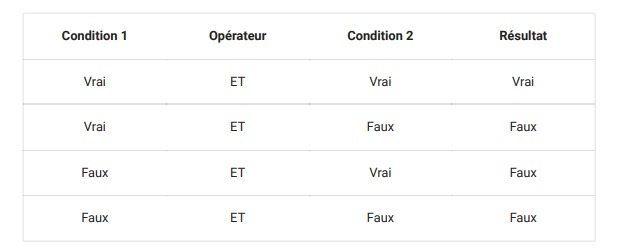
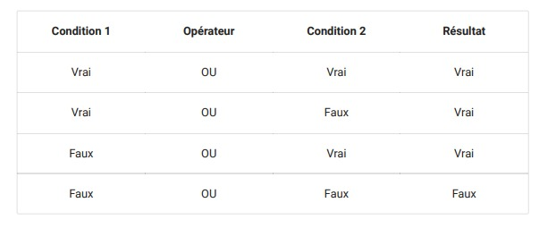

# cour 04 : Les Conditions 


En Python, les conditions sont utilisées pour prendre des décisions dans votre code en fonction de l'évaluation de certaines expressions booléennes. Les structures de contrôle conditionnelles les plus couramment utilisées sont les instructions `if`, `elif` (abréviation de "else if"), et `else`. 


## 1. Les instructions des conditions :

### 1.1. Instruction `if` :

L'instruction `if` permet d'exécuter un bloc de code si une condition est évaluée comme vraie.

```python
x = 10

if x > 5:
    print("x est supérieur à 5")
```

### 1.2 Instruction `if` avec `else` :

L'instruction `else` permet d'exécuter un bloc de code alternatif si la condition de l'instruction `if` est évaluée comme fausse.

```python
x = 3

if x > 5:
    print("x est supérieur à 5")
else:
    print("x est inférieur ou égal à 5")
```

### 1.3. Instruction `if` avec `elif` :

L'instruction `elif` est utilisée pour évaluer plusieurs conditions en séquence. Si la condition de l'instruction `if` est fausse, elle vérifie la condition de chaque instruction `elif` dans l'ordre, et exécute le bloc associé à la première condition vraie.

```python
x = 0

if x > 0:
    print("x est positif")
elif x < 0:
    print("x est négatif")
else:
    print("x est nul")
```


## 2. Opérateurs logiques :

En Python, les opérations logiques sont utilisées pour effectuer des opérations booléennes sur des valeurs booléennes ou des expressions. Les principaux opérateurs logiques sont `and`, `or` et `not`.

### 2.1  Opérateur `and` (ET logique) :

L'opérateur `and` renvoie `True` si toutes les conditions sont vraies, sinon il renvoie `False`.

```python
a = True
b = False
result = a and b  # Résultat : False

```



### 2.2 Opérateur `or` (OU logique) :

L'opérateur `or` renvoie `True` si au moins l'une des conditions est vraie, sinon il renvoie `False`.

```python
a = True
b = False

result = a or b  # Résultat : True
```




### 2.3 Opérateur `not` (NON logique) :

L'opérateur `not` renvoie l'inverse d'une valeur booléenne.

```python
a = True

result = not a  # Résultat : False
```


Exemple combinant plusieurs opérations logiques :

```python
x = 5
y = 10

result = (x > 0) and (y < 15)  # Résultat : True
```


Lorsque plusieurs opérateurs logiques sont utilisés dans une expression, ils sont évalués dans un ordre spécifique. L'ordre de priorité est `not`, `and`, `or`. Vous pouvez utiliser des parenthèses pour spécifier l'ordre d'évaluation si nécessaire.

```python
result = not (x > 0 and y < 15)  # Résultat : False
```


## 3. Conditions ternaires :

Python permet également d'écrire des conditions ternaires, qui sont une manière concise d'exprimer une condition en une seule ligne.

```python
x = 8
message = "x est positif" if x > 0 else "x est négatif ou nul"
print(message)
```

Ces structures conditionnelles vous permettent de créer des programmes flexibles et réactifs en fonction des valeurs de vos variables et de vos besoins logiques.

## 4. l'indentation:

En Python, l'indentation (l'alignement vertical des lignes de code) est cruciale pour la structure du code et pour indiquer les blocs de code associés aux structures de contrôle telles que les instructions `if`, `else`, `elif`, les boucles `for` et `while`, les définitions de fonctions, et autres.

Contrairement à certains autres langages de programmation qui utilisent des accolades `{}` ou des mots-clés comme `begin` et `end` pour délimiter les blocs de code, Python utilise l'indentation pour déterminer la portée des blocs de code.

Voici un exemple simple pour illustrer l'indentation en Python :

```python
if True:
    print("Cette ligne est à l'intérieur du bloc de l'instruction if.")
    print("Elle est exécutée si la condition est vraie.")
else:
    print("Cette ligne est à l'intérieur du bloc de l'instruction else.")
    print("Elle est exécutée si la condition de l'instruction if est fausse.")
```

Dans cet exemple, les lignes de code à l'intérieur du bloc `if` et du bloc `else` sont indentées avec une tabulation (ou un certain nombre d'espaces). L'indentation est généralement constituée de 4 espaces dans la plupart des conventions de style Python (comme recommandé par PEP 8, les conventions de style de code Python), bien que l'utilisation d'une tabulation (un caractère de tabulation) soit également acceptée.

Il est important de maintenir une indentation cohérente dans tout votre code pour que Python puisse interpréter correctement la structure du programme. Une indentation incorrecte peut entraîner des erreurs ou des comportements inattendus.

Exemple d'indentation correcte :

```python
for i in range(5):
    if i % 2 == 0:
        print("Nombre pair :", i)
    else:
        print("Nombre impair :", i)
```

Notez que l'indentation ne doit pas seulement être visuellement correcte, mais également cohérente dans l'ensemble du code. Python est très sensible à la façon dont vous organisez votre code en termes d'indentation.


## 5. Tester des **``float``**:


Lorsque vous testez l'égalité de nombres à virgule flottante en Python, vous devez prendre en compte la possibilité d'erreurs d'arrondi dues à la représentation binaire des nombres à virgule flottante. En raison de ces erreurs d'arrondi, il est généralement déconseillé d'utiliser l'opérateur d'égalité (`==`) pour comparer deux nombres à virgule flottante. Au lieu de cela, il est préférable d'utiliser une tolérance ou une marge d'erreur acceptable.

Voici une approche courante pour tester l'égalité de deux nombres à virgule flottante avec une tolérance :

```python
# Fonction pour tester l'égalité de deux floats avec une tolérance
def are_floats_equal(float1, float2, tolerance=1e-9):
    return abs(float1 - float2) < tolerance

# Exemple d'utilisation
a = 0.1 + 0.2
b = 0.3

if are_floats_equal(a, b):
    print("Les floats sont égaux.")
else:
    print("Les floats ne sont pas égaux.")
```

Dans cet exemple, la fonction `are_floats_equal` compare la différence absolue entre les deux nombres avec une tolérance spécifiée (`tolerance=1e-9` dans cet exemple). Si la différence absolue est inférieure à la tolérance, les nombres sont considérés comme égaux.

Il est important de choisir une tolérance appropriée en fonction du contexte de votre application. La valeur `1e-9` est souvent utilisée, mais vous pouvez ajuster cette valeur en fonction de la précision nécessaire pour votre cas d'utilisation spécifique.

En résumé, pour tester l'égalité de nombres à virgule flottante en Python, évitez d'utiliser l'opérateur d'égalité directe et préférez plutôt une approche basée sur une tolérance.