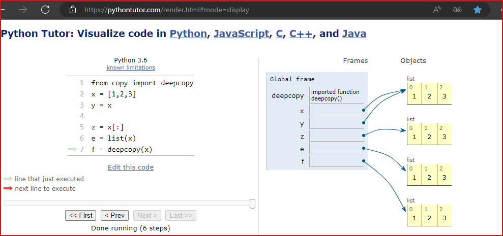

# cour 06 : Les listes 

## 1. Définition :

En programmation, une liste est une structure de données qui permet de stocker et d'organiser des éléments de manière séquentielle. Une liste peut contenir des éléments de différents types (nombres, chaînes de caractères, objets, etc.) et permet un accès individuel aux éléments en utilisant un indice.

En Python, une liste est un type de données intégré qui permet de stocker une collection ordonnée d'éléments. La syntaxe de base pour créer une liste en Python est d'utiliser des crochets `[]` et de séparer les éléments par des virgules.

Voici comment vous pouvez définir une liste en Python :

```python
# Définition d'une liste vide
empty_list = []

# Définition d'une liste avec quelques éléments
numbers = [1, 2, 3, 4, 5]
fruits = ["pomme", "banane", "orange"]

# Une liste peut contenir des éléments de types différents
mixed_list = [1, "hello", 3.14, True]

```

## 2.  **Accès aux éléments :** 

### 2.1 l'indice d'un élément  :

l'indice d'un élément dans une liste est un nombre entier qui représente la position de cet élément dans la liste. Les indices commencent généralement à zéro pour la plupart des langages de programmation, y compris Python. Cela signifie que le premier élément de la liste a un indice de 0, le deuxième a un indice de 1, et ainsi de suite.

Voici un exemple pour illustrer les indices des éléments dans une liste :

```python
fruits = ["pomme", "banane", "orange"]

# Indices des éléments dans la liste
# "pomme" a l'indice 0
# "banane" a l'indice 1
# "orange" a l'indice 2
```

Pour accéder à un élément spécifique dans la liste, vous utilisez l'indice de cet élément entre crochets. Par exemple, pour obtenir la valeur de la "banane" dans la liste `fruits`, vous utilisez l'indice 1 :

```python
fruits = ["pomme", "banane", "orange"]

# Accès à un élément par son indice
deuxieme_fruit = fruits[1]  # "banane"
```

Il est important de noter que si vous essayez d'accéder à un indice qui n'existe pas dans la liste (par exemple, un indice supérieur à la longueur de la liste), cela provoquera une erreur d'indice hors limites. Vous devez vous assurer que l'indice que vous utilisez est valide pour la liste donnée.


### 2.2 Accès par Indice :

L'accès par indice est la méthode la plus courante. Les indices commencent à zéro, et vous pouvez utiliser un indice positif pour accéder aux éléments de la liste en partant du début.

```python
fruits = ["pomme", "banane", "orange"]

# Accès par indice positif
premier_fruit = fruits[0]  # "pomme"
deuxieme_fruit = fruits[1]  # "banane"
```

### 2.3 Accès par Indice Négatif :

Vous pouvez également utiliser des indices négatifs pour accéder aux éléments à partir de la fin de la liste. L'indice `-1` correspond au dernier élément, `-2` à l'avant-dernier, et ainsi de suite.

```python
fruits = ["pomme", "banane", "orange"]

# Accès par indice négatif
dernier_fruit = fruits[-1]  # "orange"
avant_dernier_fruit = fruits[-2]  # "banane"
```

### 2.4 Accès par Tranche (``Slicing``) :

- L'accès par tranche permet d'extraire une partie de la liste. Vous spécifiez une plage d'indices, et la tranche résultante inclura les éléments de l'indice de début jusqu'à l'indice de fin (non inclus).

    ```python
    fruits = ["pomme", "banane", "orange", "kiwi", "raisin"]

    # Accès par tranche
    sous_liste = fruits[1:4]  # ["banane", "orange", "kiwi"]
    ```

- **Zoom sur slicing :**

    En Python, le slicing (trançage) est une technique puissante pour extraire une partie d'une séquence, telle qu'une liste, une chaîne de caractères ou un tuple. La syntaxe générale du slicing est `start:stop:step`, où `start` est l'indice de début, `stop` est l'indice de fin (non inclus), et `step` est l'incrément entre les indices. Voici différentes manières de l'utiliser :


    - **Slicing de Base :**

        Le slicing de base consiste à spécifier uniquement `start` et `stop`. Il extrait les éléments de l'indice `start` à l'indice `stop-1`.

        ```python
        fruits = ["pomme", "banane", "orange", "kiwi", "raisin"]

        # Slicing de base
        sous_liste = fruits[1:4]  # ["banane", "orange", "kiwi"]
        ```

    - **Slicing avec Step :**

        Vous pouvez spécifier un `step` pour sauter un certain nombre d'éléments entre `start` et `stop`.

        ```python
        numbers = [0, 1, 2, 3, 4, 5, 6, 7, 8, 9]

        # Slicing avec step
        sublist_even = numbers[2:9:2]  # [2, 4, 6, 8]
        ```


    - **Slicing sans Start ou Stop (Slicing Complet) :**

        Si vous ne spécifiez ni `start` ni `stop`, vous obtiendrez une copie complète de la liste.

        ```python
        fruits = ["pomme", "banane", "orange", "kiwi", "raisin"]

        # Slicing complet
        copie_complete = fruits[:]
        ```


    - **Slicing avec Indices Négatifs :**

        Les indices négatifs peuvent également être utilisés dans le slicing. Cependant, cela nécessite de spécifier `start` et `stop` de manière appropriée.

        ```python
        fruits = ["pomme", "banane", "orange", "kiwi", "raisin"]

        # Slicing avec indices négatifs
        sous_liste = fruits[-3:-1]  # ["orange", "kiwi"]
        ```


    - **Slicing avec Step Négatif :**

        Un `step` négatif inverse l'ordre des éléments.

        ```python
        numbers = [0, 1, 2, 3, 4, 5, 6, 7, 8, 9]

        # Slicing avec step négatif
        reverse_list = numbers[::-1]  # [9, 8, 7, 6, 5, 4, 3, 2, 1, 0]
        ```

Le slicing est une technique flexible et puissante qui offre de nombreuses façons d'extraire des données à partir de séquences en Python. Vous pouvez choisir la méthode de slicing qui convient le mieux à votre cas d'utilisation spécifique.


#### RQ :
 
- Soyez très **attentif** au fait que les indices d'une liste de n éléments commencent à 0 et se terminent à n-1. 


## 3. **Opération sur les listes:**

### 3.1 **Modification d'éléments :**

- **Modification par indice :**
  ```python
  fruits = ["pomme", "banane", "orange"]
  fruits[1] = "kiwi"
  # Maintenant, fruits = ["pomme", "kiwi", "orange"]
  ```


### 3.2 **Concaténation et duplication  de listes :**

- les listes supportent l'opérateur + de concaténation, ainsi que l'opérateur * pour la duplication :
- **Utilisation de l'opérateur `+` :**
  ```python
  fruits1 = ["pomme", "banane"]
  fruits2 = ["orange", "kiwi"]
  fruits = fruits1 + fruits2
  # Maintenant, fruits = ["pomme", "banane", "orange", "kiwi"]
  ```
- **Utilisation de l'opération `*`:**
    ```python
    l1 = [1]*3 
    # l1 = [1 , 1 ,1]
    ```

### 3.3 **Recherche d'un élément :`in`**

- **Utilisation de l'opérateur `in` :**
  ```python
  fruits = ["pomme", "banane", "orange"]
  est_present = "kiwi" in fruits  # False
  ```


## 4. **Méthodes des listes :**

### 4.1  **Ajout d'éléments :`append()` , `insert()`**

- **Ajout à la fin de la liste avec `append()` :**
  ```python
  fruits = ["pomme", "banane", "orange"]
  fruits.append("kiwi")
  # Maintenant, fruits = ["pomme", "banane", "orange", "kiwi"]
  ```

- **Insertion à un indice spécifique avec `insert()` :**
  ```python
  fruits = ["pomme", "banane", "orange"]
  fruits.insert(1, "kiwi")
  # Maintenant, fruits = ["pomme", "kiwi", "banane", "orange"]
  ```

### 4.2 **Suppression d'éléments :`remove()`**

- **Suppression par valeur avec `remove()` :**
  ```python
  fruits = ["pomme", "kiwi", "banane", "orange"]
  fruits.remove("kiwi")
  # Maintenant, fruits = ["pomme", "banane", "orange"]
  ```

- **Suppression par indice avec `del` :**
  ```python
  fruits = ["pomme", "banane", "orange"]
  del fruits[1]
  # Maintenant, fruits = ["pomme", "orange"]
  ```


### 4.3  **trier les éléments d'une liste:`sort()` ,`sorted()`**

En Python, la méthode `sort()` et la fonction `sorted()` sont utilisées pour trier les éléments d'une liste. Cependant, il y a une différence importante entre les deux.

#### a. Méthode `sort()` :

La méthode `sort()` est une méthode intégrée des listes en Python. Elle modifie la liste d'origine en la triant par ordre croissant (par défaut).

```python
numbers = [4, 2, 8, 1, 6]
numbers.sort()
# Maintenant, numbers = [1, 2, 4, 6, 8]
```

Vous pouvez également utiliser l'argument `reverse=True` pour trier par ordre décroissant :

```python
numbers = [4, 2, 8, 1, 6]
numbers.sort(reverse=True)
# Maintenant, numbers = [8, 6, 4, 2, 1]
```

#### b. Fonction `sorted()` :

La fonction `sorted()` renvoie une nouvelle liste triée à partir des éléments de la liste donnée. Elle ne modifie pas la liste d'origine.

```python
numbers = [4, 2, 8, 1, 6]
sorted_numbers = sorted(numbers)
# sorted_numbers = [1, 2, 4, 6, 8], numbers reste inchangée
```

Comme pour `sort()`, vous pouvez utiliser l'argument `reverse=True` avec `sorted()` :

```python
numbers = [4, 2, 8, 1, 6]
sorted_numbers_desc = sorted(numbers, reverse=True)
# sorted_numbers_desc = [8, 6, 4, 2, 1], numbers reste inchangée
```


### 4.4 **la méthode ``count``:**

La méthode `count()` est utilisée pour compter le nombre d'occurrences d'un élément particulier dans une liste.

```python
numbers = [1, 2, 3, 2, 4, 2, 5]

# Compter le nombre d'occurrences de l'élément 2
occurrences = numbers.count(2)  # Résultat : 3
```

Cette méthode renvoie le nombre d'occurrences de l'élément spécifié dans la liste.


### 4.5 **Méthode `reverse()` :**

La méthode `reverse()` inverse l'ordre des éléments dans une liste. Elle modifie la liste d'origine sans créer une nouvelle liste.

```python
numbers = [1, 2, 3, 4, 5]

# Inverser l'ordre des éléments dans la liste
numbers.reverse()
# Maintenant, numbers = [5, 4, 3, 2, 1]
```

Cette méthode est utile si vous souhaitez inverser l'ordre des éléments dans une liste sans créer une nouvelle liste.


## 5. **fonctions de manipulation des listes :** 

### 5.1 **Longueur de la liste :`len()`**

- **Utilisation de la fonction `len()` :**
  ```python
  fruits = ["pomme", "banane", "orange"]
  longueur = len(fruits)  # 3
  ```


### 5.2 Fonction `sum()` :

La fonction `sum()` est utilisée pour calculer la somme des éléments d'une liste (ou d'une autre séquence numérique).

```python
numbers = [1, 2, 3, 4, 5]

# Calculer la somme des éléments
total = sum(numbers)  # Résultat : 15
```

### 5.3 Fonction `min()` :

La fonction `min()` renvoie le plus petit élément d'une liste.

```python
numbers = [4, 2, 8, 1, 6]

# Trouver le plus petit élément
minimum = min(numbers)  # Résultat : 1
```

### 5.4 Fonction `max()` :

La fonction `max()` renvoie le plus grand élément d'une liste.

```python
numbers = [4, 2, 8, 1, 6]

# Trouver le plus grand élément
maximum = max(numbers)  # Résultat : 8
```


## 6. **Copie d'une liste :**

En Python, il existe plusieurs façons de créer des copies indépendantes d'une liste. Cependant, la manière dont ces copies traitent les objets imbriqués peut varier. Voici une explication des différentes méthodes :

### a. `l[:]` (Slicing) :

La syntaxe de découpage (`[:]`) crée une copie superficielle (shallow copy) de la liste. Cela signifie que la liste principale est copiée, mais si la liste contient des objets imbriqués (par exemple, une liste de listes), les objets imbriqués ne sont pas copiés de manière indépendante.

```python
original_list = [1, [2, 3], 4]
shallow_copy = original_list[:]
```

### b. `l.copy()` :

La méthode `copy()` crée également une copie superficielle de la liste.

```python
original_list = [1, [2, 3], 4]
shallow_copy = original_list.copy()
```

### c. `list(l)` :

La fonction `list()` utilisée pour créer une liste à partir d'une séquence crée une copie superficielle de la liste.

```python
original_list = [1, [2, 3], 4]
shallow_copy = list(original_list)
```

### d. `copy.deepcopy(l)` :

La fonction `deepcopy()` du module `copy` crée une copie profonde (deep copy) de la liste. Cela signifie que non seulement la liste principale est copiée, mais aussi tous les objets imbriqués à n'importe quelle profondeur.

```python
import copy

original_list = [1, [2, 3], 4]
deep_copy = copy.deepcopy(original_list)
```

### RQ :Comparaison des méthodes  

- La copie superficielle (`[:]`, `copy()`, `list()`) crée une nouvelle liste, mais les objets imbriqués restent référencés, ce qui signifie que les modifications aux objets imbriqués seront visibles dans les deux listes.
  
- La copie profonde (`deepcopy()`) crée une nouvelle liste et des copies indépendantes de tous les objets imbriqués, garantissant que les modifications ne se propagent pas entre les deux listes.





## 7. **les list comprehensions :**

les list comprehensions sont une syntaxe concise pour créer des listes. Elles permettent de créer une liste en une seule ligne en appliquant une expression à chaque élément d'une séquence (comme une autre liste). Voici la syntaxe générale des list comprehensions :

```python
nouvelle_liste = [expression for element in sequence if condition]
```

- **expression :** L'expression à appliquer à chaque élément.
- **element :** La variable représentant chaque élément dans la séquence.
- **sequence :** La séquence à parcourir (par exemple, une liste, une chaîne de caractères, une plage).
- **condition (optionnelle) :** Une condition pour filtrer les éléments.

Voici quelques exemples pour illustrer l'utilisation des list comprehensions :

- Création d'une liste de carrés des nombres de 0 à 9 :

```python
carres = [x**2 for x in range(10)]
# Résultat : [0, 1, 4, 9, 16, 25, 36, 49, 64, 81]
```

- Filtrage des nombres pairs dans une liste :

```python
nombres = [1, 2, 3, 4, 5, 6, 7, 8, 9]
pairs = [x for x in nombres if x % 2 == 0]
# Résultat : [2, 4, 6, 8]
```

- Création d'une liste de chaînes en majuscules à partir d'une liste de mots :

```python
mots = ["chat", "chien", "oiseau"]
majuscules = [mot.upper() for mot in mots]
# Résultat : ["CHAT", "CHIEN", "OISEAU"]
```

-  Création d'une liste de tuples avec les nombres et leurs carrés :

```python
nombres = [1, 2, 3, 4]
tuples_carres = [(x, x**2) for x in nombres]
# Résultat : [(1, 1), (2, 4), (3, 9), (4, 16)]
```

