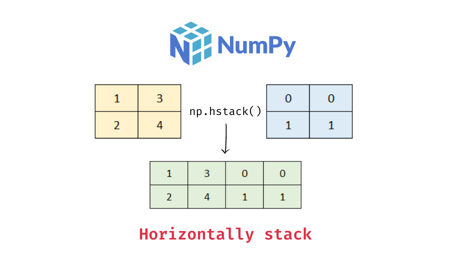
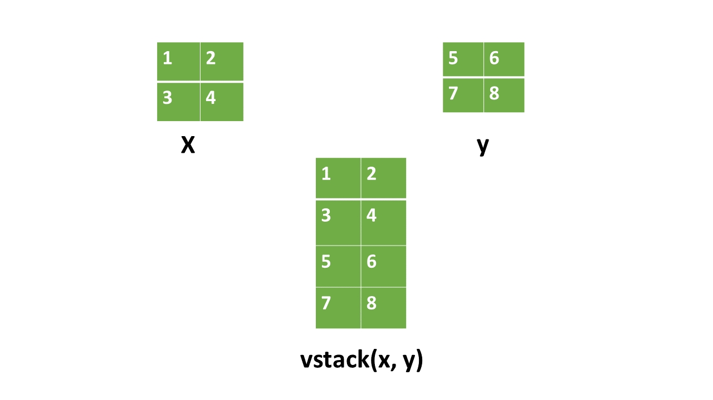

# cour 2 : **Manpulation:**


## 1. **Concaténation des ``ndarry``:**


### 1.1 **la focntion ``hstack``:**

- **Description:**

    >La fonction `hstack` de NumPy est utilisée pour empiler des tableaux horizontalement, c'est-à-dire pour concaténer des tableaux le long de leur deuxième axe, en les mettant côte à côte. Cela signifie que les tableaux doivent avoir le même nombre de lignes (ou de dimensions le long de cet axe) pour pouvoir être empilés horizontalement.

    


- **Syntaxe:**

    ```python
    numpy.hstack((A , B))
    ```
    - avce la condition que : ``A.shape[0] == B.shape[0]``

- **Exemple:**


    ```python
    import numpy as np

    # Création de deux tableaux
    a = np.array([[1, 2, 3],
                [4, 5, 6]])

    b = np.array([[7, 8],
                [9, 10]])

    # Empilement horizontal des tableaux
    result = np.hstack((a, b))

    print("Tableau a:")
    print(a)
    print("\nTableau b:")
    print(b)
    print("\nRésultat de l'empilement horizontal:")
    print(result)
    ```

    - **Output :**
        ```
        Tableau a:
        [[1 2 3]
        [4 5 6]]

        Tableau b:
        [[ 7  8]
        [ 9 10]]

        Résultat de l'empilement horizontal:
        [[ 1  2  3  7  8]
        [ 4  5  6  9 10]]
        ```


### 1.2 **la fonction ``vstack``:**

- **Description :**

    >La fonction `vstack` de NumPy est utilisée pour empiler des tableaux verticalement, c'est-à-dire pour concaténer des tableaux le long de leur premier axe, en les empilant les uns sur les autres. Cela signifie que les tableaux doivent avoir le même nombre de colonnes (ou de dimensions le long de cet axe) pour pouvoir être empilés verticalement.

    

- **Syntaxe :**

    ```python
    numpy.vstack((A ,B))
    ```
    - avce la condition que : ``A.shape[1] == B.shape[1]``


- **Exemple :**

    ```python
    import numpy as np

    # Création de deux tableaux
    a = np.array([[1, 2],
                [3, 4]])

    b = np.array([[5, 6],
                [7, 8]])

    # Empilement vertical des tableaux
    result = np.vstack((a, b))

    print("Tableau a:")
    print(a)
    print("\nTableau b:")
    print(b)
    print("\nRésultat de l'empilement vertical:")
    print(result)
    ```

    - **Output :**
        
        ```
        Tableau a:
        [[1 2]
        [3 4]]

        Tableau b:
        [[5 6]
        [7 8]]

        Résultat de l'empilement vertical:
        [[1 2]
        [3 4]
        [5 6]
        [7 8]]
        ```


### 1.3 **la fonction ``concatenate`` :**

- **Description :**

    >La fonction `concatenate` de NumPy est utilisée pour concaténer des tableaux le long d'un axe spécifié. Cela permet de fusionner plusieurs tableaux en un seul en utilisant une dimension commune. 


- **Syntaxe :**

    ```python
    numpy.concatenate((arr1, arr2, ...), axis=0)
    ```
    - `arr1, arr2, ...` : Séquence de tableaux à concaténer. Ils doivent avoir les mêmes dimensions sauf pour l'axe le long duquel la concaténation est effectuée.
    - `axis` : L'axe le long duquel la concaténation doit être effectuée. Par défaut, l'axe est 0.
    - `axis=0`  => ``vstack`` et `axis=1`  => ``hstack``


- **Exemple :**
    ```python
    import numpy as np

    # Création de deux tableaux
    a = np.array([[1, 2],
                [3, 4]])

    b = np.array([[5, 6],
                [7, 8]])

    # Concaténation le long de l'axe 0 (lignes)
    result = np.concatenate((a, b), axis=0)

    print("Tableau a:")
    print(a)
    print("\nTableau b:")
    print(b)
    print("\nRésultat de la concaténation le long de l'axe 0:")
    print(result)
    ```

    **Output :**
    ```
    Tableau a:
    [[1 2]
    [3 4]]

    Tableau b:
    [[5 6]
    [7 8]]

    Résultat de la concaténation le long de l'axe 0:
    [[1 2]
    [3 4]
    [5 6]
    [7 8]]
    ```


## 2. **Redimensionnement  des ``ndarry``:**


### 2.1 **la fonction ``respahe``:**

- **Description :**

    >La fonction `reshape` de NumPy est utilisée pour modifier la forme (c'est-à-dire le nombre de lignes et de colonnes) d'un tableau sans modifier ses données. Cela permet de réorganiser les données d'un tableau dans une nouvelle forme spécifiée.


- **Syntaxe :**

    ```python
    numpy.reshape(a, newshape)
    # ou la méthode :
    a.reshape(newshape)
    ```
    - `a` : Tableau d'entrée à remodeler.
    - `newshape` : Tuple ou liste spécifiant la nouvelle forme du tableau.
    - la condition : ``a.shape[0]*a.shape[1] == newshape[0]*newshape[1]``

- **Exemple :**

    ```python
    import numpy as np

    # Création d'un tableau unidimensionnel
    a = np.array([1, 2, 3, 4, 5, 6])

    # Remodelage en un tableau 2D de 3 lignes et 2 colonnes
    result = np.reshape(a, (3, 2))

    print("Tableau original:")
    print(a)
    print("\nRésultat du remodelage:")
    print(result)
    ```

    - **Output :**
        ```
        Tableau original:
        [1 2 3 4 5 6]

        Résultat du remodelage:
        [[1 2]
        [3 4]
        [5 6]]
        ```

### 2.2 **la fonction ``sequeeze()``:**

- **Description :**

    >La fonction `squeeze` de NumPy est utilisée pour supprimer les dimensions de taille 1 d'un tableau NumPy. Cela signifie qu'elle réduit la dimensionnalité du tableau en éliminant les axes qui ont une taille de 1.


- **Syntaxe :**

    ```python
    numpy.squeeze(a, axis=None)
    # ou la méthode :
    a.squeeze()
    ```
    - `a` : Tableau d'entrée à traiter.
    - `axis` : Facultatif. Spécifie les axes le long desquels la fonction doit opérer. Par défaut, tous les axes de taille 1 sont supprimés.

- **Exemple :**

    ```python
    import numpy as np

    # Création d'un tableau avec une dimension supplémentaire de taille 1
    a = np.array([[[1, 2, 3]]])

    # Suppression de la dimension supplémentaire
    result = np.squeeze(a)

    print("Tableau original:")
    print(a)
    print("\nRésultat après suppression de la dimension de taille 1:")
    print(result)
    ```

    - **Output :**
        ```
        Tableau original:
        [[[1 2 3]]]

        Résultat après suppression de la dimension de taille 1:
        [1 2 3]
        ```


### 2.3. **la fonction ``ravel``:**

- **Description :**

    >La fonction `ravel` de NumPy est utilisée pour aplatir un tableau multidimensionnel en un tableau unidimensionnel. Cela signifie qu'elle transforme un tableau de n'importe quelle forme en une seule dimension en lisant les éléments du tableau dans un ordre séquentiel.


- **Syntaxe :**

    ```python
    numpy.ravel(a, order='C')
    ```
    - `a` : Tableau d'entrée à aplatir.


- **Exemple :**
    ```python
    import numpy as np

    # Création d'un tableau multidimensionnel
    a = np.array([[1, 2, 3],
                [4, 5, 6]])

    # Aplatir le tableau en un tableau unidimensionnel
    result = np.ravel(a)

    print("Tableau original:")
    print(a)
    print("\nRésultat de l'aplatissement:")
    print(result)
    ```

    - **Output :**
        ```
        Tableau original:
        [[1 2 3]
        [4 5 6]]

        Résultat de l'aplatissement:
        [1 2 3 4 5 6]
        ```

