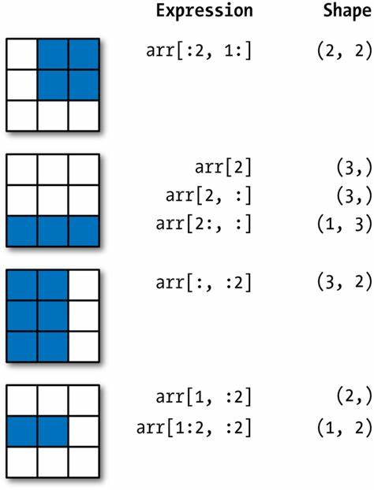
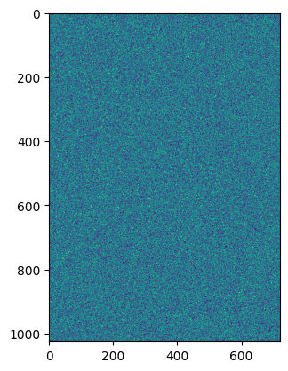

# cour 3 : **Indexation:**


## 1. **``Indexing:``**

- **Description:**

    >L'indexation d'un ndarray (tableau NumPy multidimensionnel) vous permet d'accéder à des éléments individuels d'un ``ndarry`` .l'indexation commance par 0 Cela signifie que le premier élément est accessible en utilisant l'indice 0 ( 1ere ligne).


- **Syntaxe:**

    ```py
    A[i ,j]
    # ou 
    A[i]
    ```
    - avce (i,j) : la postion du élement du A .
    - ``A[i]`` : accès à la (i+1)-éme ligne du A . 

- **Exemple:**

    ```python
    import numpy as np

    # Création d'un tableau
    arr = np.array([
        [1, 2, 3],
        [4, 5, 6],
        [7, 8, 9]])

    # Accès à un élément individuel (ligne 1, colonne 2)
    print(arr[1, 2])  # Sortie : 6
    print(arr[2]) # Sortie : [7 , 8 , 9]
    ```


## 2. **Accès à une ligne ou une colonne :**


>Vous pouvez accéder à une ligne ou une colonne entière du tableau.

- **Synatxe:**

    ```py
    # accés à la ligne du position i :
    A[i]

    # accés à la colonne du position j :
    A[:,j]
    ```

- **Exemple:**

   ```python
    import numpy as np

    # Création d'un tableau
    arr = np.array([
        [1, 2, 3],
        [4, 5, 6],
        [7, 8, 9]])
   # Accès à la deuxième ligne
   print(arr[1])  # Sortie : [4 5 6]

   # Accès à la troisième colonne
   print(arr[:, 2])  # Sortie : [3 6 9]
   ```

## 3. **``slincing`` :**

- **Description:**

    >Le ``slicing`` en NumPy permet d'extraire des sous-tableaux (ou sous-ensembles) à partir d'un tableau NumPy multidimensionnel. Cela vous permet de sélectionner des parties spécifiques de votre tableau en spécifiant des plages d'indices pour chaque dimension.

    
    
- **Syntaxe :**

    ```python
    A[debut:fin:pas, debut:fin:pas]
    ```
    - `A` : Tableau NumPy à trancher.
    - `debut`, `fin`, `pas` : Paramètres pour spécifier les plages d'indices et le pas de l'indexation pour chaque dimension du tableau.
    -  si le ``début`` ou la ``fin`` ne sont pas spécifiés, cela signifie qu'ils sont considérés comme étant à partir de 0 jusqu'à la fin. 
    -  si le début spécifié est négatif, cela signifie qu'il est compté à partir de la fin jusqu'à l'indice spécifié
    - ``fin``  ne sera pas incluse dans la plage.


- **Exemple :**

    ```python
    import numpy as np

    # Création d'un tableau NumPy
    A = np.array([[1, 2, 3],
                [4, 5, 6],
                [7, 8, 9]])

    # Exemple de slicing pour extraire une sous-section du tableau
    sous_tableau = A[0:2, 1:3]

    print("Tableau original :")
    print(A)
    print("\nSous-tableau extrait :")
    print(sous_tableau)
    ```

    - **Output :**
        ```
        Tableau original :
        [[1 2 3]
        [4 5 6]
        [7 8 9]]

        Sous-tableau extrait :
        [[2 3]
        [5 6]]
        ```


### RQ :

- on peut affecter un nombre n dans une tranche de ``ndaryy`` sélectionnez, comme par exemple :

    ```python
    import numpy as np
    A = np.reshape(np.arange(1 , 10 ,1) , (3,3))
    print(A)
    # array([[1, 2, 3],
    #        [4, 5, 6],
    #        [7, 8, 9]])

    # subSetting :
    D = A[1: , 1]
    print(D)

    # changement :
    A[1: , 1] = 0
    print(A)
    # output :
    # array([[1, 2, 3],
    #        [4, 0, 6],
    #        [7, 0, 9]])

    ```


## 4. **``Indexation booléenne`` :**

- **Description :**

    >L'indexation booléenne en NumPy est une méthode permettant de sélectionner des éléments d'un tableau NumPy en se basant sur une condition booléenne. Cela signifie que vous pouvez utiliser des tableaux de valeurs booléennes (appelés ``masques`` booléens) pour filtrer les éléments d'un tableau en fonction d'une condition donnée.


- **Syntaxe :**

    ```python
    A[condition]
    ```
    - `A` : Tableau NumPy à indexer.
    - `condition` : Un tableau de valeurs booléennes ou une expression booléenne qui définit la condition pour sélectionner les éléments du tableau.
    - return un ``ndarray`` de dimesnion 1 .

- **Exemple 1 :**

    ```python
    import numpy as np

    # Création d'un tableau NumPy
    A = np.array([1, 2, 3, 4, 5])

    # Création d'un masque booléen basé sur une condition
    masque = A > 3

    # Utilisation du masque pour sélectionner les éléments du tableau
    resultat = A[masque]

    print("Tableau original :", A)
    print("Masque booléen :", masque)
    print("Résultat de l'indexation booléenne :", resultat)
    ```

    - **Output :**
        ```
        Tableau original : [1 2 3 4 5]
        Masque booléen : [False False False  True  True]
        Résultat de l'indexation booléenne : [4 5]
        ```

- **Exemple 2 : Traitement des images**

    ```python
    import numpy as np 
    import matplotlib.pyplot as plt 

    # on définit l'image :
    image = np.random.randint(0 ,255 ,[1024 , 720])

    # Affichage :
    plt.imshow(image) 

    # on peut utiliser le indexation boolean pour filetr l'image :
    image[image > 200] = 0
    plt.imshow(image)
    ```
    
    


## 5. **Indexation des tranches QQ:**

- **Description :**

    >L'indexation des tranches en NumPy vous permet d'accéder à des éléments spécifiques d'un tableau en utilisant des tableaux ou des listes d'indices. Cela vous permet de sélectionner des éléments de différentes colonnes en utilisant des indices spécifiques.

- **Syntaxe :**

    ```python
    tableau[:, indices]
    ```

    - `tableau` : Tableau NumPy à indexer.
    - `indices` : Tableau ou liste d'indices spécifiant les colonnes à sélectionner.

- **Exemple :**


    ```python
    import numpy as np

    # Création d'un tableau NumPy
    arr = np.array([[1, 2, 3],
                    [4, 5, 6],
                    [7, 8, 9]])

    # Accès à des éléments spécifiques en utilisant l'indexation des tranches
    indices = np.array([0, 2])
    resultat = arr[:, indices]

    print("Tableau original :")
    print(arr)
    print("\nÉléments sélectionnés :")
    print(resultat)
    ```

    - **Output :**
        ```
        Tableau original :
        [[1 2 3]
        [4 5 6]
        [7 8 9]]

        Éléments sélectionnés :
        [[1 3]
        [4 6]
        [7 9]]
        ```


