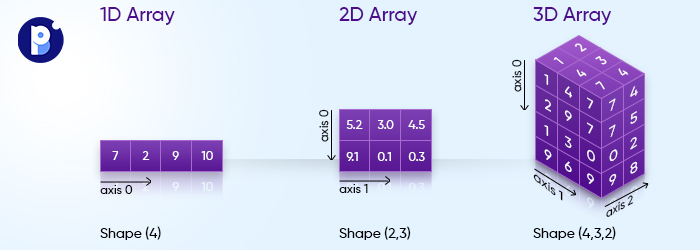

# cour 4 : **Méthodes des ``ndarry``:**

- [docs_ndarry](https://numpy.org/doc/stable/reference/generated/numpy.ndarray.html)

## 1. **les ``axes`` des ``ndarry``:**

- **``définition``:**

    >L'objet ndarray (tableau NumPy) est la structure de données fondamentale de la bibliothèque NumPy. Il représente un tableau multidimensionnel contenant des éléments du même type de données. Les axes dans un ndarray font référence aux différentes dimensions du tableau. Voici une description plus détaillée :


- **``Axes`` :**
    >Les axes dans un tableau NumPy font référence aux différentes dimensions du tableau. Chaque axe est identifié par un numéro entier, où l'axe 0 correspond aux lignes, l'axe 1 correspond aux colonnes, et ainsi de suite pour les dimensions supérieures.

- **``Caractéristiques``:**

  - Les axes permettent d'organiser les données multidimensionnelles dans un tableau NumPy.

  - Ils sont utilisés pour effectuer des opérations le long de différentes dimensions du tableau, telles que les calculs de moyenne, de somme, de minimum, de maximum, etc.





## 2. **les méthodes ``sum``  et ``cumsum``:**

### 2.1 **``sum():``**

- **Description :**

    >La méthode `sum` de NumPy est utilisée pour calculer la somme des éléments d'un tableau NumPy le long d'un axe spécifié ou de tous les éléments si aucun axe n'est spécifié.


- **Syntaxe (avec axis) :**

    ```python
    numpy.sum(a, axis=None)
    ```
    - `a` : Tableau NumPy pour lequel la somme doit être calculée.
    - `axis` : Spécifie l'axe le long duquel la somme doit être calculée. Par défaut, la somme est calculée sur tous les éléments du tableau.


- **Exemple :**

    ```python
    import numpy as np

    # Création d'un tableau NumPy
    arr = np.array([[1, 2, 3],
                    [4, 5, 6]])

    # Calcul de la somme de tous les éléments
    somme_totale = np.sum(arr)

    # Calcul de la somme le long de l'axe 0 (somme par colonne)
    somme_par_colonne = np.sum(arr, axis=0)

    # Calcul de la somme le long de l'axe 1 (somme par ligne)
    somme_par_ligne = np.sum(arr, axis=1)

    print("Tableau original :")
    print(arr)
    print("\nSomme totale des éléments du tableau :", somme_totale)
    print("Somme par colonne :", somme_par_colonne)
    print("Somme par ligne :", somme_par_ligne)
    ```

    - **Output :**

        ```
        Tableau original :
        [[1 2 3]
        [4 5 6]]

        Somme totale des éléments du tableau : 21
        Somme par colonne : [5 7 9]
        Somme par ligne : [ 6 15]
        ```


### 2.2 **``cumsum():``**

- **Description :**

    >La méthode `cumsum()` de NumPy est utilisée pour calculer la somme cumulative des éléments d'un tableau NumPy le long d'un axe spécifié.

- **Syntaxe (avec axis) :**
    ```python
    numpy.cumsum(a, axis=None)
    ```
    - `a` : Tableau NumPy pour lequel la somme cumulative doit être calculée.
    - `axis` : Facultatif. Spécifie l'axe le long duquel la somme cumulative doit être calculée. Par défaut, la somme cumulative est calculée sur tous les éléments du tableau.

- **Exemple :**

    ```python
    import numpy as np

    # Création d'un tableau NumPy
    arr = np.array([[1, 2, 3],
                    [4, 5, 6]])

    # Calcul de la somme cumulative de tous les éléments
    somme_cumulative_totale = np.cumsum(arr)

    # Calcul de la somme cumulative le long de l'axe 0 (somme cumulative par colonne)
    somme_cumulative_par_colonne = np.cumsum(arr, axis=0)

    # Calcul de la somme cumulative le long de l'axe 1 (somme cumulative par ligne)
    somme_cumulative_par_ligne = np.cumsum(arr, axis=1)

    print("Tableau original :")
    print(arr)
    print("\nSomme cumulative de tous les éléments du tableau :", somme_cumulative_totale)
    print("Somme cumulative par colonne :", somme_cumulative_par_colonne)
    print("Somme cumulative par ligne :", somme_cumulative_par_ligne)
    ```

    - **Output :**
        ```
        Tableau original :
        [[1 2 3]
        [4 5 6]]

        Somme cumulative de tous les éléments du tableau : [ 1  3  6 10 15 21]
        Somme cumulative par colonne : [[1 2 3]
        [5 7 9]]
        Somme cumulative par ligne : [[ 1  3  6]
        [ 4  9 15]]
        ```


### RQ : ``prod``  et ``cumprod``

- comme ``sum`` et ``cumsum`` il existe aussi ``prod``  et ``cumprod`` [voir](#) la docs .


## 3. **les méthodes ``min``  et ``argmin``:**

### 3.1 **``min():``**

- **Description :**
    >La méthode `min()` de NumPy est utilisée pour trouver la valeur minimale parmi les éléments d'un tableau NumPy, en tenant compte d'un axe spécifié si nécessaire.


- **Syntaxe (avec axis) :**

    ```python
    numpy.min(a, axis=None)
    ```
    - `a` : Tableau NumPy pour lequel la valeur minimale doit être trouvée.
    - `axis` : Facultatif. Spécifie l'axe le long duquel la valeur minimale doit être trouvée. Par défaut, la valeur minimale est trouvée parmi tous les éléments du tableau.


- **Exemple :**

    ```python
    import numpy as np

    # Création d'un tableau NumPy
    arr = np.array([[1, 2, 3],
                    [4, 0, 6]])

    # Trouver la valeur minimale parmi tous les éléments du tableau
    min_tous_elements = np.min(arr)

    # Trouver la valeur minimale le long de l'axe 0 (minimum par colonne)
    min_par_colonne = np.min(arr, axis=0)

    # Trouver la valeur minimale le long de l'axe 1 (minimum par ligne)
    min_par_ligne = np.min(arr, axis=1)

    print("Tableau original :")
    print(arr)
    print("\nValeur minimale parmi tous les éléments du tableau :", min_tous_elements)
    print("Valeur minimale par colonne :", min_par_colonne)
    print("Valeur minimale par ligne :", min_par_ligne)
    ```

    **Output :**
    ```
    Tableau original :
    [[1 2 3]
    [4 0 6]]

    Valeur minimale parmi tous les éléments du tableau : 0
    Valeur minimale par colonne : [1 0 3]
    Valeur minimale par ligne : [1 0]
    ```


### 3.2 **``argmin():``**

- **Description :**

    >La méthode `argmin()` de NumPy est utilisée pour trouver l'indice de l'élément le plus petit dans un tableau NumPy, en tenant compte d'un axe spécifié si nécessaire.


- **Syntaxe (avec axis) :**

    ```python
    numpy.argmin(a, axis=None)
    ```
    - `a` : Tableau NumPy dans lequel l'indice de l'élément le plus petit doit être trouvé.
    - `axis` : Facultatif. Spécifie l'axe le long duquel l'indice de l'élément le plus petit doit être trouvé. Par défaut, l'indice de l'élément le plus petit est trouvé parmi tous les éléments du tableau.

- **Exemple :**

    ```python
    import numpy as np

    # Création d'un tableau NumPy
    arr = np.array([[1, 2, 3],
                    [4, 0, 6]])

    # Trouver l'indice de l'élément le plus petit parmi tous les éléments du tableau
    indice_min_tous_elements = np.argmin(arr)

    # Trouver l'indice de l'élément le plus petit le long de l'axe 0 (minimum par colonne)
    indice_min_par_colonne = np.argmin(arr, axis=0)

    # Trouver l'indice de l'élément le plus petit le long de l'axe 1 (minimum par ligne)
    indice_min_par_ligne = np.argmin(arr, axis=1)

    print("Tableau original :")
    print(arr)
    print("\nIndice de l'élément le plus petit parmi tous les éléments du tableau :", indice_min_tous_elements)
    print("Indice de l'élément le plus petit par colonne :", indice_min_par_colonne)
    print("Indice de l'élément le plus petit par ligne :", indice_min_par_ligne)
    ```

    **Output :**
    ```
    Tableau original :
    [[1 2 3]
    [4 0 6]]

    Indice de l'élément le plus petit parmi tous les éléments du tableau : 4
    Indice de l'élément le plus petit par colonne : [0 1 0]
    Indice de l'élément le plus petit par ligne : [0 1]
    ```


### RQ : ``max()``  et ``argmax()``

- comme ``min()`` et ``argmin()`` il existe aussi ``max()``  et ``argmax()`` [voir](#) la docs .


## 3. **les méthodes ``sort``  et ``argsort``:**

### 3.1 **``sort():``**

- **Description :**

    >La méthode `sort()` de NumPy est utilisée pour trier un tableau NumPy le long d'un axe spécifié.


- **Syntaxe (avec axis) :**

    ```python
    numpy.sort(a, axis=-1, kind=None, order=None)
    ```
    - `a` : Tableau NumPy à trier.
    - `axis` : Facultatif. Spécifie l'axe le long duquel le tri doit être effectué. 
    - `kind` : Facultatif. Spécifie l'algorithme de tri à utiliser. Les options possibles sont `'quicksort'`, `'mergesort'`, `'heapsort'` et `'stable'`. Par défaut, `'quicksort'` est utilisé.
    - `order` : Facultatif. Spécifie le nom des champs à utiliser pour le tri dans le cas d'un tableau structuré.

- **Exemple :**
    ```python
    import numpy as np

    # Création d'un tableau NumPy
    arr = np.array([3, 1, 2])

    # Trier les éléments du tableau
    arr_sorted = np.sort(arr)

    print("Tableau original :", arr)
    print("Tableau trié :", arr_sorted)

    # dans le cas A.ndim = 2 

    A = np.array([
        [3 , 1 , 4] ,
        [10 , 1 , 7] ,

        [ 4 , 0 , 1]
    ])


    A.sort(axis=0)

    print(A)
    ```

    **Output :**
    ```
    Tableau original : [3 1 2]
    Tableau trié : [1 2 3]
    [[ 3  0  1]
    [ 4  1  4]
    [10  1  7]]
    ```


### 3.2 **``argsort():``**

- **Description :**

    >La méthode `argsort()` de NumPy est utilisée pour obtenir les indices qui trieraient un tableau NumPy dans l'ordre croissant le long d'un axe spécifié.


- **Syntaxe (avec axis) :**

    ```python
    numpy.argsort(a, axis=-1, kind=None, order=None)
    ```
    - `a` : Tableau NumPy à trier.
    - `axis` : Facultatif. Spécifie l'axe le long duquel le tri doit être effectué.
    - `kind` : Facultatif. Spécifie l'algorithme de tri à utiliser. Les options possibles sont `'quicksort'`, `'mergesort'`, `'heapsort'` et `'stable'`. Par défaut, `'quicksort'` est utilisé.
    - `order` : Facultatif. Spécifie le nom des champs à utiliser pour le tri dans le cas d'un tableau structuré.

- **Exemple :**
    ```python
    import numpy as np

    # Création d'un tableau NumPy
    arr = np.array([3, 1, 2])

    # Obtenir les indices de tri
    indices_tries = np.argsort(arr)

    print("Tableau original :", arr)
    print("Indices de tri :", indices_tries)
    print("Tableau trié :", arr[indices_tries])
    ```

    **Output :**
    ```
    Tableau original : [3 1 2]
    Indices de tri : [1 2 0]
    Tableau trié : [1 2 3]
    ```


## 4. **``all`` && ``any`` :**


## 5.  **``mean`` , ``std`` et  ``var``:** 


