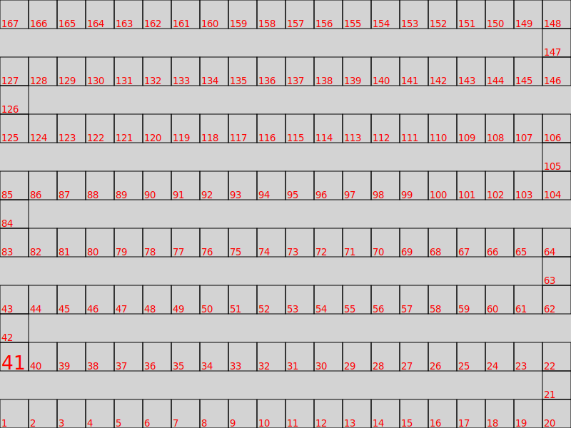

## Énoncé

On souhaite générer un plateau de jeu pour un jeu de <del>l'oie</del> du serpent.

Plus précisément, on aimerait réaliser une image `SVG` comme celle-ci :



Les cases partent du coin en bas à gauche de l'image puis montent en serpentant.

Votre programme devra prendre en entrée sur la ligne de commande deux paramètres : la largeur et la hauteur désirée pour l'image.
L'image ci-dessus a été réalisée avec une largeur de 800 et une hauteur de 600.
Chaque case aura une taille fixe de 40x40.

On cherchera à rentrer un nombre maximal de cases dans l'image, tout en terminant sur une ligne horizontale.

Pour remplir le fond de l'image en gris et dessiner du texte en `SVG` nous ajouterons deux fonctions à notre module `svg.py`.

## Correction
<details markdown="1">
<summary>Cliquez ici pour révéler la correction.</summary>
Voici le code d'une correction possible.

Ajouts dans le module `svg.py`:

```python
# À implémenter dans `TP8. Plateau`
def genere_zone_colorie(x_min, y_min, largeur, hauteur, couleur_remplissage):
    """
    Retourne la chaîne de caractères correspondant à un élément qui colorie une
    zone rectangulaire de la couleur indiquée
    """
    return (
        f'<rect x="{x_min}" y ="{y_min}" '
        f'width="{largeur}" height="{hauteur}" '
        f'stroke="none" fill="{couleur_remplissage}" />'
    )


# À implémenter dans `TP8. Plateau`
def genere_texte(x_min, y_bas, contenu, hauteur):
    """
    Retourne la chaîne de caractères correspondant à un élément SVG représentant
    un texte. Place le texte à la position indiquée. x_min est l'abscisse du
    début du texte. y_bas est l'ordonnée de la ligne de base du texte (le bas
    d'une lettre telle que “n”). Attention, ce n'est pas l'ordonnée maximale
    puisque certaines lettres descendent sous cette ligne (g, j, p, q, y). Le
    paramètre hauteur définit la taille de police (c'est-à-dire la hauteur d'une
    ligne de texte)
    """
    balise_ouvrante = f'<text x="{x_min}" y="{y_bas}" font-size="{hauteur}">'
    balise_fermante = "</text>"
    return f"{balise_ouvrante}{contenu}{balise_fermante}"
```

Fichier `plateau_serpent.py` :

```python
#!/usr/bin/env python3
"""
Generation d'un plateau de jeu serpentant en python
"""
import sys
import svg

DROITE = 0
HAUT = 1
GAUCHE = 2

TAILLE_CASE = 40


def dessine_case(abscisse, ordonnee, numero_case):
    """Dessine la case donnée

    Les coordonnées données concerne le sommet en bas à gauche.
    """

    # Création des 4 sommets
    sommet1 = svg.Point(abscisse, ordonnee)  # En bas à gauche
    sommet2 = svg.Point(abscisse, ordonnee - TAILLE_CASE)  # En haut à gauche
    sommet3 = svg.Point(
        abscisse + TAILLE_CASE, ordonnee - TAILLE_CASE
    )  # En haut à droite
    sommet4 = svg.Point(abscisse + TAILLE_CASE, ordonnee)  # En bas à droite

    # Affichage du rectangle
    print(svg.genere_balise_debut_groupe("black", "none", 1))
    print(svg.genere_polygone((sommet1, sommet2, sommet3, sommet4)), "\n")
    print(svg.genere_balise_fin_groupe())

    # Affichage du texte
    print(svg.genere_balise_debut_groupe("none", "red", 0))
    print(
        svg.genere_texte(
            abscisse + 2,
            ordonnee - 2,
            str(numero_case),
            TAILLE_CASE / (3 if numero_case != 41 else 1.5),
        )
        + "\n"
    )
    print(svg.genere_balise_fin_groupe())


def dessine_ligne(
    abscisse_case1_ligne,
    ordonnee_case1_ligne,
    numero_premiere_case_ligne,
    direction_ligne,
    nombre_cases_ligne,
):
    """
    Dessine une ligne du nombre de cases donne, dans la direction donnee.
    """
    abscisse = abscisse_case1_ligne
    ordonnee = ordonnee_case1_ligne
    mouvements = ((+TAILLE_CASE, 0), (0, -TAILLE_CASE), (-TAILLE_CASE, 0))
    for numero_case in range(
        numero_premiere_case_ligne, numero_premiere_case_ligne + nombre_cases_ligne
    ):
        dessine_case(abscisse, ordonnee, numero_case)
        abscisse += mouvements[direction_ligne][0]
        ordonnee += mouvements[direction_ligne][1]


def dessine_lignes(hauteur, nombre_lignes, directions, nb_cases):
    """Dessine toutes les lignes."""

    # On commence tout en bas à gauche de l'image
    abscisse_courante = 0
    ordonnee_courante = hauteur
    numero_case_courante = 1

    # On définit comment on va bouger en fonction de la direction
    mouvements = (
        (+TAILLE_CASE * (nb_cases[0] - 1), -TAILLE_CASE),
        (0, -TAILLE_CASE * nb_cases[1]),
        (-TAILLE_CASE * (nb_cases[2] - 1), -TAILLE_CASE),
    )

    for ligne in range(nombre_lignes):

        # On dessine la ligne
        direction_ligne = directions[ligne % len(directions)]
        nb_cases_ligne = nb_cases[ligne % len(nb_cases)]
        dessine_ligne(
            abscisse_courante,
            ordonnee_courante,
            numero_case_courante,
            direction_ligne,
            nb_cases_ligne,
        )

        # On se déplace à la ligne suivante
        abscisse_courante += mouvements[direction_ligne][0]
        ordonnee_courante += mouvements[direction_ligne][1]
        numero_case_courante += nb_cases_ligne


def generation_plateau(largeur, hauteur):
    """Dessine un plateau de largeur x hauteur"""

    # On calcule le nombre de case par ligne pleine et le nombre de lignes
    cases_par_lignes = largeur // TAILLE_CASE
    nombre_lignes = hauteur // TAILLE_CASE

    # On ajuste le nombre de lignes pour finir sur une ligne horizontale
    if not nombre_lignes % 2:
        nombre_lignes -= 1

    # On commence l'image et on met un fond blanc
    print(svg.genere_balise_debut_image(largeur, hauteur))
    print(svg.genere_zone_colorie(0, 0, largeur, hauteur, "lightgray"))

    # On dessine les lignes
    directions = [DROITE, HAUT, GAUCHE, HAUT]
    nb_cases = [cases_par_lignes, 1, cases_par_lignes, 1]
    dessine_lignes(hauteur, nombre_lignes, directions, nb_cases)

    # On finit l'image
    print(svg.genere_balise_fin_image())


def main():
    """
    genere un plateau de jeu serpentant aux dimensions donnees.
    """
    if len(sys.argv) != 3:
        print(
            "usage: plateau_serpent.py largeur hauteur \
              (les cases font 40x40)"
        )
        sys.exit(1)

    generation_plateau(int(sys.argv[1]), int(sys.argv[2]))


if __name__ == "__main__":
    main()
```

</details>

## Exercices

- [Boucles for](/2-iterations/travaux-pratiques/05-convertisseur/exercices/01-boucles-for/index.html)
- [Ligne de commandes et arguments](/2-iterations/travaux-pratiques/07-kaleidoscope/exercices/01-parametres-main/index.html)
