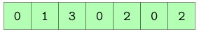
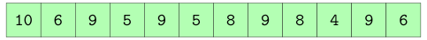

## Objectifs

On se propose d'implémenter un algorithme qui partitionne un tableau en 2 autour d'un élément dit *pivot*.
La partition gauche, contient tous les éléments inférieurs ou égaux au pivot.
La partition droite, contient tous les éléments supérieurs au pivot.

Notre algorithme prendra en entrée un tableau de `n` entiers ainsi que l'indice de la case du tableau contenant le pivot.

Pour les deux versions que nous implémenterons, **nous déterminerons leur complexité en temps et en mémoire**.

## Pivot avec nouveaux tableaux dynamiques

Dans un premier temps, implémentez une fonction `pivote(tableau, indice_pivot)` renvoyant deux tableaux dynamiques (on s'autorise donc à utiliser `append`):

- le premier contient tous les éléments inférieurs ou égaux au pivot ;
- le second contient tous les éléments supérieurs au pivot ;
- le pivot lui même n’appartient à aucun des tableaux renvoyés.

Il y a en général de nombreuses possibilités de solutions, l'ordre entre les "petits" (respectivement les "grands") n'étant pas contraint.

Par exemple, si on appelle `pivote(tab, 0)` et que `tab` est le tableau suivant


alors un résultat correct serait :




## Pivot en place

Dans un second temps, on se propose de travailler en place.
Au lieu de renvoyer deux tableaux dynamiques, on déplace directement les éléments du tableau d'entrée en procédant par échanges.
Le pivot **doit** se retrouver entre les deux parties du tableau.
On vous demande de ne pas utiliser de tableaux additionnels.

Attention cette implémentation est difficile et nécessite sans doute d'essayer sur papier avant de commencer et de **réfléchir aux invariants de boucle**.

Toujours sur le même tableau d'entrée, un résultat correct de `pivote(tab, 0)` serait :


## Correction globale
<details markdown="1">
<summary>Cliquez ici pour révéler la correction.</summary>
Une correction détaillée en deux vidéos est disponible :

<iframe src="https://videos.univ-grenoble-alpes.fr/video/12516-ensimag-bpi-correction-du-mini-projet-pivot-12/?is_iframe=true" width="640" height="360" style="padding: 0; margin: 0; border:0" allowfullscreen ></iframe>

<iframe src="https://videos.univ-grenoble-alpes.fr/video/12524-ensimag-bpi-correction-du-mini-projet-pivot-22/?is_iframe=true" width="640" height="360" style="padding: 0; margin: 0; border:0" allowfullscreen ></iframe>

Une autre correction possible est la suivante :
```python
#!/usr/bin/env python3
"""Déplacement autour d'un pivot dans un tableau."""
import sys


def pivote(tableau, indice_pivot):
    """Pivote le tableau donné autour de l'indice donné.

    Renvoie deux tableaux dynamiques:
      - le premier contient tous les éléments inférieurs ou égaux au pivot ;
      - le second tous les éléments supérieurs au pivot.

    Le pivot lui même n'appartient à aucun des tableaux dynamiques renvoyés.
    L'ordre entre les "petits" (resp. les "grands") n’étant pas contraint.
    """

    tableau_dyn_gauche = []
    tableau_dyn_droit = []
    pivot = tableau[indice_pivot]

    # On place les valeurs une par une à gauche ou
    # à droite en comparant au pivot
    for indice, valeur in enumerate(tableau):

        # Le pivot n'appartient à aucun des deux tableaux
        if indice == indice_pivot:
            continue

        # On compare avec la valeur du pivot pour
        # placer à gauche ou à droite
        if valeur <= pivot:
            tableau_dyn_gauche.append(valeur)
        else:
            tableau_dyn_droit.append(valeur)

    return tableau_dyn_gauche, tableau_dyn_droit


def echange(tableau, i, j):
    """Échange les valeurs aux indices i et j de tableau."""

    # Python est trop fort, on peut faire ça en une ligne,
    # sans avoir recours à une variable temporaire, waaaouu.
    tableau[i], tableau[j] = tableau[j], tableau[i]

    # Ceci n'est qu'un leurre, bien sûr.
    # Python utilise *deux* variables temporaires en interne.
    # Le code ci-dessus est équivalent au code suivant :
    #   temp = (tableau[j], tableau[i]) # création d'un tuple
    #   tableau[i] = temp[0]
    #   tableau[j] = temp[1]


def pivote_en_place(tableau, indice_pivot):
    """Pivote en place le tableau donné autour de la valeur à l'indice donné

    Rien de mieux qu'un dessin au tableau pour "voir" cet algorithme qui utilise
    deux indices : i qui part de gauche et avance à droite, et j qui part de
    droite et avance à gauche.

    L'algorithme s'arrête quand i et j se croisent.

    L'algorithme est "optimisé" en ce qui concerne le nombre d'échanges de deux éléments.
    Quand un élément est plus petit que le pivot, il n'y a pas d'échange.
    On remet le pivot à la bonne place une fois sorti de la boucle,
    c'est à dire quand on connait sa position.
    """

    # On place le pivot en premier
    pivot = tableau[indice_pivot]
    echange(tableau, indice_pivot, 0)

    # Indice de l'élément à comparer au pivot
    # INVARIANT_I : t[e] <= pivot ∀e tel que 1 <= e < i
    #   - vrai au départ car 1 <= e < i est vide
    i = 1

    # Indice du dernier élément non comparé au pivot
    # INVARIANT_J : t[e] > pivot ∀e tel que j < e < len(t)
    # vrai au départ car j < e < len(t) est vide
    j = len(tableau) - 1

    # Tant qu'il reste un élément à comparer au pivot
    while i <= j:

        # On le laisse à sa place et on fait avancer i
        if tableau[i] <= pivot:
            i += 1
            # INVARIANT_I préservé car
            #   - on rajoute t[i] à ∀e tel que 1 <= e < i
            #   - t[i] <= pivot
            # INVARIANT_J préservé car
            #   - pas d'élément rajouté à ∀e tel que j < e < len(t)
            #   - t[e] inchangé ∀e
            #     donc t[e] <= pivot ∀e tel que 1 <= e < i toujours vrai

        # On le place à droite du pivot en échangeant
        # de place avec le dernier élément non comparé au pivot
        else:
            echange(tableau, i, j)
            j -= 1
            # INVARIANT_I préservé car :
            #   - pas d'élément rajouté à ∀e tel que 1 <= e < i
            #   - t[e] inchangé ∀e tel que 1 <= e < i
            #     donc t[e] <= pivot ∀e tel que 1 <= e < i
            # INVARIANT_j préservé car :
            #   - on rajoute t[i] à ∀e tel que j < e < len(t)
            #   - t[i] > pivot

    # Quand on sort de la boucle, j = i - 1 nous donne la place du pivot
    # par définition d'après nos deux invariants
    echange(tableau, 0, j)

    return tableau, j


def main():
    """Point d'entrée du programme"""

    # On demande à l'utilisateur le tableau ainsi que l'indice du pivot
    if len(sys.argv) != 3 or sys.argv[1] == "-h" or sys.argv[1] == "--help":
        print("utilisation:", sys.argv[0], "tableau index_pivot")
        sys.exit()
    tableau = [int(i) for i in sys.argv[1].split()]
    indice_pivot = int(sys.argv[2])

    # On pivote "HORS place"
    print(
        "avant pivotage autour du",
        tableau[indice_pivot],
        "à l'indice",
        indice_pivot,
        "on a le tableau suivant : \n",
        "  tab =",
        tableau,
        "avec une taille de",
        len(tableau),
    )
    tab_gauche, tab_droit = pivote(tableau, indice_pivot)
    print(
        "après pivotage autour du",
        tableau[indice_pivot],
        "à l'indice",
        indice_pivot,
        "on a les deux tableaux suivants : ",
    )
    print("  tab gauche =", tab_gauche, "avec une taille de", len(tab_gauche))
    print("  tab droit  =", tab_droit, "avec une taille de", len(tab_droit))

    # On pivote "EN place"
    print()
    print(
        "avant pivotage en place autour du",
        tableau[indice_pivot],
        "à l'indice",
        indice_pivot,
        "on a le tableau suivant : \n",
        "  tab =",
        tableau,
        "avec une taille de",
        len(tableau),
    )
    pivote_en_place(tableau, indice_pivot)
    print(
        "après pivotage en place autour du",
        tableau[indice_pivot],
        "à l'indice",
        indice_pivot,
        "on a le tableau suivant : \n",
        "  tab =",
        tableau,
        "avec une taille de",
        len(tableau),
    )


if __name__ == "__main__":
    main()
```
</details>

## Exercices

- [Le juste prix](/2-iterations/travaux-pratiques/10-tout-eteint/exercices/01-le-juste-prix/index.html)
- [Tableaux](/2-iterations/travaux-pratiques/09-sous-suite/exercices/01-tableaux/index.html)
- [Et ça continue, encore et encore...](/2-iterations/travaux-pratiques/11-pivot/exercices/01-et-ca-continue-encore-et-encore/index.html)
