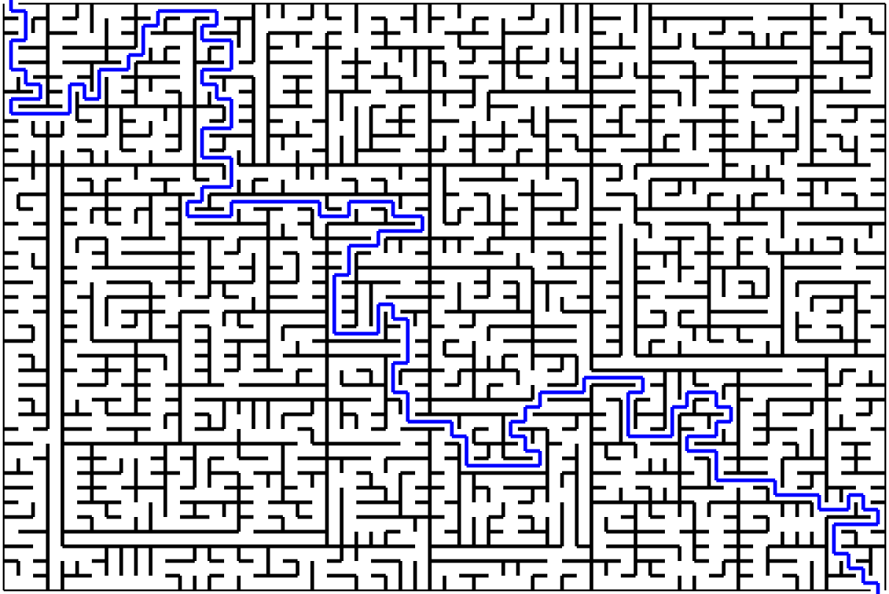

## Énoncé

On se propose pour cette séance de dessiner en `SVG` et récursivement des labyrinthes comme ci-dessous :

On commencera par dessiner la labyrinthe sans le chemine de l'entrée à la sortie.

Dans un deuxième temps seulement on modifiera notre programme pour rajouter le dessin de ce chemin de l'entrée à la sortie.

## Exercices

- [Incrémente](/4-recursivite/travaux-pratiques/19-fractales/exercices/01-incremente/index.html)
- [Stack overflow](/4-recursivite/travaux-pratiques/19-fractales/exercices/02-stackoverflow/index.html)
