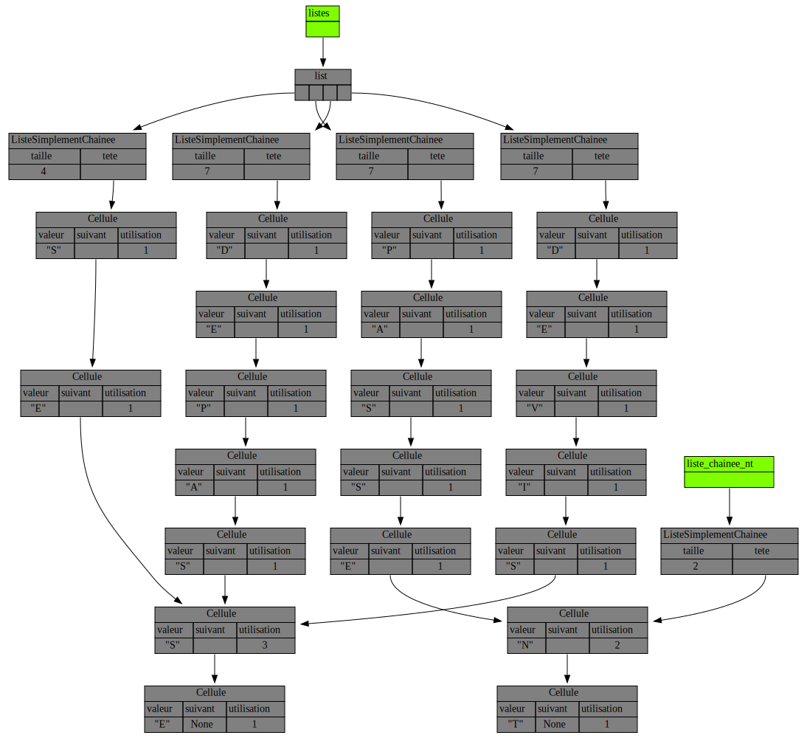

## Énoncé

On se propose de manipuler des listes relativement complexes.

 On utilise ici des listes partageant des cellules, par exemple pour stocker des mots finissant par les mêmes lettres.
 Comme toute cellule n’a qu’un seul champ suivant, on ne peut partager que la fin des listes.
 Le partage de cellule se fera **uniquement** au travers d'appels à une fonction permettant d'ajouter une liste simplement chaînée en suffixe d'une autre.

Pour pouvoir implémenter l'opération d'ajout de suffixe, il est nécessaire de savoir quelles sont les cellules faisant parties de plusieurs listes.
On se propose donc de rajouter dans la classe `Cellule` un champ `utilisation` comptant le nombre de références vers la cellule.

On vous demande de compléter le fichier `suffixes.py` affiché ci-dessous et [disponible ici](suffixes.py).
Prenez bien le temps de comprendre ce qui est attendu de vous en lisant attentivement le code fourni et en regardant les sorties du traceur affichées au bas de cette page.
Que doit-il se passer si on ajoute dans notre exemple `NT` à `DEPASSE` ?

```python
#!/usr/bin/env python3

"""Listes simplement chaînées avec partages de suffixes."""

import traceur


class Cellule:
    """Une cellule d'une liste simplement chaînée.

    Contient une référence vers la valeur, une référence vers la cellule
    suivante et une référence vers un compteur comptabilisant combien
    de cellules pointent dessus.
    """

    def __init__(self, valeur, suivant=None):
        self.valeur = valeur
        self.suivant = suivant
        self.utilisation = 1

    def __str__(self):
        return str(self.valeur) + " , " + str(self.utilisation)


class ListeSimplementChainee:
    """Liste simplement chainée avec partage de cellule.

    Des listes simplement chainées différentes peuvent partager
    des cellules communes.
    """

    def __init__(self, mot):
        """Construit une liste simplement chaînée à partir d'un mot.

        La liste simplement chaînée construite ne partage aucune cellule
        pour le moment.
        """
        premiere_cellule = None
        self.taille = 0
        for lettre in reversed(mot):
            premiere_cellule = Cellule(lettre, premiere_cellule)
            self.taille += 1
        self.tete = premiere_cellule

    def __str__(self):
        """Renvoie la chaîne de cractères "val1 --> val2 --> val3 ..." """
        return "-->".join(str(cell.valeur) for cell in recupere_cellules(self))


def recupere_cellules(liste_chainee):
    """Générateur renvoyant un itérateur sur toutes les cellules."""
    # TODO
    ...


def ajoute_suffixe(liste_chainee, autre):
    """Ajoute la liste chaînée `autre` à la fin de `liste_chainee`.

    Toutes les cellules de autre sont partagées.
    Si la fin de `liste_chainee` était déjà partagée avec quelqu'un, alors
    il faut dédoubler toute la partie partagée avant l'ajout pour ne pas changer
    les autres listes chaînées utilisant cette fin.
    """
    # TODO
    ...


def teste_listes():
    """On teste toutes les operations dans différentes configurations."""

    print(
        "on crée une list, c'est à dire un tableau dynamique, de 4 listes simplement chainées"
    )
    listes_chainees = [
        ListeSimplementChainee(mot) for mot in ("SE", "PAS", "DE", "DEVIS")
    ]
    print(*listes_chainees, sep="\n")

    # On temporise
    _ = input("tapez sur une touche pour continuer")
    print()

    print("on ajoute", listes_chainees[0], "apres", listes_chainees[1])
    ajoute_suffixe(listes_chainees[1], listes_chainees[0])
    print(*listes_chainees, sep="\n")

    # On temporise
    _ = input("tapez sur une touche pour continuer")
    print()

    print("on ajoute une liste vide après", listes_chainees[1])
    ajoute_suffixe(listes_chainees[1], ListeSimplementChainee(""))
    print(*listes_chainees, sep="\n")

    # On temporise
    _ = input("tapez sur une touche pour continuer")
    print()

    print(
        "on ajoute",
        listes_chainees[1],
        "apres",
        listes_chainees[2],
        "et",
        listes_chainees[0],
        "apres",
        listes_chainees[3],
    )
    ajoute_suffixe(listes_chainees[2], listes_chainees[1])
    ajoute_suffixe(listes_chainees[3], listes_chainees[0])
    print(*listes_chainees, sep="\n")
    traceur.display_vars(
        traceur.Variable("listes", listes_chainees),
        deeply=False,
        visualize=False,
        image_name="4_listes",
    )

    # On temporise
    _ = input("tapez sur une touche pour continuer")
    print()

    liste_chainee_nt = ListeSimplementChainee("NT")
    print("on ajoute 'NT' apres 'PASSE'")
    ajoute_suffixe(listes_chainees[1], liste_chainee_nt)
    print(*listes_chainees, liste_chainee_nt, sep="\n")

    # On temporise
    _ = input("tapez sur une touche pour continuer")
    print()

    print("on ajoute 'SE' apres elle-meme")
    ajoute_suffixe(listes_chainees[0], listes_chainees[0])
    print(*listes_chainees, sep="\n")
    traceur.display_vars(
        traceur.Variable("listes", listes_chainees),
        traceur.Variable("liste_chainee_nt", liste_chainee_nt),
        deeply=False,
        visualize=False,
        image_name="5_listes",
    )


if __name__ == "__main__":
    teste_listes()
```

La fonction `teste_listes` contient deux appels au module `traceur` affichant l'état des listes à deux endroits différents du programme.
Dans les deux appels au `traceur`,  `deeply=False` est utilisé pour simplifier le schéma en "imbriquant" les instances de types `int`, `float` et `str` dans les instances qui les référencent.
Néanmoins, il faut garder à l'esprit que ceci n'est qu'un leurre d'affichage et que tous les attributs quelque soit leur type sont **des références**.
Pour vous aider à comprendre ce qui est attendu, voici le résultat du premier appel au `traceur` dans le code ci-dessus :


Et voici le résultat du second appel au `traceur` dans le code ci-dessus :



## Correction
<details markdown="1">
<summary>Cliquez ici pour révéler la correction.</summary>
```python
#!/usr/bin/env python3

"""Listes simplement chaînées avec partages de suffixes."""

import traceur


class Cellule:
    """Une cellule d'une liste simplement chaînée.

    Contient une référence vers la valeur, une référence vers la cellule
    suivante et une référence vers un compteur comptabilisant combien
    de cellules pointent dessus.
    """

    def __init__(self, valeur, suivant=None):
        self.valeur = valeur
        self.suivant = suivant
        self.utilisation = 1

    def __str__(self):
        return str(self.valeur) + " , " + str(self.utilisation)


class ListeSimplementChainee:
    """Liste simplement chainée avec partage de cellule.

    Des listes simplement chainées différentes peuvent partager
    des cellules communes.
    """

    def __init__(self, mot):
        """Construit une liste simplement chaînée à partir d'un mot.

        La liste simplement chaînée construite ne partage aucune cellule
        pour le moment.
        """
        premiere_cellule = None
        self.taille = 0
        for lettre in reversed(mot):
            premiere_cellule = Cellule(lettre, premiere_cellule)
            self.taille += 1
        self.tete = premiere_cellule

    def __str__(self):
        """Renvoie la chaîne de cractères "val1 --> val2 --> val3 ..." """
        return "-->".join(str(cell.valeur) for cell in recupere_cellules(self))


def recupere_cellules(liste_chainee):
    """Générateur renvoyant un itérateur sur toutes les cellules."""
    cellule_courante = liste_chainee.tete
    while cellule_courante is not None:
        yield cellule_courante
        cellule_courante = cellule_courante.suivant


def ajoute_suffixe(liste_chainee, autre):
    """Ajoute la liste chaînée `autre` à la fin de `liste_chainee`.

    Toutes les cellules de autre sont partagées.
    Si la fin de `liste_chainee` était déjà partagée avec quelqu'un, alors
    il faut dédoubler toute la partie partagée avant l'ajout pour ne pas changer
    les autres listes chaînées utilisant cette fin.
    """
    # Rien à faire si `autre` est vide
    if autre.tete is None:
        return

    # On augmente la taille
    liste_chainee.taille += autre.taille

    # On incrémente de 1 le compteur d'utilisation
    # de la tête de `autre` car en sortie de cette fonction
    # il y aura une nouvelle référence pointant sur cette tête.
    # On doit faire ça ici pour que la duplication ci-dessous
    # ait lieu AUSSI quand `autre` est `liste_chainee`, c'est à
    # dire quand on ajoute une liste en suffixe à elle même.
    autre.tete.utilisation += 1

    # On cherche la première cellule partagée de `liste_chainee`
    # en sauvegardant son précédent
    first_shared = None
    prec = None
    iter_cells = recupere_cellules(liste_chainee)
    for cell in iter_cells:
        if cell.utilisation > 1:
            first_shared = cell
            break
        prec = cell

    # On sauvegarde la tête de `autre`
    other_head = autre.tete

    # On duplique tout à partir de la première
    # cellule partagée incluse.
    if first_shared:

        # La première cellule partagée n'est plus utilisée par
        # liste_chainee, donc on décrement son compteur
        # d'utilisations
        first_shared.utilisation -= 1

        # On duplique la première cellule partagée
        new_cell = Cellule(first_shared.valeur)

        # On raccroche le précédent à la nouvelle
        # cellule si besoin
        if prec:
            prec.suivant = new_cell

        # Sinon c'est que la première cellule partagée
        # est la tête, et donc faut mettre à jour celle-ci
        else:
            liste_chainee.tete = new_cell

        # On duplique ensuite les autres cellules partagées
        prec = new_cell
        for cell in iter_cells:
            new_cell = Cellule(cell.valeur)
            prec.suivant = new_cell
            prec = new_cell

    # On chaîne le dernier de `liste_chainee` avec la tête de `autre`
    prec.suivant = other_head


def teste_listes():
    """On teste toutes les operations dans différentes configurations."""

    print(
        "on crée une list, c'est à dire un tableau dynamique, de 4 listes simplement chainées"
    )
    listes_chainees = [
        ListeSimplementChainee(mot) for mot in ("SE", "PAS", "DE", "DEVIS")
    ]
    print(*listes_chainees, sep="\n")

    # On temporise
    _ = input("tapez sur une touche pour continuer")
    print()

    print("on ajoute", listes_chainees[0], "apres", listes_chainees[1])
    ajoute_suffixe(listes_chainees[1], listes_chainees[0])
    print(*listes_chainees, sep="\n")

    # On temporise
    _ = input("tapez sur une touche pour continuer")
    print()

    print("on ajoute une liste vide après", listes_chainees[1])
    ajoute_suffixe(listes_chainees[1], ListeSimplementChainee(""))
    print(*listes_chainees, sep="\n")

    # On temporise
    _ = input("tapez sur une touche pour continuer")
    print()

    print(
        "on ajoute",
        listes_chainees[1],
        "apres",
        listes_chainees[2],
        "et",
        listes_chainees[0],
        "apres",
        listes_chainees[3],
    )
    ajoute_suffixe(listes_chainees[2], listes_chainees[1])
    ajoute_suffixe(listes_chainees[3], listes_chainees[0])
    print(*listes_chainees, sep="\n")
    traceur.display_vars(
        traceur.Variable("listes", listes_chainees),
        deeply=False,
        visualize=False,
        image_name="4_listes",
    )

    # On temporise
    _ = input("tapez sur une touche pour continuer")
    print()

    liste_chainee_nt = ListeSimplementChainee("NT")
    print("on ajoute 'NT' apres 'PASSE'")
    ajoute_suffixe(listes_chainees[1], liste_chainee_nt)
    print(*listes_chainees, liste_chainee_nt, sep="\n")

    # On temporise
    _ = input("tapez sur une touche pour continuer")
    print()

    print("on ajoute 'SE' apres elle-meme")
    ajoute_suffixe(listes_chainees[0], listes_chainees[0])
    print(*listes_chainees, sep="\n")
    traceur.display_vars(
        traceur.Variable("listes", listes_chainees),
        traceur.Variable("liste_chainee_nt", liste_chainee_nt),
        deeply=False,
        visualize=False,
        image_name="5_listes",
    )


if __name__ == "__main__":
    teste_listes()
```
</details>
## Exercices

- [Première classe](/3-references/travaux-pratiques/15-listes-sc/exercices/01-premiere-classe/index.html)
- [Débogage visuel](/3-references/travaux-pratiques/15-listes-sc/exercices/02-debogage-visuel/index.html)
- [Référence vers une fonction](/3-references/travaux-pratiques/17-op-listes-sc-yield/exercices/01-reference-vers-fonction/index.html)
