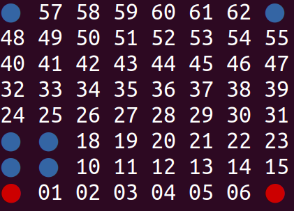

## Énoncé

Dans ce mini projet, on se propose d'implémenter une interface en mode texte pour le jeu *Blob wars*.
Le jeu se joue à deux joueurs (les bleus et les rouges) sur un plateau de taille 8x8.
Les cases sont numérotées de 0 à 63.

Le plateau contient des pions (également appelés blobs) bleus et rouges.
On joue chacun son tour.
À chaque tour le joueur courant choisit un de ses pions et le déplace.
Tout pion peut se déplacer sur une case adjacente vide, y compris en diagonale, en se dupliquant et créant ainsi un nouveau pion de même couleur.
Un pion peut également se déplacer de deux cases, c'est à dire max(∆ligne,∆colonne) = 2.
Dans ce cas, il n'y a pas de duplication et on dit que le pion fait un "saut".
Une fois arrivé sur sa destination un pion transforme tous les pions voisins de son adversaire en pions de sa propre couleur.
Le jeu s’arrête dès qu’un joueur ne peut pas jouer.
Le joueur ayant le plus de pion sur le plateau remporte alors la partie.

À titre d'exemple les deux images ci-dessous illustre un saut du pion bleu en case 32 vers la case 17.




L'objectif de ce TP consiste à implémenter une interface en mode texte Blob wars permettant à deux joueurs humains devant l'écran de jouer.
La vidéo [disponible ici](blobwars.mp4) donne un exemple du résultat attendu.

On réalisera deux versions du jeu.
Dans la première, le plateau sera représenté par un **tableau de 64 cases**.
Dans la seconde version, le plateau sera représenté **uniquement par deux entiers de 64 bits**, un pour les rouges et un pour les bleus.
Chacun des 64 bits de l'entier rouge indique si un point rouge se trouve ou non sur la case dont l'indice correspond à la position du bit.
Pareil pour l'entier bleu.

## Correction
<details markdown="1">
<summary>Cliquez ici pour révéler la correction.</summary>
Voici une correction possible pour la version utilisant un tableau de 64 cases :

```python
#!/usr/bin/env python3

"""Jouons à Blobwars"""
import os
import collections

# Définition d'un coup
Coup = collections.namedtuple("Coup", "depart arrivee")

# Contenu d'une case
VIDE = 0
BLEU = 1
ROUGE = -1

# Pour colorier la sortie dans le terminal
CROUGE = "\033[31m"
CBLUE = "\033[34m"
CEND = "\033[0m"


def calcule_position(x, y):
    return x + y * 8


def calcule_coordonees(position):
    return (position % 8, position // 8)


def affiche_plateau(plateau):
    os.system("cls" if os.name == "nt" else "clear")
    for y in range(7, -1, -1):
        for x in range(0, 8):
            position = calcule_position(x, y)
            if plateau[position] == VIDE:
                print("{:02d} ".format(position), end="")
            elif plateau[position] == ROUGE:
                circle = CROUGE + "\u25CF " + CEND
                print("{:^3s}".format(circle), end=" ")
            else:
                circle = CBLUE + "\u25CF " + CEND
                print("{:^3s}".format(circle), end=" ")
        print()
    print()


def get_positions_blobs(plateau, couleur):
    positions = []
    for position, blob in enumerate(plateau):
        if blob == couleur:
            positions.append(position)
    return positions


def get_positions_voisines(position, distance):
    voisines = []
    x_pos, y_pos = calcule_coordonees(position)
    for x in range(max(x_pos - distance, 0), min(x_pos + distance, 7) + 1):
        for y in range(max(y_pos - distance, 0), min(y_pos + distance, 7) + 1):
            if x_pos != x or y_pos != y:
                voisines.append(calcule_position(x, y))
    return voisines


def get_coups_valides(plateau, couleur):
    coups = []
    for position in get_positions_blobs(plateau, couleur):
        for voisin in get_positions_voisines(position, 2):
            if plateau[voisin] == VIDE:
                coups.append(Coup(position, voisin))
    return coups


def joue_coup(plateau, couleur, coup):

    # On met le nouveau pion à sa place
    plateau[coup.arrivee] = couleur

    # On retourne les voisins de l'autre couleur
    for voisin in get_positions_voisines(coup.arrivee, 1):
        if plateau[voisin] == -couleur:
            plateau[voisin] = couleur

    # On enleve le pion initial si distance = 2
    x_depart, y_depart = calcule_coordonees(coup.depart)
    x_arrivee, y_arrivee = calcule_coordonees(coup.arrivee)
    if max(abs(x_depart - x_arrivee), abs(y_depart - y_arrivee)) == 2:
        plateau[coup.depart] = VIDE


def demande_coup(couleur, coup_exemple):
    print("Joueur", "rouge" if couleur == ROUGE else "bleu", "veuillez entrer un coup")
    print(
        "Le format doit être 'depart arrivee', par exemple '{} {}'".format(
            coup_exemple.depart, coup_exemple.arrivee
        )
    )
    print("C'est à vous :", end=" ")
    coup_str = input().split(" ")
    if not len(coup_str) == 2:
        return None
    if not coup_str[0].isdigit() or not coup_str[1].isdigit():
        return None
    return Coup(int(coup_str[0]), int(coup_str[1]))


def joue_partie():

    # Création du plateau initial
    plateau = [VIDE for _ in range(64)]
    plateau[0] = plateau[7] = ROUGE
    plateau[56] = plateau[63] = BLEU

    # On joue tant que possible
    couleur = ROUGE
    coups_valides = get_coups_valides(plateau, couleur)
    while coups_valides:
        affiche_plateau(plateau)
        while True:
            coup = demande_coup(couleur, coups_valides[0])
            if coup in coups_valides:
                break
            else:
                print("coup invalide")
        joue_coup(plateau, couleur, coup)
        couleur = -couleur
        coups_valides = get_coups_valides(plateau, couleur)
        print()

    # On affiche le résultat
    affiche_plateau(plateau)
    score_rouge = len(get_positions_blobs(plateau, ROUGE))
    score_bleu = len(get_positions_blobs(plateau, BLEU))
    winner = max(score_rouge, score_bleu)
    print("Score rouge =", score_rouge, "et score bleu =", score_bleu)
    print("C'est donc", "rouge" if winner == ROUGE else "bleu", "qui gagne !")


if __name__ == "__main__":
    joue_partie()
```

Et voici une correction possible pour la version utilisant deux entiers de 64 bits :

```python
#!/usr/bin/env python3

"""Jouons à Blobwars"""
import os
import collections

# Définition d'un coup
Coup = collections.namedtuple("Coup", "depart arrivee")

ROUGE = 0
BLEU = 1

# Pour colorier la sortie dans le terminal
CROUGE = "\033[31m"
CBLUE = "\033[34m"
CEND = "\033[0m"


def calcule_position(x, y):
    return x + y * 8


def calcule_coordonees(position):
    return (position % 8, position // 8)


def affiche_plateau(plateau):
    os.system("cls" if os.name == "nt" else "clear")
    for y in range(7, -1, -1):
        for x in range(0, 8):
            position = calcule_position(x, y)
            if (
                plateau[ROUGE] & 1 << position
            ):  # <=> plateau[ROUGE] & 1 << position != 0
                circle = CROUGE + "\u25CF " + CEND
                print("{:^3s}".format(circle), end=" ")
            elif (
                plateau[BLEU] & 1 << position
            ):  # <=> plateau[BLEU] & 1 << position != 0
                circle = CBLUE + "\u25CF " + CEND
                print("{:^3s}".format(circle), end=" ")
            else:
                print("{:02d} ".format(position), end="")
        print()
    print()


def get_positions_blobs(plateau, couleur):
    positions = []
    for position in range(64):
        if plateau[couleur] & 1 << position:
            positions.append(position)
    return positions


def get_positions_voisines(position, distance):
    voisines = []
    x_pos, y_pos = calcule_coordonees(position)
    for x in range(max(x_pos - distance, 0), min(x_pos + distance, 7) + 1):
        for y in range(max(y_pos - distance, 0), min(y_pos + distance, 7) + 1):
            if x_pos != x or y_pos != y:
                voisines.append(calcule_position(x, y))
    return voisines


def get_coups_valides(plateau, couleur):
    coups = []
    for position in get_positions_blobs(plateau, couleur):
        for voisin in get_positions_voisines(position, 2):
            if plateau[couleur] & 1 << voisin == 0:
                coups.append(Coup(position, voisin))
    return coups


def joue_coup(plateau, couleur, coup):

    # On met le nouveau pion à sa place
    plateau[couleur] |= 1 << coup.arrivee

    # On retourne les voisins de l'autre couleur
    couleur_oposee = abs(couleur - 1)
    for voisin in get_positions_voisines(coup.arrivee, 1):
        if plateau[couleur_oposee] & 1 << voisin:
            plateau[couleur] |= 1 << voisin
            plateau[couleur_oposee] &= ~(1 << voisin)

    # On enleve le pion initial si distance = 2
    x_depart, y_depart = calcule_coordonees(coup.depart)
    x_arrivee, y_arrivee = calcule_coordonees(coup.arrivee)
    if max(abs(x_depart - x_arrivee), abs(y_depart - y_arrivee)) == 2:
        plateau[couleur] &= ~(1 << coup.depart)


def demande_coup(couleur, coup_exemple):
    print("Joueur", "rouge" if couleur == ROUGE else "bleu", "veuillez entrer un coup")
    print(
        "Le format doit être 'depart arrivee', par exemple '{} {}'".format(
            coup_exemple.depart, coup_exemple.arrivee
        )
    )
    print("C'est à vous :", end=" ")
    coup_str = input().split(" ")
    if not len(coup_str) == 2:
        return None
    if not coup_str[0].isdigit() or not coup_str[1].isdigit():
        return None
    return Coup(int(coup_str[0]), int(coup_str[1]))


def joue_partie():

    # Création du plateau initial
    plateau = [0, 0]
    plateau[ROUGE] = 1 << 0 | 1 << 7
    plateau[BLEU] = 1 << 56 | 1 << 63

    # On joue tant que possible
    couleur = ROUGE
    coups_valides = get_coups_valides(plateau, couleur)
    while coups_valides:
        affiche_plateau(plateau)
        while True:
            coup = demande_coup(couleur, coups_valides[0])
            if coup in coups_valides:
                break
            else:
                print("coup invalide")
        joue_coup(plateau, couleur, coup)
        couleur = abs(couleur - 1)
        coups_valides = get_coups_valides(plateau, couleur)

    # On affiche le résultat
    affiche_plateau(plateau)
    score_rouge = len(get_positions_blobs(plateau, ROUGE))
    score_bleu = len(get_positions_blobs(plateau, BLEU))
    winner = max(score_rouge, score_bleu)
    print("Score rouge =", score_rouge, "et score bleu =", score_bleu)
    print("C'est donc", "rouge" if winner == ROUGE else "bleu", "qui gagne !")


if __name__ == "__main__":
    joue_partie()
```
</details>

## Exercices

- [Le juste prix](/2-iterations/travaux-pratiques/10-tout-eteint/exercices/01-le-juste-prix/index.html)
- [Tableaux](/2-iterations/travaux-pratiques/09-sous-suite/exercices/01-tableaux/index.html)
- [Boucles for](/2-iterations/travaux-pratiques/05-convertisseur/exercices/01-boucles-for/index.html)
- [Je m'en vais comme un prince !](/2-iterations/travaux-pratiques/optionnels/02-blobwars/exercices/01-je-m-en-vais-comme-un-prince/index.html)
