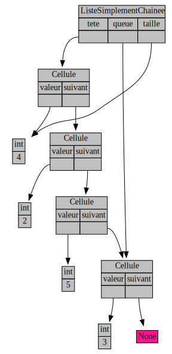

## Énoncé

On cherche à implémenter des listes simplement chaînées similaires à celles vues en TD.
Pour cela, on va utiliser un type `Cellule` et un type `ListeSimplementChainee`.

Une liste composée des entiers 4, 2, 5 et 3 ressemble à :


Analyser le schéma ci-dessus pour bien comprendre quels doivent êtres les attributs de chacune des deux classes.
Compléter ensuite le fichier `liste_simplement_chainee.py` [disponible ici](liste_simplement_chainee.py) et affiché ci-dessous.
Des appels au `traceur` sont faits dans la fonction de teste du code fourni.
Il faudra donc avoir un module traceur opérationnel (aller voir les exercices associés mentionnés ci-dessous si besoin).
On pourra bien entendu rajouter tous les appels au `traceur` nécessaires afin de déboguer plus facilement notre code.

```python
#!/usr/bin/env python3

"""Listes simplement chaînées + quelques operations."""

import traceur


class Cellule:
    """Une cellule d'une liste."""

    # TODO
    ...


class ListeSimplementChainee:
    """Une liste simplement chaînée."""

    # TODO
    ...


def ajoute_en_tete(liste_chainee, valeur):
    """Ajoute une cellule en tête."""
    # TODO
    ...


def ajoute_en_queue(liste_chainee, valeur):
    """Ajoute une cellule en queue."""
    # TODO
    ...


def recherche(liste_chainee, valeur):
    """Recherche une valeur dans la liste_chainee donnée.

    Renvoie la première cellule contenant la valeur donnée ou
    None si la valeur n'est pas trouvée dans la liste_chainee.
    """
    # TODO
    ...


def supprime(liste_chainee, valeur):
    """Supprime la premiere cellule contenant la valeur donnée."""
    # TODO
    ...


def teste_listes():
    """On teste les operations de base, dans différentes configurations."""
    liste_chainee = ListeSimplementChainee()
    traceur.display_instance(
        liste_chainee, visualize=False, image_name="liste_chainee_0"
    )
    ajoute_en_tete(liste_chainee, 3)
    ajoute_en_tete(liste_chainee, 5)
    ajoute_en_tete(liste_chainee, 2)
    ajoute_en_tete(liste_chainee, 4)
    print("liste_chainee : ", liste_chainee)
    traceur.display_instance(
        liste_chainee, visualize=False, image_name="liste_chainee_1"
    )
    print("recherche : ", recherche(liste_chainee, 3).valeur)
    supprime(liste_chainee, 5)
    print("apres suppression de 5 : ", liste_chainee)
    traceur.display_instance(
        liste_chainee, visualize=False, image_name="liste_chainee_2"
    )
    supprime(liste_chainee, 4)
    print("apres suppression de 4 : ", liste_chainee)
    traceur.display_instance(
        liste_chainee, visualize=False, image_name="liste_chainee_3"
    )


teste_listes()
```

## Correction
<details markdown="1">
<summary>Cliquez ici pour révéler la correction.</summary>

Voici les quatre images correspondant aux appels au `traceur` que l'on doit obtenir :

*liste_chainee_0.svg* :


*liste_chainee_1.svg* :


*liste_chainee_2.svg* :


*liste_chainee_3.svg* :


Et voici le code de correction.

```python
#!/usr/bin/env python3

"""Listes simplement chaînées + quelques operations."""

import traceur


class Cellule:
    """Une cellule d'une liste."""

    def __init__(self, valeur, suivant=None):
        self.valeur = valeur
        self.suivant = suivant


class ListeSimplementChainee:
    """Une liste simplement chaînée."""

    def __init__(self):
        self.tete = None
        self.queue = None
        self.taille = 0

    def __str__(self):
        """Renvoie val1 --> val2 --> val3 ...

        Attention à l'utilisation du `+=` sur des str.
        Nous verrons comment faire mieux en Python avec
        des générateurs prochainement.
        """
        str_repr = ""
        cellule_courante = self.tete
        while cellule_courante is not None:
            if str_repr:
                str_repr += " --> "
            str_repr += str(cellule_courante.valeur)
            cellule_courante = cellule_courante.suivant
        return str_repr


def ajoute_en_tete(liste_chainee, valeur):
    """Ajoute une cellule en tête."""
    # Temps constant
    liste_chainee.taille += 1
    liste_chainee.tete = Cellule(valeur, liste_chainee.tete)
    if liste_chainee.queue is None:
        liste_chainee.queue = liste_chainee.tete
    return liste_chainee


def ajoute_en_queue(liste_chainee, valeur):
    """Ajoute une cellule en queue."""
    # Possible en temps constant grace au pointeur de queue.
    liste_chainee.taille += 1
    nouvelle_cellule = Cellule(valeur)
    if liste_chainee.queue:
        liste_chainee.queue.suivant = nouvelle_cellule
    else:
        liste_chainee.tete = nouvelle_cellule

    liste_chainee.queue = nouvelle_cellule
    return liste_chainee


def recherche(liste_chainee, valeur):
    """Recherche une valeur dans la liste_chainee donnée.

    Renvoie la première cellule contenant la valeur donnée ou
    None si la valeur n'est pas trouvée dans la liste_chainee.
    """
    cellule_courante = liste_chainee.tete
    while cellule_courante is not None:
        if cellule_courante.valeur == valeur:
            return cellule_courante
        cellule_courante = cellule_courante.suivant
    return None


def supprime_suivant(liste_chainee, cellule):
    """Supprime la cellule apres la cellule donnée.

    Si la cellule donnée est None, supprime le premier élément de la liste_chainee.
    pre-condition: il y a un element a enlever.
    """
    liste_chainee.taille -= 1
    if cellule:
        assert cellule.suivant is not None, "utilisation invalide de supprimer_suivant"
        cellule_supprimee = cellule.suivant
        cellule.suivant = cellule_supprimee.suivant
    else:
        assert (
            liste_chainee.tete is not None
        ), "utilisation invalide de supprimer_suivant"
        cellule_supprimee = liste_chainee.tete
        liste_chainee.tete = cellule_supprimee.suivant

    if cellule_supprimee == liste_chainee.queue:
        liste_chainee.queue = cellule


def supprime(liste_chainee, valeur):
    """Supprime la premiere cellule contenant la valeur donnée."""
    cellule_precedente = None
    cellule_courante = liste_chainee.tete
    while cellule_courante is not None:
        if cellule_courante.valeur == valeur:
            supprime_suivant(liste_chainee, cellule_precedente)
            return liste_chainee
        cellule_precedente = cellule_courante
        cellule_courante = cellule_courante.suivant
    return liste_chainee


def teste_listes():
    """On teste les operations de base, dans différentes configurations."""
    liste_chainee = ListeSimplementChainee()
    traceur.display_instance(
        liste_chainee, visualize=False, image_name="liste_chainee_0"
    )
    ajoute_en_tete(liste_chainee, 3)
    ajoute_en_tete(liste_chainee, 5)
    ajoute_en_tete(liste_chainee, 2)
    ajoute_en_tete(liste_chainee, 4)
    print("liste_chainee : ", liste_chainee)
    traceur.display_instance(
        liste_chainee, visualize=False, image_name="liste_chainee_1"
    )
    print("recherche : ", recherche(liste_chainee, 3).valeur)
    supprime(liste_chainee, 5)
    print("apres suppression de 5 : ", liste_chainee)
    traceur.display_instance(
        liste_chainee, visualize=False, image_name="liste_chainee_2"
    )
    supprime(liste_chainee, 4)
    print("apres suppression de 4 : ", liste_chainee)
    traceur.display_instance(
        liste_chainee, visualize=False, image_name="liste_chainee_3"
    )


teste_listes()
```
</details>
## Exercices

- [Première classe](/3-references/travaux-pratiques/15-listes-sc/exercices/01-premiere-classe/index.html)
- [Débogage visuel](/3-references/travaux-pratiques/15-listes-sc/exercices/02-debogage-visuel/index.html)
